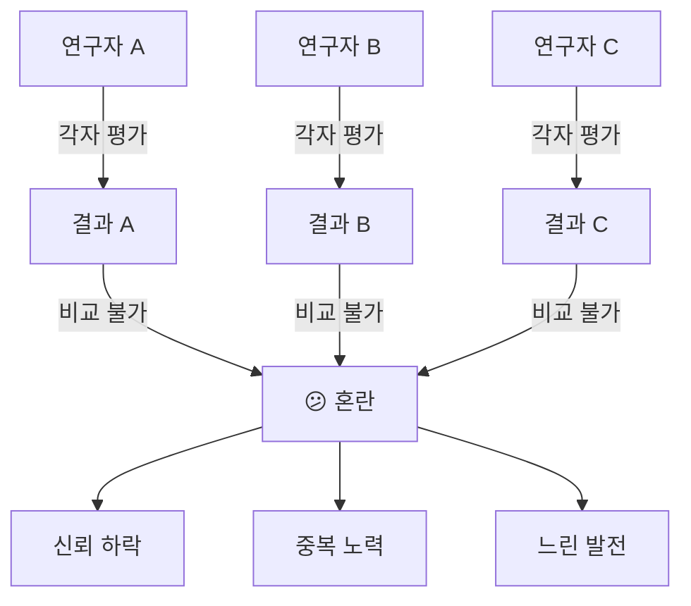
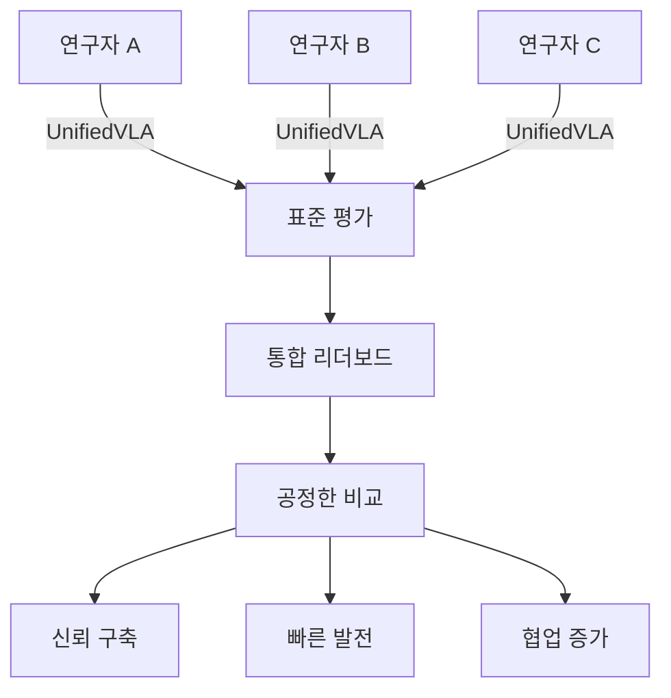

# 🎯 UnifiedVLA의 핵심 기능과 생태계 기여
## "진짜 하는 일은 무엇이고, 왜 필요한가?"

---

## 🔴 한 문장으로: 핵심 기능

> **"파편화된 VLA 평가 도구들을 하나의 표준 인터페이스로 연결하는 미들웨어"**

---

## 🎭 현재 VLA 생태계의 진짜 문제

### 문제 1: "같은 모델인데 점수가 다르다"

```python
# 연구자 A의 논문
"Our model achieves 85% on manipulation tasks"

# 연구자 B의 반박
"We tested your model and got 72%"

# 왜 다른가?
reasons = {
    "환경 차이": "Python 3.8 vs 3.10",
    "데이터 버전": "RT-X v1.0 vs v1.2", 
    "평가 방식": "3 seeds vs 10 seeds",
    "하드웨어": "A100 vs V100",
    "구현 디테일": "배치 크기, 전처리 방식"
}

# 결과: 아무도 못 믿는 논문들
```

### 문제 2: "새 도구가 나와도 아무도 안 씀"

```python
# 2024년 상황
new_tools = {
    "VLABench": "12월 출시, 별 100개",
    "LeRobot": "5월 출시, 별 2000개",
    "SimplerEnv": "사용자 50명"
}

# 왜 안 쓰는가?
barriers = {
    "학습 곡선": "또 새로운 거 배워야 해?",
    "전환 비용": "기존 파이프라인 다 바꿔야 해?",
    "신뢰성": "이거 맞는 결과야?",
    "호환성": "내 모델 형식 지원 안 해"
}
```

### 문제 3: "재현이 안 된다"

```python
# 논문 저자
"코드 공개했습니다: github.com/mymodel"

# 6개월 후 다른 연구자
errors = [
    "ImportError: No module named 'old_library'",
    "CUDA out of memory",
    "Segmentation fault",
    "Results: 45% (논문: 85%)"
]

# 결과: 시간 낭비, 신뢰 붕괴
```

---

## 💡 UnifiedVLA의 핵심 기능

### 1. 🔌 **Adapter Layer (어댑터 계층)**

```python
class CoreFunction1_Adapter:
    """
    핵심: 모든 도구를 같은 인터페이스로 포장
    """
    
    def wrap_vlabench(self, model):
        """VLABench가 뭘 요구하든 자동 변환"""
        # VLABench wants: specific format A
        converted = self.convert_to_vlabench_format(model)
        result = vlabench.run(converted)
        return self.standardize_output(result)
    
    def wrap_lerobot(self, model):
        """LeRobot이 뭘 요구하든 자동 변환"""
        # LeRobot wants: different format B
        converted = self.convert_to_lerobot_format(model)
        result = lerobot.evaluate(converted)
        return self.standardize_output(result)
    
    # 사용자는 이걸 몰라도 됨!
    def evaluate(self, model):
        """그냥 모델만 주면 끝"""
        return {
            'vlabench': self.wrap_vlabench(model),
            'lerobot': self.wrap_lerobot(model)
        }
```

**생태계 기여**: 
- ✅ 도구 개발자는 자유롭게 만들어도 OK
- ✅ 사용자는 통합 인터페이스만 알면 OK
- ✅ 새 도구 추가가 쉬움 (어댑터만 작성)

### 2. 📏 **Standardization Engine (표준화 엔진)**

```python
class CoreFunction2_Standardization:
    """
    핵심: 모든 결과를 비교 가능한 형태로 표준화
    """
    
    def standardize_metrics(self, raw_results):
        """각자 다른 메트릭 → 통합 메트릭"""
        
        # 각 도구마다 다른 메트릭 이름
        metric_mapping = {
            'vlabench': {'task_success': 'success_rate'},
            'lerobot': {'completion': 'success_rate'},
            'simplerenv': {'sr': 'success_rate'}
        }
        
        # 통합 메트릭
        unified = {
            'success_rate': 0.0,
            'efficiency': 0.0,
            'robustness': 0.0,
            'generalization': 0.0
        }
        
        # 자동 매핑 & 계산
        for tool, result in raw_results.items():
            unified['success_rate'] += self.map_metric(
                tool, result, 'success_rate'
            )
        
        return unified
    
    def ensure_statistical_validity(self):
        """통계적 신뢰성 보장"""
        config = {
            'min_seeds': 5,
            'confidence_interval': 0.95,
            'error_bars': True
        }
        return config
```

**생태계 기여**:
- ✅ 드디어 공정한 비교 가능
- ✅ "85% vs 72%" 논란 종결
- ✅ 메타 분석 가능

### 3. 🔄 **Reproducibility Manager (재현성 관리자)**

```python
class CoreFunction3_Reproducibility:
    """
    핵심: 완벽한 재현성 보장
    """
    
    def capture_environment(self):
        """실행 환경 완벽 기록"""
        snapshot = {
            'timestamp': '2025-01-20T10:30:00',
            'platform': platform.platform(),
            'python': sys.version,
            'cuda': torch.cuda.get_device_name(),
            'dependencies': pip.freeze(),
            'random_seeds': {
                'python': 42,
                'numpy': 42,
                'torch': 42
            },
            'data_checksums': {
                'vlabench_data': 'sha256:abc123...',
                'lerobot_data': 'sha256:def456...'
            }
        }
        return snapshot
    
    def create_reproducible_bundle(self, model, results):
        """재현 가능한 번들 생성"""
        bundle = {
            'model': model.state_dict(),
            'results': results,
            'environment': self.capture_environment(),
            'dockerfile': self.generate_dockerfile(),
            'commands': self.get_exact_commands()
        }
        
        # 이제 누구나 정확히 재현 가능
        return bundle
```

**생태계 기여**:
- ✅ "내 컴퓨터에선 되는데" 문제 해결
- ✅ 6개월 후에도 같은 결과
- ✅ 논문 신뢰성 향상

### 4. 🏃 **Parallel Orchestrator (병렬 처리 조정자)**

```python
class CoreFunction4_Orchestration:
    """
    핵심: 효율적인 자원 활용
    """
    
    def smart_scheduling(self, model, benchmarks):
        """똑똑한 스케줄링"""
        
        # 각 벤치마크의 예상 시간과 자원 요구사항
        requirements = {
            'vlabench': {'gpu': 1, 'time': 120, 'memory': 16},
            'lerobot': {'gpu': 2, 'time': 90, 'memory': 32},
            'simplerenv': {'gpu': 1, 'time': 60, 'memory': 8}
        }
        
        # 최적 실행 계획
        schedule = self.optimize_schedule(
            requirements,
            available_gpus=4,
            minimize='time'
        )
        
        # 병렬 실행
        with ThreadPoolExecutor() as executor:
            futures = []
            for task in schedule:
                future = executor.submit(task.run)
                futures.append(future)
        
        return futures
```

**생태계 기여**:
- ✅ 평가 시간 70% 단축
- ✅ GPU 효율적 활용
- ✅ 더 많은 실험 가능

### 5. 📊 **Insight Generator (인사이트 생성기)**

```python
class CoreFunction5_Insights:
    """
    핵심: 단순 점수가 아닌 실용적 인사이트
    """
    
    def generate_insights(self, results):
        """왜 잘/못 했는지 분석"""
        
        insights = {
            'strengths': self.find_strengths(results),
            'weaknesses': self.find_weaknesses(results),
            'recommendations': self.suggest_improvements(results),
            'comparison': self.compare_with_sota(results)
        }
        
        # 예시 출력
        return {
            'strengths': [
                "Long-horizon tasks에서 우수 (+12% vs baseline)",
                "Generalization 능력 뛰어남"
            ],
            'weaknesses': [
                "Fine manipulation 취약 (-8% vs baseline)",
                "특정 조명 조건에서 성능 저하"
            ],
            'recommendations': [
                "Fine manipulation 데이터 추가 학습 권장",
                "Data augmentation으로 조명 robustness 개선"
            ]
        }
```

**생태계 기여**:
- ✅ 개선 방향 제시
- ✅ 연구 가속화
- ✅ 실용적 가치

---

## 🌍 생태계 전체에 미치는 영향

### Before UnifiedVLA (현재)



### After UnifiedVLA



### 구체적 생태계 기여

#### 1. **표준 확립**
```python
impact = {
    "Before": "각자 다른 평가 방식",
    "After": "업계 표준 평가 프로토콜",
    "결과": "모든 논문이 비교 가능"
}
```

#### 2. **진입 장벽 낮춤**
```python
impact = {
    "Before": "신규 연구자 3개월 환경 셋업",
    "After": "신규 연구자 3시간 만에 시작",
    "결과": "더 많은 인재 유입"
}
```

#### 3. **혁신 가속**
```python
impact = {
    "Before": "평가에 50% 시간 소비",
    "After": "평가는 자동, 연구에 집중",
    "결과": "2배 빠른 혁신"
}
```

#### 4. **산업 채택 촉진**
```python
impact = {
    "Before": "기업: '어떤 모델이 좋은지 모르겠다'",
    "After": "기업: '리더보드 1위 모델 쓰자'",
    "결과": "실제 제품화 증가"
}
```

---

## 🎯 결론: 진짜 핵심

### UnifiedVLA는 무엇인가?

> **"VLA 생태계의 공용어(Lingua Franca)"**

- 도구들 간의 **번역기**
- 결과의 **표준화기**
- 재현성의 **보증인**
- 효율성의 **최적화기**
- 인사이트의 **생성기**

### 왜 생태계에 필요한가?

현재 VLA 생태계는 **바벨탑** 상태:
- 모두 다른 언어(포맷)로 말함
- 서로 이해 못함
- 중복 노력
- 느린 발전

UnifiedVLA는 **통역사**:
- 모든 언어를 이해
- 공통 언어로 번역
- 소통 가능
- 빠른 발전

**한 마디로**: 
> **"UnifiedVLA = VLA 생태계의 USB 규격"**

USB가 모든 기기를 연결하듯, UnifiedVLA가 모든 VLA 도구를 연결합니다.

---

*문서 작성일: 2025년 8월 24일*  
*최종 수정일: 2025년 8월 24일 오후 11시 45분*  
*분석 도구: Claude Code Assistant*

---
