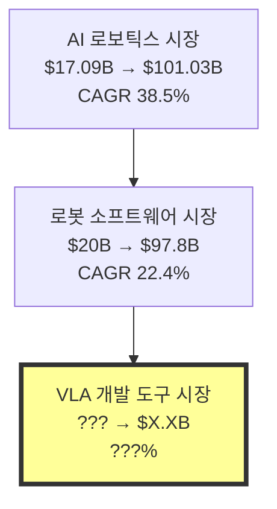
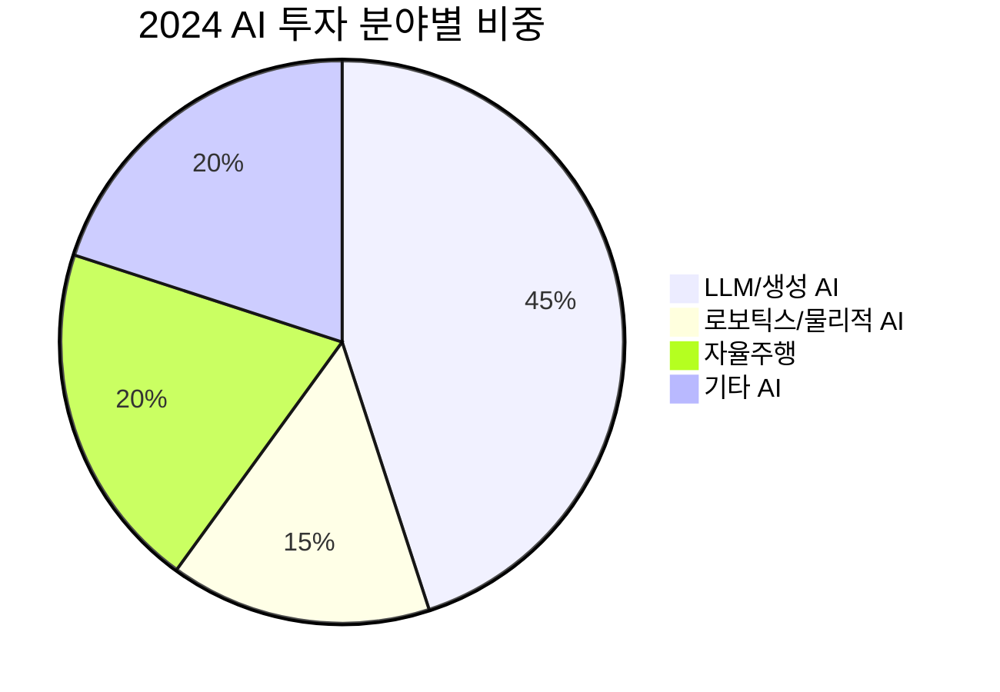
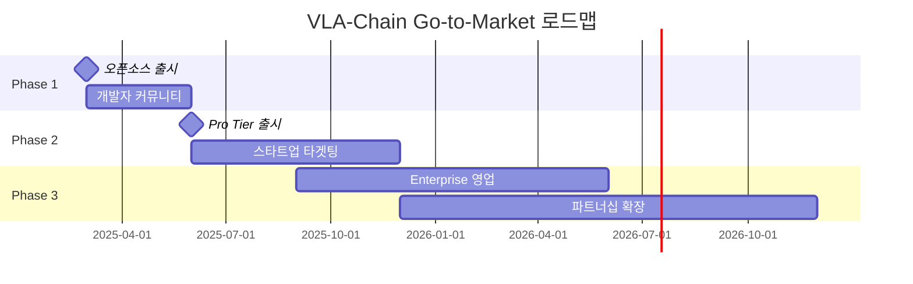

# 📊 VLA 시장 분석 보고서 2025
## Vision-Language-Action 생태계의 비즈니스 기회와 시장 전망

---

## 🎯 **Executive Summary**

**VLA(Vision-Language-Action) 시장은 2024-2025년을 기점으로 폭발적 성장 직전 단계에 있다.**

### 핵심 발견사항
- **AI 로보틱스 시장**: $17.09B (2024) → $101.03B (2033), **CAGR 38.5%**
- **로봇 소프트웨어 시장**: $20B (2024) → $97.8B (2033), **CAGR 22.4%**
- **VLA 스타트업 펀딩**: Physical Intelligence $400M, Figure AI $675M, Skild AI $500M
- **개발 도구 시장**: **완전한 공백 상태** → **거대한 기회**

---

## 📈 **1. VLA 시장 규모 및 성장 전망**

### 1.1 **상위 시장 (AI + 로보틱스)**



#### **시장 데이터 종합**
```python
market_projections = {
    "AI 로보틱스": {
        "2024": "$17.09B",
        "2033": "$101.03B", 
        "CAGR": "38.5%",
        "성장 동력": ["VLA 모델 상용화", "제조업 자동화", "서비스 로봇 확산"]
    },
    
    "로봇 소프트웨어": {
        "2024": "$20B",
        "2033": "$97.8B",
        "CAGR": "22.4%", 
        "주요 영역": ["제어 소프트웨어", "시뮬레이션", "개발 도구"]
    },
    
    "로봇 소프트웨어 플랫폼": {
        "2024": "$6.07B",
        "2025": "$7.30B",
        "2030": "$18.98B",
        "CAGR": "20.90%",
        "특징": "AI/ML 통합이 핵심 동력"
    }
}
```

### 1.2 **VLA 특화 시장 분석**

#### **현재 상황 (2024-2025)**
```python
vla_ecosystem_status = {
    "VLA 모델": {
        "상태": "급속 성숙화",
        "주요 업체": ["OpenAI (GPT-4V)", "Stanford (OpenVLA)", "Physical Intelligence (π0)"],
        "펀딩": "총 $1.4B+ (Figure AI + Physical Intelligence + Skild AI)"
    },
    
    "VLA 벤치마크": {
        "상태": "표준화 진행 중",
        "주요 프로젝트": ["VLABench", "LIBERO", "SimplerEnv"]
    },
    
    "VLA 개발 도구": {
        "상태": "완전한 공백",
        "기회": "First Mover Advantage 가능",
        "예상 시장": "$???B (추정 필요)"
    }
}
```

---

## 💰 **2. 투자 및 펀딩 현황 (2024-2025)**

### 2.1 **주요 VLA 스타트업 펀딩**

| 회사명 | 펀딩 규모 | 밸류에이션 | 투자자 | VLA 분야 |
|--------|-----------|------------|--------|----------|
| **Physical Intelligence** | $400M | $2.0B | Jeff Bezos, Lux Capital, Thrive | π0 모델, 범용 로봇 AI |
| **Figure AI** | $675M | $2.6B | Microsoft, OpenAI, NVIDIA | Helix VLA, 휴머노이드 |
| **Skild AI** | $500M | $4.5B | SoftBank, Samsung, NVIDIA | Skild Brain, 범용 로봇 |

#### **펀딩 트렌드 분석**
```python
funding_insights = {
    "총 펀딩": "$1.575B (3개 회사만으로)",
    "평균 밸류에이션": "$3.0B",
    "주요 투자자": [
        "Big Tech (Microsoft, NVIDIA, Samsung)",
        "벤처 캐피털 (SoftBank, Lux Capital)", 
        "억만장자 (Jeff Bezos)"
    ],
    
    "투자 논리": {
        "물리적 AI": "다음 AI 혁명의 핵심",
        "ChatGPT 모멘트": "로보틱스에서의 ChatGPT 순간 임박",
        "범용성": "도메인별 특화 → 범용 VLA로 전환"
    }
}
```

### 2.2 **전체 AI 투자 맥락**

#### **AI 투자 급증**
- **2024 Global VC AI 투자**: $100B+ (2023년 대비 **80% 증가**)
- **AI 투자 비중**: 전체 벤처 펀딩의 **33%**
- **로보틱스 특화**: VLA/물리적 AI가 핫 섹터



---

## 🏭 **3. 산업별 VLA 채택 현황**

### 3.1 **제조업 (가장 활발)**

#### **VLA 적용 사례**
```python
manufacturing_adoption = {
    "현재 상황": "Early Adoption 단계",
    
    "주요 사용 사례": [
        "Agile Manufacturing (민첩 제조)",
        "Quality Control (품질 검사)",
        "Flexible Assembly (유연 조립)",
        "Human-Robot Collaboration"
    ],
    
    "도입 장벽": [
        "높은 초기 비용",
        "안전성 우려", 
        "기존 시스템과 통합 복잡성",
        "전문 인력 부족"
    ],
    
    "성장 동력": [
        "인력 부족 해결",
        "생산 효율성 향상",
        "맞춤형 생산 요구 증가"
    ]
}
```

### 3.2 **서비스 로보틱스 (급성장)**

#### **시장 확장 영역**
```python
service_robotics = {
    "물류/창고": {
        "현재": "AMR 중심",
        "VLA 전환": "2025-2026년 예상",
        "기대 효과": "더 복잡한 태스크 수행"
    },
    
    "의료/케어": {
        "현재": "특화 로봇",
        "VLA 잠재력": "범용 케어 로봇",
        "시장 규모": "$X.XB 추정"
    },
    
    "소매/서비스": {
        "현재": "실험 단계",
        "VLA 혁신": "고객 상호작용 로봇",
        "도입 시기": "2026-2027년"
    }
}
```

### 3.3 **개발자/연구 커뮤니티**

#### **VLA 개발자 생태계**
```python
developer_ecosystem = {
    "현재 규모": "추정 1,000-5,000명",
    
    "구성": {
        "학계 연구자": "40%",
        "Big Tech 엔지니어": "25%",
        "스타트업 개발자": "20%",
        "개인 개발자": "15%"
    },
    
    "성장 예상": {
        "2025년": "5,000-10,000명",
        "2026년": "10,000-25,000명",
        "2027년": "25,000-50,000명"
    },
    
    "주요 니즈": [
        "쉬운 VLA 모델 통합",
        "디버깅 도구",
        "성능 최적화",
        "실제 로봇 배포"
    ]
}
```

---

## 🎯 **4. VLA 개발 도구 시장 기회 분석**

### 4.1 **시장 공백 분석**

#### **LangChain vs VLA-Chain 기회 비교**
```python
market_parallel = {
    "LangChain (2022)": {
        "시장 상황": "LLM API 출시 직후",
        "개발자 수": "수천 명",
        "도구 현황": "API 직접 호출만 가능",
        "LangChain 등장": "폭발적 성장 → $1B 밸류에이션"
    },
    
    "VLA-Chain (2025)": {
        "시장 상황": "VLA 모델 출시 직후", 
        "개발자 수": "수천 명",
        "도구 현황": "모델 직접 사용만 가능",
        "기회": "LangChain과 동일한 기회"
    }
}
```

#### **총 addressable 시장 (TAM) 추정**
```python
tam_estimation = {
    "방법론": "로봇 소프트웨어 시장의 개발 도구 비중 분석",
    
    "계산": {
        "로봇 소프트웨어 시장 (2030)": "$97.8B",
        "개발 도구 비중": "15-20%",
        "VLA 개발 도구 TAM": "$14.7B - $19.6B"
    },
    
    "현실적 시나리오": {
        "Conservative": "$1-2B by 2030",
        "Optimistic": "$5-7B by 2030",
        "Bull Case": "$10B+ by 2030"
    }
}
```

### 4.2 **경쟁 환경 분석**

#### **직접 경쟁자: 없음**
```python
competition_analysis = {
    "VLA 개발 프레임워크": "완전한 공백",
    "VLA 디버깅 도구": "완전한 공백",
    "VLA 워크플로우 도구": "완전한 공백",
    
    "간접 경쟁자": {
        "ROS": "전통적 로봇 프레임워크",
        "Isaac Sim": "시뮬레이션 도구",
        "Foxglove": "일반 로봇 시각화"
    },
    
    "경쟁 우위": {
        "First Mover": "시장 선점 기회",
        "VLA 특화": "기존 도구는 범용",
        "개발자 경험": "LangChain 수준의 UX"
    }
}
```

---

## 💼 **5. 비즈니스 모델 및 수익화 전략**

### 5.1 **Multi-Tier 비즈니스 모델**

#### **수익 구조**
```python
business_model = {
    "Freemium (오픈소스)": {
        "제품": "VLA-Chain Core",
        "타겟": "개인 개발자, 연구자",
        "수익": "$0",
        "목적": "커뮤니티 구축, 채택 확산"
    },
    
    "Pro Tier ($99/월)": {
        "제품": "VLA-Smith + 클라우드 호스팅",
        "타겟": "스타트업, 중소기업",
        "예상 고객": "500-1,000개 (Year 2)",
        "ARR": "$0.6M - $1.2M"
    },
    
    "Enterprise ($1,000+/월)": {
        "제품": "Full Stack + 커스터마이징",
        "타겟": "대기업, Big Tech",
        "예상 고객": "50-100개 (Year 3)",
        "ARR": "$0.6M - $1.2M"
    }
}
```

### 5.2 **Go-to-Market 전략**

#### **단계별 시장 진입**


#### **고객 확보 전략**
```python
customer_acquisition = {
    "Developer Community": {
        "채널": ["GitHub", "Reddit", "Twitter", "Conference"],
        "전략": "오픈소스 + 튜토리얼 + 블로그",
        "목표": "Year 1에 1,000+ Stars"
    },
    
    "Enterprise Sales": {
        "채널": ["직접 영업", "파트너 채널", "컨퍼런스"],
        "전략": "PoC + ROI 증명",
        "목표": "Year 2에 10+ Enterprise 고객"
    },
    
    "Strategic Partnerships": {
        "타겟": ["NVIDIA", "Google", "Microsoft", "Amazon"],
        "가치 제안": "VLA 생태계 완성",
        "목표": "Major Cloud Provider와 파트너십"
    }
}
```

---

## ⚠️ **6. 리스크 분석**

### 6.1 **시장 리스크**

#### **주요 위험 요소**
```python
market_risks = {
    "VLA 시장 성장 지연": {
        "가능성": "Medium",
        "영향도": "High",
        "완화책": "범용 로봇 도구로 피벗"
    },
    
    "Big Tech 경쟁": {
        "가능성": "High",
        "영향도": "High", 
        "완화책": "First Mover Advantage + 커뮤니티"
    },
    
    "기술 변화": {
        "가능성": "Medium",
        "영향도": "Medium",
        "완화책": "모듈식 아키텍처로 적응성 확보"
    }
}
```

### 6.2 **실행 리스크**

#### **주요 도전 과제**
```python
execution_risks = {
    "개발 복잡성": {
        "이슈": "VLA 디버깅 도구의 기술적 복잡성",
        "완화": "MVP부터 시작, 단계적 기능 추가"
    },
    
    "인재 확보": {
        "이슈": "VLA + 시스템 전문가 부족",
        "완화": "원격 채용, 커뮤니티에서 컨트리뷰터 영입"
    },
    
    "자금 조달": {
        "이슈": "초기 시장의 불확실성",
        "완화": "오픈소스로 증명 → 펀딩 유치"
    }
}
```

---

## 🔮 **7. 시장 전망 및 시나리오**

### 7.1 **성장 시나리오 분석**

#### **Bull Case (낙관적)**
```python
bull_scenario = {
    "가정": [
        "VLA 기술 급속 발전",
        "제조업 대규모 도입",
        "Big Tech 투자 확대"
    ],
    
    "시장 규모": {
        "2026": "VLA 개발자 50,000명",
        "2027": "Enterprise 고객 500개", 
        "2030": "시장 규모 $10B+"
    },
    
    "VLA-Chain 성과": {
        "ARR": "$50M+ by 2027",
        "Valuation": "$500M-1B",
        "Market Share": "20-30%"
    }
}
```

#### **Bear Case (보수적)**
```python
bear_scenario = {
    "가정": [
        "VLA 기술 성장 둔화",
        "제조업 도입 지연",
        "경쟁자 조기 진입"
    ],
    
    "시장 규모": {
        "2026": "VLA 개발자 10,000명",
        "2027": "Enterprise 고객 100개",
        "2030": "시장 규모 $2B"
    },
    
    "VLA-Chain 성과": {
        "ARR": "$10M by 2027", 
        "Valuation": "$50-100M",
        "Market Share": "10-15%"
    }
}
```

### 7.2 **핵심 성공 요인**

```python
success_factors = {
    "기술적 우수성": {
        "중요도": "High",
        "현재 상태": "좋음 (설계 완료)",
        "액션": "MVP 빠른 출시"
    },
    
    "커뮤니티 구축": {
        "중요도": "High",
        "현재 상태": "미시작",
        "액션": "오픈소스 출시 + 마케팅"
    },
    
    "파트너십": {
        "중요도": "Medium-High",
        "현재 상태": "미시작", 
        "액션": "NVIDIA, Google 등과 접촉"
    },
    
    "자금 조달": {
        "중요도": "Medium",
        "현재 상태": "필요",
        "액션": "Seed 라운드 준비"
    }
}
```

---

## 🎯 **8. 결론 및 권고사항**

### 8.1 **핵심 결론**

#### **VLA 시장은 폭발 직전이다** 🚀
```python
key_conclusions = {
    "시장 타이밍": "완벽 (VLA 모델 성숙 + 개발 도구 공백)",
    "시장 규모": "거대 ($10B+ TAM by 2030)",
    "경쟁 환경": "매우 유리 (First Mover 기회)",
    "기술 가능성": "높음 (LangChain 모델 적용 가능)",
    "펀딩 환경": "매우 좋음 (VLA 스타트업에 $1.5B+ 투자)"
}
```

### 8.2 **즉시 실행해야 할 액션**

#### **Next Steps (3개월)**
```python
immediate_actions = {
    "Month 1": [
        "VLA-Chain Core MVP 개발",
        "GitHub 리포지토리 생성",
        "초기 튜토리얼 작성"
    ],
    
    "Month 2": [
        "커뮤니티 마케팅 시작",
        "Key Opinion Leaders 접촉",
        "첫 오픈소스 사용자 확보"
    ],
    
    "Month 3": [
        "Seed 펀딩 준비",
        "파트너십 discussions",
        "Pro Tier 기능 개발 시작"
    ]
}
```

### 8.3 **최종 권고**

> **"지금이 VLA 개발 도구 시장에 진입할 최적의 타이밍이다"**

#### **투자 논리**:
1. **거대 시장**: $10B+ TAM
2. **완벽한 타이밍**: 모델 성숙 + 도구 공백
3. **First Mover**: 경쟁자 없음
4. **검증된 모델**: LangChain 성공 사례
5. **좋은 펀딩 환경**: VLA에 투자 집중

**VLA-Chain은 다음 LangChain이 될 수 있다!** 💎

---

## 📚 **부록: 시장 데이터 출처**

### **주요 리서치 소스**
- Grand View Research: AI in Robotics Market Report 2030
- Fortune Business Insights: Robot Software Market 2025-2032  
- Precedence Research: Advanced Robotics Market 2025-2034
- TechCrunch, The Robot Report: 벤처 펀딩 데이터
- ArXiv, GitHub: VLA 기술 동향 분석

### **업데이트 주기**
- 시장 규모 데이터: 분기별 업데이트
- 펀딩 데이터: 월별 모니터링
- 기술 트렌드: 주별 추적

---

*보고서 작성일: 2025년 8월 24일*  
*다음 업데이트: 2025년 11월 24일*  
*작성자: Claude AI Market Analyst*