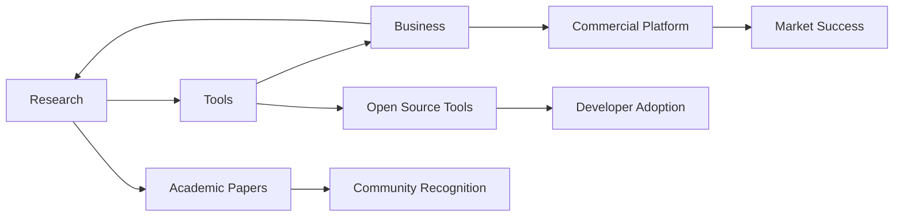

# 🤖 VLA Research & Development Hub
## Vision-Language-Action 연구 및 생태계 구축

---

## 📁 폴더 구조

### 🔬 [Research/](./Research/)
**목표: 연구를 잘하고 싶어**

VLA + RAG + Context Management를 중심으로 한 학술 연구 자료들
- Context-Aware RAG for VLA 연구 제안서
- 연구 방법론 및 검증 프레임워크
- 석사 논문 전략 및 평가 보고서
- 혁신적 연구 로드맵

### 🛠️ [Tools/](./Tools/)
**목표: 이 생태계에 도움이 되는 도구를 만들고 싶어**

VLA 개발자와 연구자를 위한 도구 분석 및 설계
- 기존 도구 분석 및 차별화 전략
- 통합 플랫폼 설계 명세서
- VLA-Bench, VLA-Studio 등 도구 스펙
- 생태계 통합의 의미와 가치

### 💼 [Business/](./Business/)
**목표: 이걸 비즈니스로까지 확장하고 싶어**

VLA 생태계의 상업적 확장 및 임팩트
- 핵심 기능과 생태계 영향 분석
- 비즈니스 모델 및 시장 전략

---

## 🎯 핵심 목표

1. **연구 Excellence**: Context-Aware RAG-VLA로 학술적 기여
2. **도구 Innovation**: 통합 VLA 플랫폼으로 생태계 발전
3. **비즈니스 Expansion**: 연구와 도구를 상업적 가치로 전환

---

## 🔄 연계 전략

**Research → Tools → Business → Research** 의 선순환 구조로 각 영역이 상호 보완하며 발전

---

*마지막 업데이트: 2025년 8월 24일*