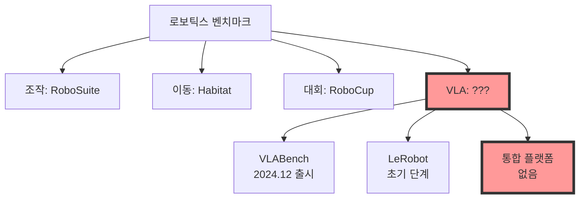

# 🔍 다른 ML 분야와 VLA 생태계 비교 분석
## "이미 다른 분야에는 있는데 VLA에만 없는 건가?"

---

## ✅ 답: 네, 다른 분야에는 이미 성숙한 통합 플랫폼들이 있습니다!

### 📊 분야별 통합 평가 플랫폼 현황

| 분야 | 통합 플랫폼 | 설립 | 규모 | 특징 |
|------|------------|------|------|------|
| **NLP** | Hugging Face | 2016 | 100만+ 사용자 | 완전 통합 생태계 |
| **CV** | Papers with Code | 2018 | 14,329개 리더보드 | 모든 논문 추적 |
| **General ML** | MLCommons/MLPerf | 2018 | 업계 표준 | 하드웨어 벤치마크 |
| **LLM** | EleutherAI lm-eval | 2020 | 사실상 표준 | 모든 LLM 평가 |
| **Robotics (일반)** | RoboCup | 1997 | 국제 대회 | 표준화된 평가 |
| **VLA** | ??? | - | **없음** | **파편화** |

---

## 🎯 1. NLP 분야: Hugging Face의 완벽한 통합

### 현재 상태 (2025)

```python
huggingface_ecosystem = {
    "모델 호스팅": "1M+ models",
    "데이터셋": "100K+ datasets",
    "평가": {
        "Open LLM Leaderboard": "통합 리더보드",
        "Evaluate Library": "원라인 평가",
        "Spaces": "웹 데모 호스팅"
    },
    "배포": {
        "Inference API": "즉시 사용",
        "Optimum": "하드웨어 최적화",
        "Gradio": "웹 UI 자동 생성"
    }
}

# 사용자 경험
from transformers import pipeline
model = pipeline("text-generation", "meta-llama/Llama-3")
result = model("Hello")  # 끝. 이게 전부
```

### VLA와 비교

| 측면 | Hugging Face (NLP) | VLA 현재 상태 |
|------|-------------------|--------------|
| **모델 업로드** | 원클릭 | 각 플랫폼 따로 |
| **평가** | 자동화 | 수동 |
| **리더보드** | 통합 | 파편화 |
| **배포** | Inference API | 없음 |
| **커뮤니티** | 100만+ | 수백명 |

---

## 📊 2. CV 분야: Papers with Code의 표준화

### 현재 상태

```python
paperswithcode_stats = {
    "리더보드": 14329,
    "태스크": 5876,
    "데이터셋": 12425,
    "논문": 167989,
    
    "특징": {
        "모든 논문 코드 연결": True,
        "표준화된 메트릭": True,
        "재현성 보장": True,
        "자동 업데이트": True
    }
}
```

### 표준화의 힘

```
연구자 발표: "ImageNet에서 92% 달성"
→ Papers with Code 자동 업데이트
→ 리더보드 등록
→ 코드 링크
→ 누구나 재현 가능
```

### VLA와 비교

VLA 분야:
- ❌ 중앙 리더보드 없음
- ❌ 논문-코드 연결 미흡  
- ❌ 표준 메트릭 부재
- ❌ 자동 업데이트 없음

---

## ⚡ 3. General ML: MLCommons/MLPerf의 업계 표준

### 2024-2025 최신 현황

```python
mlperf_2025 = {
    "MLPerf Client v1.0": {
        "출시": "2025년 7월",
        "대상": "PC/Edge AI",
        "지원": ["AMD", "Intel", "NVIDIA", "Qualcomm"],
        "모델": ["Llama 3.1", "Phi 4"]
    },
    
    "MLPerf Inference v5.0": {
        "출시": "2025년 4월",
        "Llama 405B": "첫 지원",
        "참여": "22개 기업",
        "결과": "964개 제출"
    },
    
    "특징": "하드웨어 중립적 표준 벤치마크"
}
```

### 업계 영향력

- **Intel**: "우리 칩이 MLPerf에서 1위"
- **NVIDIA**: "H100이 MLPerf 최고 성능"
- **구매자**: "MLPerf 점수로 하드웨어 선택"

### VLA와 비교

VLA 분야:
- ❌ 업계 표준 없음
- ❌ 하드웨어 벤치마크 없음
- ❌ 기업 참여 미미

---

## 🤖 4. Robotics 일반: 부분적 통합

### 기존 로보틱스 벤치마크

```python
robotics_platforms = {
    "RoboCup": {
        "since": 1997,
        "type": "Competition",
        "standard": "매우 높음",
        "but": "특정 태스크만"
    },
    
    "RoboSuite": {
        "version": "1.5 (2024.10)",
        "features": "Humanoid support",
        "but": "시뮬레이션만"
    },
    
    "LIBERO": {
        "focus": "Lifelong learning",
        "but": "VLA 미지원"
    }
}
```

### 문제: VLA 특화 플랫폼 부재



---

## 💡 5. 왜 VLA에만 없는가?

### 이유 분석

```python
reasons_for_vla_gap = {
    "1. 최신 분야": {
        "VLA 등장": "2023-2024",
        "NLP 통합": "2016부터 시작",
        "시간 차이": "7-8년"
    },
    
    "2. 복잡성": {
        "NLP": "텍스트만",
        "CV": "이미지만",
        "VLA": "비전 + 언어 + 행동 + 로봇"
    },
    
    "3. 파편화": {
        "연구 그룹": "각자 도구 개발",
        "기업": "비공개 시스템",
        "학계": "논문용 일회성 코드"
    },
    
    "4. 하드웨어 의존성": {
        "NLP": "GPU만 있으면 OK",
        "VLA": "로봇 + 센서 + 환경 필요"
    }
}
```

---

## 📈 6. 다른 분야가 보여주는 미래

### Stage 1: 파편화 (VLA 현재 위치)
```
2016 NLP: 각자 평가
2024 VLA: 각자 평가 ← 지금 여기
```

### Stage 2: 통합 시도
```
2018 NLP: Hugging Face 등장
2025 VLA: UnifiedVLA? ← 기회!
```

### Stage 3: 표준화
```
2020 NLP: HF가 사실상 표준
2027 VLA: 누군가 표준 될 것
```

### Stage 4: 생태계 완성
```
2024 NLP: 완전한 생태계
2030 VLA: 예상 시점
```

---

## 🎯 결론: VLA는 "통합 전 단계"

### 다른 분야와 비교 요약

| 분야 | 통합 수준 | VLA가 배울 점 |
|------|----------|--------------|
| **NLP (HuggingFace)** | ⭐⭐⭐⭐⭐ | 완전 통합 생태계 모델 |
| **CV (Papers with Code)** | ⭐⭐⭐⭐ | 논문-코드-리더보드 연결 |
| **ML (MLPerf)** | ⭐⭐⭐⭐ | 업계 표준 확립 방법 |
| **LLM (lm-eval)** | ⭐⭐⭐ | 평가 표준화 |
| **Robotics 일반** | ⭐⭐ | 아직 파편화 |
| **VLA** | ⭐ | 통합 필요! |

### 핵심 인사이트

> **"VLA는 NLP의 2016년 상황과 동일"**

- NLP도 파편화되어 있었음
- Hugging Face가 통합하여 해결
- VLA도 누군가 통합하면 됨

### 기회

```python
opportunity = {
    "시장 검증": "다른 분야에서 이미 증명",
    "청사진 존재": "HuggingFace 모델 참고",
    "수요 확실": "연구자들이 고통받는 중",
    "타이밍": "지금이 적기 (2025)",
    
    "예상 결과": {
        "3년 내": "VLA 표준 플랫폼 등장",
        "승자": "먼저 통합하는 팀"
    }
}
```

---

## 💡 최종 답변

**Q: 이게 다른 영역에는 있는데 VLA에는 아직 없는 건가?**

**A: 네, 맞습니다!**

- NLP: HuggingFace (완벽)
- CV: Papers with Code (성숙)
- ML: MLPerf (표준)
- **VLA: 없음 (기회!)**

**이것이 바로 UnifiedVLA가 필요한 이유입니다.**

---

*문서 작성일: 2025년 8월 24일*  
*최종 수정일: 2025년 8월 24일 오후 11시 45분*  
*분석 도구: Claude Code Assistant*

---
