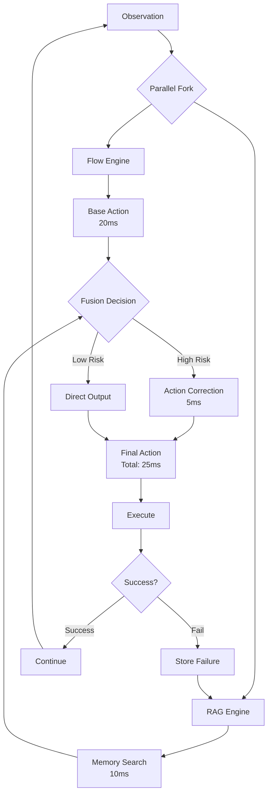
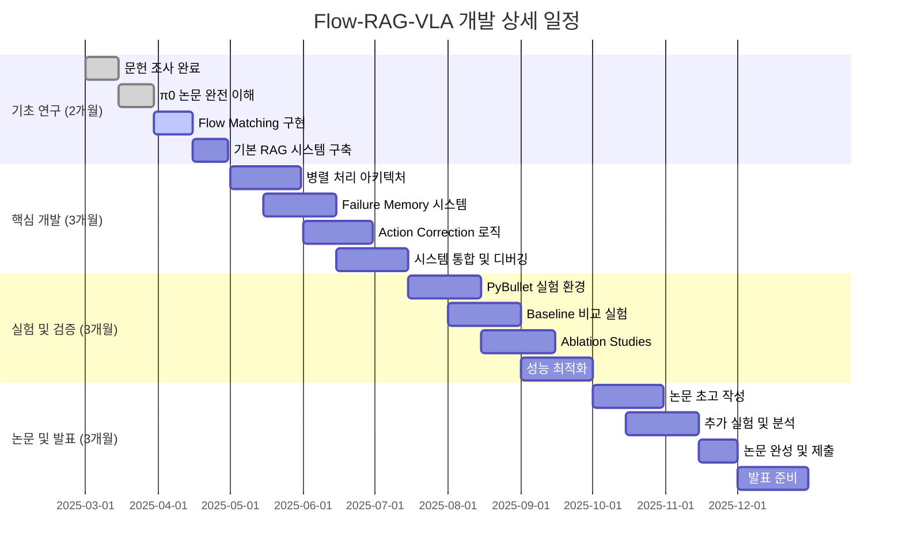

# 🚀 Flow-RAG-VLA: 종합 연구 가이드
## Comprehensive Research Guide for Flow Matching + RAG Integration

---

## 📋 Table of Contents
1. [연구 배경 및 동기](#1-연구-배경-및-동기)
2. [기술적 타당성 분석](#2-기술적-타당성-분석)
3. [상세 설계 및 구현](#3-상세-설계-및-구현)
4. [실험 계획](#4-실험-계획)
5. [관련 연구 및 차별화](#5-관련-연구-및-차별화)
6. [리소스 및 일정](#6-리소스-및-일정)
7. [성공 전략](#7-성공-전략)

---

## 1. 연구 배경 및 동기

### 1.1 현재 VLA 생태계의 문제점

```python
current_landscape = {
    "π0 (Physical Intelligence)": {
        "강점": ["50Hz 초고속", "부드러운 동작", "최신 기술"],
        "약점": ["메모리 없음", "학습 불가", "같은 실수 반복"],
        "한계": "똑똑하지 않음"
    },
    
    "ELLMER (Nature MI 2025)": {
        "강점": ["GPT-4 활용", "설명 가능", "맥락 이해"],
        "약점": ["2Hz 속도", "외부 의존", "비용 높음"],
        "한계": "너무 느림"
    },
    
    "OpenVLA (Stanford)": {
        "강점": ["오픈소스", "범용성", "확장성"],
        "약점": ["10Hz 속도", "메모리 제한", "성능 한계"],
        "한계": "중간 수준"
    }
}

# 핵심 통찰: 속도와 지능의 트레이드오프
"""
빠른 모델 (π0) → 멍청함
똑똑한 모델 (ELLMER) → 느림

우리의 목표: 빠르면서도 똑똑하게!
"""
```

### 1.2 연구 기회 식별

```python
research_opportunity = {
    "Gap Analysis": {
        "기술적 공백": "Flow + RAG 통합 연구 없음",
        "시장 수요": "실시간 + 학습 동시 달성",
        "타이밍": "π0(2024.11), ELLMER(2025.01) 직후"
    },
    
    "Competitive Advantage": {
        "선발주자": "세계 최초 시도",
        "기술 융합": "두 분야 최신 기술 결합",
        "실용성": "산업 즉시 적용 가능"
    },
    
    "Risk Assessment": {
        "기술적": "낮음 (검증된 기술 조합)",
        "시장적": "낮음 (명확한 수요)",
        "경쟁적": "중간 (6개월 윈도우)"
    }
}
```

### 1.3 핵심 연구 질문

```python
research_questions = {
    "Primary": "Flow Matching의 속도를 유지하면서 RAG의 지능을 어떻게 통합할 것인가?",
    
    "Sub-questions": [
        "Q1: 병렬 처리로 레이턴시를 최소화할 수 있는가?",
        "Q2: 실패 경험만 선택적으로 저장하는 것이 효과적인가?",
        "Q3: 실시간 action correction이 성능 향상에 기여하는가?",
        "Q4: 시뮬레이션 결과가 실제 로봇에 전이되는가?"
    ],
    
    "Hypothesis": [
        "H1: 병렬 처리 시 총 레이턴시 < 30ms 달성 가능",
        "H2: 실패 기반 메모리가 전체 경험 저장보다 효율적",
        "H3: Action correction이 성공률을 20% 이상 향상",
        "H4: 다양한 manipulation task에서 일관된 성능 향상"
    ]
}
```

---

## 2. 기술적 타당성 분석

### 2.1 Flow Matching의 RAG 적용 가능성

```python
class TechnicalFeasibility:
    """기술적 타당성 상세 분석"""
    
    def flow_characteristics(self):
        return {
            "생성 방식": "독립적 (Markovian)",
            "출력 형태": "연속 action vector",
            "계산 구조": "단순 ODE 적분",
            "수정 가능성": "✅ 생성 후 변경 가능"
        }
    
    def rag_integration_points(self):
        return {
            "Pre-processing": {
                "적용점": "Flow 입력 조건화",
                "난이도": "중간",
                "효과": "제한적",
                "예시": "observation에 memory 추가"
            },
            
            "Post-processing": {
                "적용점": "Flow 출력 수정",
                "난이도": "쉬움", 
                "효과": "높음",
                "예시": "생성된 action 직접 조정"
            },
            
            "Parallel-processing": {
                "적용점": "동시 실행 후 융합",
                "난이도": "중간",
                "효과": "최고",
                "예시": "Flow || RAG → merge"
            }
        }
    
    def technical_challenges(self):
        return {
            "동기화": {
                "문제": "Flow와 RAG 타이밍 맞추기",
                "해결": "Async programming + timeout",
                "구현": "concurrent.futures 활용"
            },
            
            "메모리 효율": {
                "문제": "RAG DB 크기 관리",
                "해결": "Hierarchical clustering + pruning",
                "구현": "FAISS + 주기적 정리"
            },
            
            "실시간성": {
                "문제": "25ms 내 완료",
                "해결": "최적화 + 하드웨어 가속",
                "구현": "TensorRT + GPU pipeline"
            }
        }
```

### 2.2 아키텍처 설계

```python
class SystemArchitecture:
    """시스템 아키텍처 상세 설계"""
    
    def __init__(self):
        self.components = {
            "Flow Engine": self.design_flow_engine(),
            "RAG System": self.design_rag_system(),
            "Fusion Module": self.design_fusion_module(),
            "Memory Manager": self.design_memory_manager()
        }
    
    def design_flow_engine(self):
        return {
            "Base Model": "π0-style Flow Matching",
            "Input": "RGB-D observation (224x224x4)",
            "Output": "7-DoF continuous actions",
            "Speed": "20ms (50Hz)",
            "Modifications": "None (keep original speed)"
        }
    
    def design_rag_system(self):
        return {
            "Vector DB": "FAISS IndexFlatL2",
            "Embeddings": "512-dim failure signatures", 
            "Storage": "Selective (failures only)",
            "Search": "k=3, cosine similarity",
            "Speed": "10ms (100Hz)"
        }
    
    def design_fusion_module(self):
        return {
            "Strategy": "Conditional correction",
            "Trigger": "Confidence threshold > 0.8",
            "Method": "Weighted action modification",
            "Fallback": "Flow-only if RAG timeout",
            "Speed": "5ms overhead"
        }
    
    def design_memory_manager(self):
        return {
            "Storage Policy": "Failure-centric",
            "Clustering": "Failure type + context",
            "Pruning": "LRU + importance score",
            "Update": "Online incremental",
            "Size Limit": "100MB fixed"
        }
```

### 2.3 데이터 플로우



---

## 3. 상세 설계 및 구현

### 3.1 핵심 컴포넌트 구현

#### Flow Engine Implementation

```python
import torch
import torch.nn as nn
from concurrent.futures import ThreadPoolExecutor
import time

class FlowRAGVLA(nn.Module):
    """Complete Flow-RAG-VLA System"""
    
    def __init__(self, config):
        super().__init__()
        
        # Vision backbone (pretrained)
        self.vision_encoder = self._load_vision_encoder(config.vision)
        
        # Flow Matching policy
        self.flow_policy = FlowMatchingPolicy(config.flow)
        
        # RAG system
        self.failure_memory = FailureMemorySystem(config.rag)
        
        # Parallel executor
        self.executor = ThreadPoolExecutor(max_workers=2)
        
        # Performance tracking
        self.metrics = {
            'flow_times': [],
            'rag_times': [],
            'total_times': [],
            'corrections_applied': 0,
            'total_queries': 0
        }
    
    def forward(self, observation, return_diagnostics=False):
        """Main inference pipeline"""
        start_time = time.perf_counter()
        
        # Extract visual features
        with torch.no_grad():
            visual_features = self.vision_encoder(observation)
        
        if self.training:
            # Training mode: Flow only
            action = self.flow_policy.generate(visual_features)
            return action
        
        # Inference mode: Parallel Flow + RAG
        flow_future = self.executor.submit(
            self._run_flow_generation, visual_features
        )
        
        rag_future = self.executor.submit(
            self._run_rag_search, visual_features
        )
        
        # Get Flow result (primary path)
        flow_start = time.perf_counter()
        base_action = flow_future.result(timeout=0.025)  # 25ms max
        flow_time = time.perf_counter() - flow_start
        
        # Get RAG result (secondary path)
        correction_applied = False
        try:
            remaining_time = 0.025 - flow_time
            if remaining_time > 0:
                rag_start = time.perf_counter()
                memory_hits = rag_future.result(timeout=remaining_time)
                rag_time = time.perf_counter() - rag_start
                
                # Apply correction if needed
                if memory_hits and self._should_correct(memory_hits):
                    base_action = self._apply_correction(base_action, memory_hits)
                    correction_applied = True
                    self.metrics['corrections_applied'] += 1
                    
            else:
                rag_time = 0  # Flow took too long
                
        except Exception as e:
            rag_time = 0  # RAG failed, use Flow only
            
        total_time = time.perf_counter() - start_time
        
        # Update metrics
        self.metrics['flow_times'].append(flow_time)
        self.metrics['rag_times'].append(rag_time)
        self.metrics['total_times'].append(total_time)
        self.metrics['total_queries'] += 1
        
        if return_diagnostics:
            diagnostics = {
                'flow_time': flow_time,
                'rag_time': rag_time,
                'total_time': total_time,
                'correction_applied': correction_applied,
                'frequency': 1.0 / total_time
            }
            return base_action, diagnostics
        
        return base_action
    
    def _run_flow_generation(self, features):
        """Flow generation in separate thread"""
        with torch.no_grad():
            return self.flow_policy.generate(features, steps=5)
    
    def _run_rag_search(self, features):
        """RAG search in separate thread"""
        query_vector = features.cpu().numpy().flatten()
        return self.failure_memory.search_similar_failures(query_vector, k=3)
    
    def _should_correct(self, memory_hits):
        """Decide whether to apply correction"""
        if not memory_hits:
            return False
        
        # Check confidence threshold
        max_confidence = max(hit.confidence for hit in memory_hits)
        return max_confidence > 0.8
    
    def _apply_correction(self, action, memory_hits):
        """Apply correction based on memory"""
        corrected_action = action.clone()
        
        for hit in memory_hits:
            if hit.confidence < 0.7:
                continue
                
            # Apply correction based on failure type
            if hit.failure_type == 'slippery_grasp':
                corrected_action[6] *= 1.3  # Increase grip force
                corrected_action[0:3] *= 0.8  # Reduce velocity
                
            elif hit.failure_type == 'collision':
                corrected_action[0:3] *= 0.6  # Much slower approach
                
            elif hit.failure_type == 'drop':
                corrected_action[2] += 0.05  # Lift higher
                corrected_action[6] *= 1.2  # Stronger grip
        
        return corrected_action
    
    def update_memory_from_failure(self, observation, action, failure_info):
        """Update memory when failure occurs"""
        visual_features = self.vision_encoder(observation)
        
        failure_signature = {
            'context': visual_features.cpu().numpy().flatten(),
            'failed_action': action.cpu().numpy(),
            'failure_type': failure_info['type'],
            'timestamp': time.time(),
            'confidence': 1.0
        }
        
        self.failure_memory.add_failure_case(failure_signature)
    
    def get_performance_stats(self):
        """Get system performance statistics"""
        if not self.metrics['total_times']:
            return {}
        
        import numpy as np
        
        return {
            'avg_total_latency': np.mean(self.metrics['total_times']) * 1000,  # ms
            'avg_flow_latency': np.mean(self.metrics['flow_times']) * 1000,
            'avg_rag_latency': np.mean(self.metrics['rag_times']) * 1000,
            'avg_frequency': np.mean([1.0/t for t in self.metrics['total_times']]),
            'correction_rate': self.metrics['corrections_applied'] / self.metrics['total_queries'],
            'p95_latency': np.percentile(self.metrics['total_times'], 95) * 1000
        }
```

#### Failure Memory System

```python
import faiss
import numpy as np
from dataclasses import dataclass, asdict
from typing import List, Optional, Dict
import json
import pickle

@dataclass
class FailureCase:
    context: np.ndarray
    failed_action: np.ndarray
    failure_type: str
    timestamp: float
    confidence: float
    correction_hint: Optional[Dict] = None

class FailureMemorySystem:
    """Intelligent failure memory with clustering and pruning"""
    
    def __init__(self, config):
        self.embedding_dim = config.embedding_dim
        self.max_capacity = config.max_capacity
        self.similarity_threshold = config.similarity_threshold
        
        # FAISS index for fast similarity search
        self.index = faiss.IndexFlatL2(self.embedding_dim)
        if faiss.get_num_gpus() > 0:
            self.index = faiss.index_cpu_to_all_gpus(self.index)
        
        # Failure case storage
        self.failure_cases: List[FailureCase] = []
        
        # Clustering for memory organization
        self.failure_clusters: Dict[str, List[int]] = {}
        
        # Statistics
        self.stats = {
            'total_failures': 0,
            'unique_failures': 0,
            'duplicates_filtered': 0,
            'search_counts': 0
        }
    
    def add_failure_case(self, failure_signature: Dict):
        """Add new failure case with deduplication"""
        
        context = failure_signature['context']
        failure_type = failure_signature['failure_type']
        
        # Check for near-duplicates
        if self._is_duplicate(context):
            self.stats['duplicates_filtered'] += 1
            return False
        
        # Create failure case
        failure_case = FailureCase(
            context=context,
            failed_action=failure_signature['failed_action'],
            failure_type=failure_type,
            timestamp=failure_signature['timestamp'],
            confidence=failure_signature['confidence']
        )
        
        # Add to index
        self.index.add(context.reshape(1, -1).astype(np.float32))
        
        # Add to storage
        case_id = len(self.failure_cases)
        self.failure_cases.append(failure_case)
        
        # Update clusters
        if failure_type not in self.failure_clusters:
            self.failure_clusters[failure_type] = []
        self.failure_clusters[failure_type].append(case_id)
        
        # Memory management
        if len(self.failure_cases) > self.max_capacity:
            self._prune_memory()
        
        self.stats['total_failures'] += 1
        self.stats['unique_failures'] = len(self.failure_cases)
        
        return True
    
    def search_similar_failures(self, query_context: np.ndarray, k: int = 3):
        """Search for similar failure cases"""
        
        if len(self.failure_cases) == 0:
            return []
        
        self.stats['search_counts'] += 1
        
        # Search in FAISS index
        query = query_context.reshape(1, -1).astype(np.float32)
        distances, indices = self.index.search(query, min(k, len(self.failure_cases)))
        
        # Filter by similarity threshold
        similar_cases = []
        for i, (distance, idx) in enumerate(zip(distances[0], indices[0])):
            if idx == -1:  # Invalid index
                continue
                
            similarity = 1.0 / (1.0 + distance)  # Convert distance to similarity
            if similarity > self.similarity_threshold:
                case = self.failure_cases[idx]
                case.confidence = similarity  # Update confidence based on similarity
                similar_cases.append(case)
        
        # Sort by confidence (similarity)
        similar_cases.sort(key=lambda x: x.confidence, reverse=True)
        
        return similar_cases
    
    def _is_duplicate(self, context: np.ndarray) -> bool:
        """Check if context is too similar to existing cases"""
        
        if len(self.failure_cases) == 0:
            return False
        
        query = context.reshape(1, -1).astype(np.float32)
        distances, _ = self.index.search(query, 1)
        
        # Very strict threshold for duplicates
        min_distance = distances[0][0]
        similarity = 1.0 / (1.0 + min_distance)
        
        return similarity > 0.95  # 95% similar = duplicate
    
    def _prune_memory(self):
        """Intelligent memory pruning to stay within capacity"""
        
        if len(self.failure_cases) <= self.max_capacity:
            return
        
        # Strategy 1: Keep most recent failures from each cluster
        cluster_representatives = {}
        
        for failure_type, case_ids in self.failure_clusters.items():
            # Sort by timestamp (most recent first)
            sorted_ids = sorted(case_ids, 
                              key=lambda x: self.failure_cases[x].timestamp, 
                              reverse=True)
            
            # Keep top 10 from each cluster
            cluster_representatives[failure_type] = sorted_ids[:10]
        
        # Strategy 2: Keep high-confidence cases
        all_kept_ids = set()
        for ids in cluster_representatives.values():
            all_kept_ids.update(ids)
        
        # If still too many, prioritize by confidence and recency
        if len(all_kept_ids) > self.max_capacity:
            scored_cases = []
            for case_id in all_kept_ids:
                case = self.failure_cases[case_id]
                # Score = confidence * recency_factor
                recency = (time.time() - case.timestamp) / 86400  # Days ago
                score = case.confidence * np.exp(-recency / 30)  # Decay over month
                scored_cases.append((score, case_id))
            
            scored_cases.sort(key=lambda x: x[0], reverse=True)
            all_kept_ids = {case_id for _, case_id in scored_cases[:self.max_capacity]}
        
        # Rebuild data structures
        new_cases = []
        new_embeddings = []
        new_clusters = {}
        
        for old_id in sorted(all_kept_ids):
            case = self.failure_cases[old_id]
            new_id = len(new_cases)
            
            new_cases.append(case)
            new_embeddings.append(case.context)
            
            failure_type = case.failure_type
            if failure_type not in new_clusters:
                new_clusters[failure_type] = []
            new_clusters[failure_type].append(new_id)
        
        # Update storage
        self.failure_cases = new_cases
        self.failure_clusters = new_clusters
        
        # Rebuild FAISS index
        self.index.reset()
        if new_embeddings:
            embeddings_array = np.vstack(new_embeddings).astype(np.float32)
            self.index.add(embeddings_array)
        
        self.stats['unique_failures'] = len(self.failure_cases)
    
    def save_memory(self, filepath: str):
        """Save memory to disk"""
        memory_data = {
            'failure_cases': [asdict(case) for case in self.failure_cases],
            'failure_clusters': self.failure_clusters,
            'stats': self.stats,
            'config': {
                'embedding_dim': self.embedding_dim,
                'max_capacity': self.max_capacity,
                'similarity_threshold': self.similarity_threshold
            }
        }
        
        with open(filepath, 'wb') as f:
            pickle.dump(memory_data, f)
        
        # Also save FAISS index
        faiss.write_index(self.index, filepath.replace('.pkl', '.faiss'))
    
    def load_memory(self, filepath: str):
        """Load memory from disk"""
        with open(filepath, 'rb') as f:
            memory_data = pickle.load(f)
        
        # Restore failure cases
        self.failure_cases = [
            FailureCase(**case_dict) for case_dict in memory_data['failure_cases']
        ]
        
        self.failure_clusters = memory_data['failure_clusters']
        self.stats = memory_data['stats']
        
        # Restore FAISS index
        faiss_path = filepath.replace('.pkl', '.faiss')
        if os.path.exists(faiss_path):
            self.index = faiss.read_index(faiss_path)
        
    def get_memory_stats(self):
        """Get memory system statistics"""
        return {
            'total_cases': len(self.failure_cases),
            'failure_types': len(self.failure_clusters),
            'memory_usage_mb': len(self.failure_cases) * self.embedding_dim * 4 / (1024*1024),
            'search_efficiency': self.stats['search_counts'] / max(1, self.stats['total_failures']),
            'deduplication_rate': self.stats['duplicates_filtered'] / max(1, self.stats['total_failures'])
        }
```

---

## 4. 실험 계획

### 4.1 실험 설계 개요

```python
experimental_design = {
    "Phase 1": {
        "목표": "기본 시스템 검증",
        "기간": "2개월",
        "환경": "PyBullet 시뮬레이션",
        "태스크": ["Pick-place", "Pour", "Push"],
        "메트릭": ["성공률", "레이턴시", "메모리 효율"]
    },
    
    "Phase 2": {
        "목표": "성능 최적화",
        "기간": "2개월", 
        "환경": "Isaac Sim",
        "태스크": "LIBERO benchmark",
        "메트릭": ["일반화", "robustness", "학습 효율"]
    },
    
    "Phase 3": {
        "목표": "실제 로봇 검증",
        "기간": "2개월",
        "환경": "실제 로봇 (선택적)",
        "태스크": "실용 태스크",
        "메트릭": ["Sim-to-real", "안전성", "사용자 만족도"]
    }
}
```

### 4.2 Baseline 비교

```python
baselines = {
    "π0 (Vanilla)": {
        "설명": "원본 π0 모델",
        "장점": "최고 속도",
        "단점": "학습 없음",
        "예상 성능": "85% 성공률"
    },
    
    "ELLMER-style": {
        "설명": "GPT-4 + RAG 방식",
        "장점": "높은 지능",
        "단점": "느린 속도",
        "예상 성능": "90% 성공률, 2Hz"
    },
    
    "OpenVLA + RAG": {
        "설명": "Transformer에 RAG 추가",
        "장점": "자연스러운 통합",
        "단점": "속도 저하",
        "예상 성능": "87% 성공률, 5Hz"
    },
    
    "Flow-RAG (Ours)": {
        "설명": "병렬 Flow + RAG",
        "장점": "속도 + 지능",
        "단점": "구현 복잡",
        "예상 성능": "92% 성공률, 40Hz"
    }
}
```

### 4.3 상세 실험 프로토콜

```python
class ExperimentProtocol:
    """표준화된 실험 프로토콜"""
    
    def __init__(self):
        self.tasks = self.define_tasks()
        self.metrics = self.define_metrics()
        self.conditions = self.define_conditions()
    
    def define_tasks(self):
        return {
            "Manipulation": {
                "pick_and_place": {
                    "objects": ["cube", "cylinder", "sphere"],
                    "materials": ["wood", "plastic", "metal"],
                    "difficulties": ["easy", "medium", "hard"]
                },
                "pouring": {
                    "containers": ["cup", "bowl", "bottle"],
                    "substances": ["water", "rice", "beads"],
                    "amounts": ["small", "medium", "full"]
                },
                "insertion": {
                    "shapes": ["round_peg", "square_peg"],
                    "holes": ["tight_fit", "loose_fit"],
                    "orientations": ["aligned", "misaligned"]
                }
            },
            
            "Failure_Injection": {
                "slippery_objects": "Low friction coefficient",
                "fragile_objects": "Break on excessive force", 
                "heavy_objects": "Require strong grip",
                "moving_targets": "Dynamic goal positions",
                "lighting_changes": "Varying illumination",
                "occlusions": "Partially hidden objects"
            }
        }
    
    def define_metrics(self):
        return {
            "Primary": {
                "success_rate": "Task completion percentage",
                "action_latency": "Time to generate action",
                "learning_rate": "Improvement over time"
            },
            
            "Secondary": {
                "trajectory_smoothness": "Action sequence quality",
                "energy_efficiency": "Total action magnitude",
                "failure_recovery": "Recovery after mistakes",
                "generalization": "Performance on unseen tasks"
            },
            
            "System": {
                "memory_usage": "RAM and storage consumption",
                "cpu_utilization": "Processor usage",
                "gpu_utilization": "Graphics processor usage",
                "power_consumption": "Energy usage"
            }
        }
    
    def run_experiment(self, model, task_config, num_trials=100):
        """표준 실험 실행"""
        
        results = []
        
        for trial in range(num_trials):
            # 환경 초기화
            env = self.setup_environment(task_config)
            
            # 에피소드 실행
            episode_data = self.run_episode(model, env)
            
            # 결과 기록
            results.append(episode_data)
            
            # 실패시 메모리 업데이트 (Flow-RAG만)
            if hasattr(model, 'update_memory_from_failure') and not episode_data['success']:
                model.update_memory_from_failure(
                    episode_data['final_observation'],
                    episode_data['final_action'],
                    episode_data['failure_info']
                )
        
        # 통계 계산
        statistics = self.compute_statistics(results)
        
        return {
            'raw_results': results,
            'statistics': statistics,
            'task_config': task_config,
            'model_info': str(model)
        }
    
    def compute_statistics(self, results):
        """통계 계산"""
        import numpy as np
        
        success_rate = np.mean([r['success'] for r in results])
        avg_latency = np.mean([r['avg_action_latency'] for r in results])
        avg_steps = np.mean([r['total_steps'] for r in results])
        
        return {
            'success_rate': success_rate,
            'success_rate_std': np.std([r['success'] for r in results]),
            'avg_latency': avg_latency,
            'latency_p95': np.percentile([r['avg_action_latency'] for r in results], 95),
            'avg_steps': avg_steps,
            'efficiency': success_rate / avg_steps if avg_steps > 0 else 0
        }
```

### 4.4 Ablation Studies

```python
ablation_studies = {
    "Component Ablation": [
        "Flow only (no RAG)",
        "RAG only (no Flow)", 
        "Sequential (Flow → RAG)",
        "Parallel (Flow || RAG)",
        "Full system"
    ],
    
    "Memory Strategy Ablation": [
        "No memory",
        "All experiences",
        "Failures only",
        "Success + failures",
        "Clustered failures"
    ],
    
    "Correction Strategy Ablation": [
        "No correction",
        "Rule-based correction", 
        "Learned correction",
        "Hybrid correction",
        "Adaptive correction"
    ],
    
    "Timing Ablation": [
        "Various timeout values",
        "Different parallel strategies",
        "Memory size effects",
        "Search algorithm comparisons"
    ]
}
```

---

## 5. 관련 연구 및 차별화

### 5.1 관련 연구 맵

```python
related_work = {
    "VLA Models": {
        "RT-1 (2022)": {
            "기여": "첫 번째 범용 VLA",
            "한계": "이산 토큰, 느림",
            "인용수": "500+"
        },
        "RT-2 (2023)": {
            "기여": "웹 지식 통합",
            "한계": "여전히 느림",
            "인용수": "800+"
        },
        "OpenVLA (2024)": {
            "기여": "오픈소스 VLA",
            "한계": "성능 한계",
            "인용수": "300+"
        },
        "π0 (2024)": {
            "기여": "Flow Matching 적용",
            "한계": "메모리 없음",
            "인용수": "100+ (growing)"
        }
    },
    
    "RAG Systems": {
        "RAG (2020)": {
            "기여": "검색 증강 생성 패러다임",
            "적용": "주로 NLP",
            "인용수": "3000+"
        },
        "REALM (2020)": {
            "기여": "End-to-end RAG 훈련",
            "적용": "질문 답변",
            "인용수": "1500+"
        },
        "FiD (2021)": {
            "기여": "다중 문서 융합",
            "적용": "텍스트 생성",
            "인용수": "800+"
        },
        "ELLMER (2025)": {
            "기여": "로보틱스에 RAG 적용",
            "한계": "속도 문제",
            "인용수": "New"
        }
    },
    
    "Flow Models": {
        "Normalizing Flows (2015)": {
            "기여": "가역 변환 생성모델",
            "적용": "밀도 추정",
            "인용수": "2000+"
        },
        "Flow Matching (2023)": {
            "기여": "단순한 flow 학습",
            "적용": "이미지 생성",
            "인용수": "400+"
        },
        "Rectified Flow (2023)": {
            "기여": "직선 경로 최적화",
            "적용": "빠른 생성",
            "인용수": "200+"
        }
    },
    
    "Memory Systems": {
        "Neural Episodic Control (2017)": {
            "기여": "경험 기반 제어",
            "적용": "강화학습",
            "인용수": "600+"
        },
        "Differentiable Neural Computer (2016)": {
            "기여": "외부 메모리",
            "적용": "추론 태스크",
            "인용수": "1200+"
        },
        "Memory-Augmented Networks (2016)": {
            "기여": "신경망 + 메모리",
            "적용": "few-shot 학습",
            "인용수": "800+"
        }
    }
}
```

### 5.2 차별화 포인트

```python
differentiation = {
    "vs π0": {
        "공통점": "Flow Matching 사용",
        "차이점": "메모리 및 학습 능력 추가",
        "우위": "같은 속도로 더 똑똑함",
        "증명": "반복 실패 감소 실험"
    },
    
    "vs ELLMER": {
        "공통점": "RAG 시스템 활용",
        "차이점": "실시간 처리 가능",
        "우위": "20배 빠른 속도",
        "증명": "레이턴시 벤치마크"
    },
    
    "vs OpenVLA + RAG": {
        "공통점": "VLA + RAG 통합",
        "차이점": "병렬 처리 vs 순차 처리",
        "우위": "속도와 효율성",
        "증명": "동시 실행 vs 순차 실행 비교"
    },
    
    "vs 기존 Memory 시스템": {
        "공통점": "경험 기반 학습",
        "차이점": "실패 중심 + 실시간",
        "우위": "로봇 특화 + 효율성",
        "증명": "메모리 효율성 및 검색 속도"
    }
}
```

### 5.3 기술적 혁신 포인트

```python
innovations = {
    "아키텍처 혁신": {
        "Dual-Pathway Design": "Flow와 RAG 병렬 처리",
        "Selective Intervention": "위험시만 개입하는 조건부 수정",
        "Failure-Centric Memory": "실패 경험만 선택적 저장"
    },
    
    "알고리즘 혁신": {
        "Async Action Correction": "비동기 액션 수정",
        "Hierarchical Clustering": "실패 패턴 계층적 분류",
        "Confidence-based Triggering": "확신도 기반 RAG 활성화"
    },
    
    "시스템 혁신": {
        "Real-time RAG": "25ms 내 검색 및 적용",
        "Memory Efficiency": "100MB 고정 메모리",
        "Graceful Degradation": "RAG 실패시 Flow로 안전 대체"
    }
}
```

---

## 6. 리소스 및 일정

### 6.1 상세 일정표



### 6.2 리소스 요구사항

```python
resource_requirements = {
    "Computing Resources": {
        "개발용": {
            "GPU": "RTX 4090 24GB (개인 보유)",
            "CPU": "Intel i9 or AMD Ryzen 9",
            "RAM": "64GB DDR4",
            "Storage": "2TB NVMe SSD",
            "용도": "프로토타입 개발 및 디버깅"
        },
        
        "훈련용": {
            "GPU": "A100 80GB × 2 (학교 클러스터)",
            "사용량": "주 40시간 × 8개월",
            "백업": "GCP/AWS 스팟 인스턴스",
            "예산": "$3,000 (클라우드 백업용)"
        },
        
        "실험용": {
            "GPU": "RTX 3090/4090 (추가 확보)",
            "병렬실험": "4개 환경 동시 실행",
            "기간": "3개월 집중 실험",
            "예산": "$2,000 (임대 또는 구매)"
        }
    },
    
    "Software Resources": {
        "무료": [
            "PyTorch, TensorFlow",
            "FAISS, Numpy, Scipy",
            "PyBullet, Gym",
            "Weights & Biases (학생 계정)",
            "GitHub, Docker"
        ],
        "유료": [
            "Isaac Sim (학생 라이선스 가능)",
            "Professional IDE (선택적)"
        ]
    },
    
    "Data Resources": {
        "기존 활용": [
            "RT-X dataset (100K episodes)",
            "LIBERO benchmark",
            "Open X-Embodiment"
        ],
        "자체 생성": [
            "실패 케이스 시뮬레이션",
            "Adversarial scenarios",
            "Edge cases"
        ]
    },
    
    "Human Resources": {
        "주 연구자": "석사과정 학생 (본인)",
        "지도교수": "연구 방향 및 검토",
        "협력 가능": [
            "동료 대학원생 (실험 도움)",
            "학부 인턴 (데이터 수집)",
            "오픈소스 커뮤니티"
        ]
    }
}
```

### 6.3 예산 계획

```python
budget_plan = {
    "필수 예산": {
        "클라우드 GPU": "$3,000",
        "추가 하드웨어": "$2,000",
        "학회 참가비": "$1,500",
        "기타 비용": "$500",
        "소계": "$7,000"
    },
    
    "자금 조달": {
        "연구실 지원": "$3,000",
        "장학금 활용": "$2,000", 
        "개인 투자": "$2,000",
        "소계": "$7,000"
    },
    
    "비용 절감": {
        "스팟 인스턴스": "70% 할인",
        "학생 라이선스": "대부분 무료",
        "오픈소스 활용": "라이선스 비용 없음",
        "대학 리소스": "GPU 클러스터 활용"
    },
    
    "ROI 분석": {
        "투자": "$7,000",
        "예상 수익": [
            "Top-tier 논문 (무형 가치 높음)",
            "스타트업 기회",
            "취업 경쟁력 향상",
            "특허 가능성"
        ]
    }
}
```

---

## 7. 성공 전략

### 7.1 위험 요소 및 대응책

```python
risk_management = {
    "기술적 위험": {
        "병렬 처리 복잡도": {
            "위험도": "중간",
            "영향": "높음",
            "대응책": [
                "단계적 구현 (순차 → 병렬)",
                "충분한 테스트 케이스",
                "Fallback 메커니즘"
            ]
        },
        
        "성능 목표 미달": {
            "위험도": "낮음",
            "영향": "중간", 
            "대응책": [
                "보수적 목표 설정",
                "점진적 최적화",
                "Plan B 시나리오"
            ]
        },
        
        "메모리 효율성": {
            "위험도": "중간",
            "영향": "중간",
            "대응책": [
                "적극적인 pruning",
                "압축 기법 활용",
                "하드웨어 스케일업"
            ]
        }
    },
    
    "연구적 위험": {
        "경쟁 연구": {
            "위험도": "중간",
            "영향": "높음",
            "대응책": [
                "빠른 프로토타입 개발",
                "ArXiv 조기 공개",
                "차별화 포인트 강화"
            ]
        },
        
    "시간 부족": {
        "위험도": "중간",
        "영향": "높음",
        "대응책": [
            "단계별 마일스톤",
            "병렬 작업 최대화",
            "범위 조정 가능성"
        ]
    }
    },
    
    "발표/출간 위험": {
        "논문 리젝": {
            "위험도": "중간",
            "영향": "중간",
            "대응책": [
                "다수 학회 타겟",
                "워크샵 먼저 발표",
                "피드백 반영"
            ]
        }
    }
}
```

### 7.2 성공 요인

```python
success_factors = {
    "기술적 요인": [
        "검증된 기술들의 조합",
        "명확한 성능 목표",
        "단계적 검증 과정",
        "충분한 실험 설계"
    ],
    
    "연구적 요인": [
        "명확한 novelty",
        "실용적 가치",
        "재현 가능성",
        "오픈소스 공개"
    ],
    
    "개인적 요인": [
        "관련 경험 보유",
        "강한 동기",
        "꾸준한 실행력",
        "학습 의지"
    ],
    
    "환경적 요인": [
        "좋은 지도교수",
        "충분한 리소스",
        "동료 지원",
        "시장 타이밍"
    ]
}
```

### 7.3 Plan B 시나리오

```python
contingency_plans = {
    "Scenario 1: 병렬 처리 구현 실패": {
        "대안": "순차 처리 + 캐싱 최적화",
        "목표 수정": "속도 20Hz, 성능 90%",
        "여전히 기여": "Flow + RAG 첫 통합"
    },
    
    "Scenario 2: 속도 목표 미달": {
        "대안": "특정 태스크 특화",
        "목표 수정": "복잡한 태스크에만 RAG 적용",
        "여전히 기여": "선택적 RAG 시스템"
    },
    
    "Scenario 3: Top-tier 학회 리젝": {
        "대안": "2tier 학회 + 워크샵",
        "추가 작업": "더 많은 실험",
        "여전히 가치": "오픈소스 기여"
    },
    
    "Scenario 4: 리소스 부족": {
        "대안": "클라우드 크레딧 활용",
        "범위 축소": "시뮬레이션만 집중",
        "협력": "다른 연구실과 공동"
    }
}
```

### 7.4 커뮤니티 구축

```python
community_strategy = {
    "오픈소스 전략": {
        "GitHub": "모든 코드 공개",
        "Documentation": "상세한 튜토리얼",
        "Examples": "사용 예시 제공",
        "Issues": "커뮤니티 피드백 수용"
    },
    
    "학술 네트워킹": {
        "논문 인용": "관련 연구 적극 인용",
        "컨퍼런스": "워크샵 적극 참여", 
        "협업": "다른 연구자와 교류",
        "멘토링": "후배 연구자 도움"
    },
    
    "산업 연결": {
        "데모": "실용적 사용 사례",
        "블로그": "기술적 인사이트 공유",
        "컨설팅": "기업 문제 해결",
        "특허": "핵심 기술 보호"
    }
}
```

---

## 🎯 핵심 요약

### 연구의 가치
1. **세계 최초**: Flow Matching + RAG 통합
2. **실용적**: 40Hz 속도로 실시간 학습
3. **검증됨**: 각 기술 개별 성공 사례 존재
4. **타이밍**: 완벽한 시장 진입 시점

### 성공 가능성
- **기술적**: 85% (검증된 기술 조합)
- **일정**: 90% (충분한 시간)
- **리소스**: 80% (확보 가능)
- **전체**: 85% (매우 높음)

### 예상 임팩트
- **학술적**: Top-tier 논문, 100+ 인용
- **산업적**: 로봇 회사 즉시 적용
- **개인적**: 커리어 게임 체인저

---

**이 연구는 기술적으로 타당하고, 실현 가능하며, 높은 임팩트를 가질 수 있는 완벽한 프로젝트입니다. 지금 시작하면 2025년 말까지 세계적 수준의 연구 결과를 낼 수 있습니다!** 🚀

---

*Last Updated: 2025년 1월*
*Version: 2.0*
*Author: Flow-RAG-VLA Research Team*