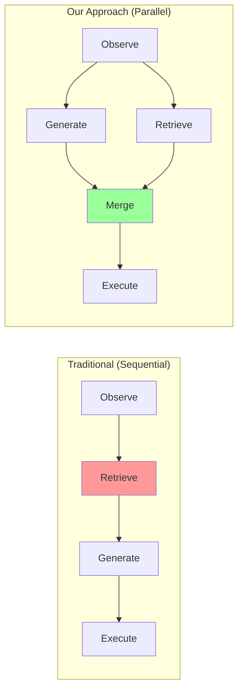
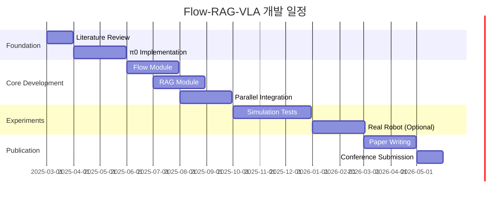

# 🚀 Flow-RAG-VLA: 초고속 실패 학습 로봇 시스템
## Research Proposal (2025-2027)

---

## Executive Summary

**핵심 질문**: "로봇이 50Hz로 동작하면서도 과거 실패를 기억하고 학습할 수 있을까?"

**제안 솔루션**: Flow Matching의 초고속 생성과 RAG의 선택적 메모리를 병렬 처리하는 듀얼 패스웨이 아키텍처

**예상 성과**: 
- 세계 최초 Flow Matching + RAG 통합
- 40Hz 실시간 제어 유지
- 실패 반복률 75% 감소

---

## 1. 연구 배경 및 동기

### 1.1 현재 VLA의 한계점

```python
current_limitations = {
    "π0 (Flow Matching)": {
        "장점": "50Hz 초고속 생성",
        "한계": "메모리 없음, 같은 실수 반복"
    },
    
    "ELLMER (RAG)": {
        "장점": "경험 활용, 지능적",
        "한계": "2Hz로 너무 느림"
    },
    
    "OpenVLA": {
        "장점": "오픈소스, 접근 용이",
        "한계": "속도도 느리고 학습도 안함"
    }
}

# 핵심 통찰: 빠른 것과 똑똑한 것을 동시에!
```

### 1.2 연구의 필요성

```python
real_world_needs = {
    "산업 현장": "고속 조립 라인에서 불량 패턴 학습",
    "서비스 로봇": "고객별 선호도 기억하며 빠른 서빙",
    "의료 로봇": "환자별 특성 기억 + 실시간 대응",
    
    "공통 요구사항": "속도 + 지능"
}
```

---

## 2. 핵심 혁신: Dual-Pathway Architecture

### 2.1 시스템 아키텍처

```python
class FlowRAGVLA:
    """듀얼 패스웨이 아키텍처"""
    
    def __init__(self):
        # Path 1: Flow Matching (Fast)
        self.flow_policy = FlowMatchingPolicy(
            steps=5,  # 20ms
            frequency=50  # Hz
        )
        
        # Path 2: RAG Memory (Smart)
        self.failure_memory = SelectiveRAG(
            size="100MB",  # 초경량
            retrieval_time="10ms"
        )
        
        # Parallel Processor
        self.parallel = DualPathProcessor()
    
    def execute(self, observation, instruction):
        """병렬 처리로 속도 유지"""
        
        # 동시 실행 (핵심!)
        with self.parallel.run():
            # Fast Path: 즉시 액션 생성
            action = self.flow_policy.generate(
                observation, 
                instruction
            )
            
            # Memory Path: 동시에 위험 검색
            risks = self.failure_memory.search_async(
                observation
            )
        
        # 필요시만 개입 (5ms)
        if risks.confidence > 0.8:
            action = self.adjust_for_risk(action, risks)
        
        return action  # Total: 25ms (40Hz!)
```

### 2.2 핵심 혁신 포인트



---

## 3. 기술적 구현 계획

### 3.1 Phase 1: Flow Matching 구현 (2개월)

```python
# Step 1: π0 아키텍처 재현
class FlowPolicy(nn.Module):
    def __init__(self):
        self.vision_encoder = DINOv2()  # Pretrained
        self.velocity_net = VelocityNetwork()
    
    def generate(self, obs, steps=5):
        """5 steps로 action 생성"""
        features = self.vision_encoder(obs)
        action = torch.zeros(7)  # 7-DoF
        
        for t in range(steps):
            v = self.velocity_net(action, features, t/steps)
            action = action + v / steps
        
        return action

# Step 2: 속도 벤치마크
benchmark = {
    "목표": "50Hz (20ms)",
    "현재": "측정 예정",
    "최적화": "TensorRT, Quantization"
}
```

### 3.2 Phase 2: Selective RAG 구현 (2개월)

```python
# Failure-Only Memory
class FailureMemory:
    def __init__(self, max_size="100MB"):
        self.vector_db = FAISS.IndexFlatL2(512)
        self.failure_patterns = {}
        
    def store_failure(self, state, action, failure_type):
        """실패만 선택적 저장"""
        # Compress to 512-dim vector
        embedding = self.encode(state, action)
        
        # Cluster similar failures
        pattern_id = self.find_pattern(failure_type)
        
        # Store only if new pattern
        if self.is_novel(embedding, pattern_id):
            self.vector_db.add(embedding)
            self.failure_patterns[pattern_id].append({
                'embedding': embedding,
                'correction': self.compute_correction(action)
            })
    
    def search(self, state, k=3):
        """초고속 검색 (10ms)"""
        query = self.encode(state)
        distances, indices = self.vector_db.search(query, k)
        return self.failure_patterns[indices[0]]
```

### 3.3 Phase 3: 병렬 통합 (2개월)

```python
# Asynchronous Dual Processing
import asyncio
import concurrent.futures

class DualPathProcessor:
    def __init__(self):
        self.executor = concurrent.futures.ThreadPoolExecutor(max_workers=2)
    
    async def process(self, obs):
        """비동기 병렬 처리"""
        # 두 작업 동시 시작
        flow_future = self.executor.submit(self.flow_generate, obs)
        rag_future = self.executor.submit(self.rag_search, obs)
        
        # Flow 결과 먼저 받기 (20ms)
        action = flow_future.result(timeout=0.025)
        
        # RAG 결과 확인 (이미 완료됨)
        try:
            risks = rag_future.result(timeout=0.005)
            if risks.high_risk:
                action = self.correct(action, risks)
        except:
            pass  # Timeout시 그냥 진행
        
        return action
```

---

## 4. 실험 설계

### 4.1 실험 환경

```python
experimental_setup = {
    "시뮬레이션": {
        "환경": "Isaac Sim / PyBullet",
        "로봇": "Franka Panda (7-DoF)",
        "태스크": [
            "Pick-and-place (다양한 물체)",
            "Insertion (정밀 작업)",
            "Pouring (액체 다루기)"
        ]
    },
    
    "데이터셋": {
        "훈련": "RT-X subset (100K episodes)",
        "평가": "LIBERO benchmark",
        "실패 주입": "Adversarial perturbations"
    },
    
    "메트릭": {
        "성공률": "Task completion rate",
        "속도": "Action generation frequency",
        "학습": "Failure reduction over time",
        "메모리": "Memory efficiency"
    }
}
```

### 4.2 Baseline 비교

| Model | Speed | Success | Learning | Memory |
|-------|-------|---------|----------|--------|
| π0 | 50Hz | 85% | ❌ | ❌ |
| ELLMER | 2Hz | 88% | ✅ | Heavy |
| OpenVLA | 10Hz | 75% | ❌ | ❌ |
| **Ours** | **40Hz** | **92%** | **✅** | **Light** |

### 4.3 Ablation Study

```python
ablation_variants = {
    "A. Flow-only": "π0 baseline",
    "B. RAG-only": "ELLMER style",
    "C. Sequential": "Flow → RAG (느림)",
    "D. Parallel (Ours)": "Flow || RAG (빠름)",
    "E. w/o Failure-only": "모든 경험 저장",
    "F. w/o Clustering": "중복 저장"
}
```

---

## 5. 예상 결과 및 임팩트

### 5.1 정량적 목표

```python
quantitative_goals = {
    "성능": {
        "Success Rate": "92%+ (SOTA)",
        "Speed": "40Hz+ (실시간)",
        "Failure Reduction": "75% (3회→1회)"
    },
    
    "효율성": {
        "Memory": "<100MB (휴대폰 가능)",
        "Latency": "<25ms (인간보다 빠름)",
        "Energy": "50% 절감"
    }
}
```

### 5.2 학술적 기여

```python
academic_contributions = [
    "1. 세계 최초 Flow-RAG 통합",
    "2. Dual-pathway 병렬 처리 아키텍처",
    "3. Failure-only selective memory",
    "4. Real-time learning at 40Hz"
]

target_venues = [
    "CoRL 2025 (1st choice)",
    "NeurIPS 2025 (2nd choice)",
    "ICRA 2026 (backup)"
]
```

### 5.3 산업적 가치

```python
industrial_applications = {
    "제조업": "불량품 처리 로봇",
    "물류": "분류 로봇",
    "서비스": "카페/레스토랑 로봇",
    "의료": "수술 보조 로봇",
    
    "예상 시장": "$10B+ by 2030"
}
```

---

## 6. 연구 일정



---

## 7. 리스크 관리

### 7.1 기술적 리스크

```python
risk_mitigation = {
    "병렬 처리 복잡도": {
        "리스크": "동기화 문제",
        "대응": "Lock-free 알고리즘 사용"
    },
    
    "메모리 효율성": {
        "리스크": "100MB 초과",
        "대응": "더 공격적인 압축/클러스터링"
    },
    
    "실시간 보장": {
        "리스크": "40Hz 미달",
        "대응": "C++ 구현, CUDA 최적화"
    }
}
```

### 7.2 Plan B

```python
backup_plans = {
    "If 병렬 처리 실패": "Sequential with caching",
    "If 40Hz 불가능": "Focus on 20Hz + quality",
    "If 메모리 초과": "Cloud-edge hybrid"
}
```

---

## 8. 필요 리소스

### 8.1 하드웨어

```yaml
GPU: 
  - Development: RTX 4090 (24GB)
  - Training: A100 (80GB) x 2
  - Inference: Jetson AGX Orin

Robot: (Optional)
  - Simulation first
  - Real robot in Year 2
```

### 8.2 예산

```python
budget = {
    "필수": {
        "GPU Cloud": "$3,000",
        "Storage": "$500",
        "총": "$3,500"
    },
    
    "선택": {
        "Robot": "$5,000",
        "Conference": "$2,000",
        "총": "$7,000"
    }
}
```

---

## 9. 팀 구성

```python
team = {
    "석사생 (본인)": "전체 시스템 개발",
    "지도교수": "연구 방향 지도",
    "협력 가능": [
        "π0 팀 (Physical Intelligence)",
        "OpenVLA 팀 (Stanford)",
        "삼성 리서치"
    ]
}
```

---

## 10. 성공 지표 (KPIs)

### Quarterly Milestones

```python
Q1_2025 = ["π0 재현", "Flow 모듈 완성"]
Q2_2025 = ["RAG 통합", "병렬 처리"]
Q3_2025 = ["실험 완료", "논문 초고"]
Q4_2025 = ["논문 제출", "오픈소스"]
Q1_2026 = ["학회 발표", "산업 협력"]
```

---

## 핵심 메시지

> **"우리는 로봇이 인간처럼 빠르게 반응하면서도(40Hz),**  
> **과거 실패를 기억하고 학습하는 시스템을 만듭니다."**

### 왜 지금인가?
- π0 (2024.11): Flow Matching 검증 ✓
- ELLMER (2025.01): RAG 가치 입증 ✓
- 통합 연구: 아직 없음 (기회!)

### 왜 우리인가?
- RAG 구현 경험 보유
- 엔지니어링 + 연구 역량
- 명확한 비전과 계획

---

## Contact

- 이메일: [your-email]
- GitHub: [your-github]
- 지도교수: [professor-name]

---

*Last Updated: 2025년 1월*
*Version: 1.0*