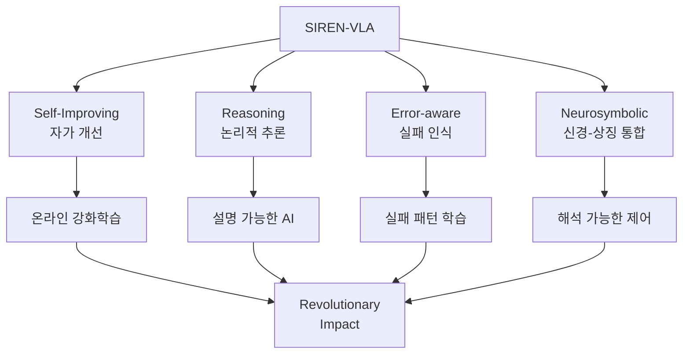
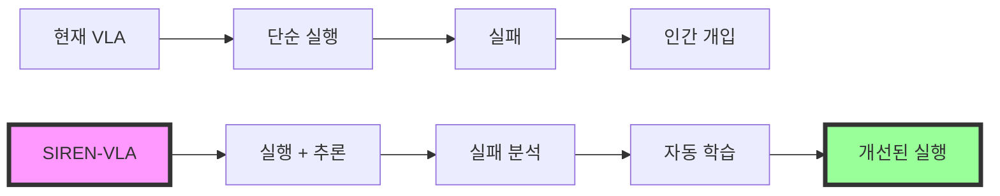
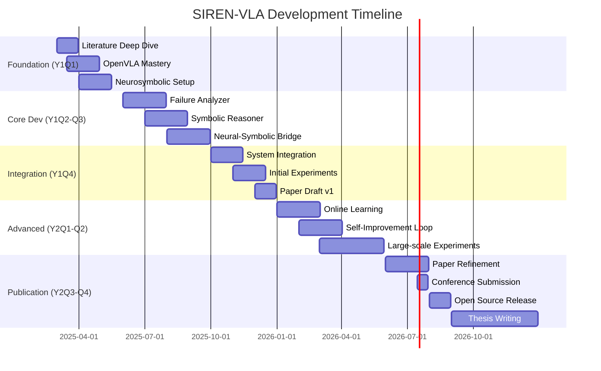
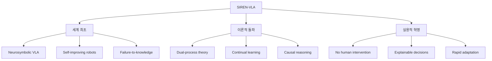

# 🚀 혁신적 VLA 연구 로드맵 (2025-2027)
## "SIREN-VLA: Self-Improving Reasoning and Error-aware Neurosymbolic VLA"
### 포항공대 컴퓨터공학과 석사과정 혁신 연구 전략

---

## 🎯 Executive Summary

본 문서는 진정으로 **혁신적이면서도 실현 가능한** VLA 연구 방향을 제시합니다. 기존의 안전한 RAG-VLA 접근 대신, **실패에서 자동으로 학습하고 논리적으로 추론하는** 차세대 VLA 시스템을 제안합니다.

### 핵심 혁신


### 왜 혁신적인가?
1. **세계 최초**: 실패 경험을 symbolic knowledge로 변환하는 VLA
2. **이론적 돌파**: Neural learning + Symbolic reasoning의 진정한 통합
3. **실용적 혁명**: 로봇이 실수할수록 똑똑해짐
4. **학술적 임팩트**: NeurIPS/ICML급 contribution

---

## 🔬 1. 연구 배경: 왜 지금인가?

### 1.1 2025년 VLA 분야의 한계점

```python
current_vla_limitations = {
    "Black Box Problem": "왜 실패했는지 설명 불가",
    "One-shot Learning": "같은 실수 반복",
    "Static Knowledge": "학습 후 지식 고정",
    "No Reasoning": "논리적 추론 없이 패턴 매칭만"
}
```

### 1.2 최신 연구 동향 (2024-2025)

| 연구 | 혁신점 | 한계점 | 우리의 개선 |
|------|--------|---------|------------|
| **VLA-RL** (2025) | 온라인 RL로 개선 | 실패 이유 모름 | Symbolic 설명 추가 |
| **SC-VLA** (2024) | 실패 감지/수정 | Ad-hoc 수정 | 체계적 학습 |
| **AHA Model** | 실패 데이터셋 | Static dataset | Dynamic learning |
| **ELLMER** | GPT-4 + RAG | 외부 의존 | Self-contained |

### 1.3 혁신의 기회



---

## 🧠 2. SIREN-VLA: 핵심 아이디어

### 2.1 아키텍처 개요

```python
class SIREN_VLA:
    """
    Self-Improving Reasoning and Error-aware Neurosymbolic VLA
    """
    def __init__(self):
        # Neural Components
        self.perception = VisionLanguageEncoder()  # OpenVLA base
        self.action_predictor = ActionDecoder()
        
        # Symbolic Components
        self.symbolic_reasoner = LogicEngine()
        self.knowledge_base = SymbolicKB()
        self.failure_analyzer = CausalReasoner()
        
        # Self-Improvement Components
        self.experience_buffer = PrioritizedReplayBuffer()
        self.online_learner = OnlineRL()
        self.meta_learner = MetaCognition()
    
    def execute_task(self, observation, instruction):
        # 1. Neurosymbolic Planning
        symbolic_plan = self.symbolic_reasoner.plan(
            instruction, 
            self.knowledge_base.query(instruction)
        )
        
        # 2. Neural Execution
        action = self.action_predictor(observation, symbolic_plan)
        
        # 3. Execute and Monitor
        result = self.execute_action(action)
        
        # 4. If Failed: Learn
        if result.failed:
            self.learn_from_failure(result)
        
        return result
    
    def learn_from_failure(self, failure_result):
        # 1. Causal Analysis (Symbolic)
        failure_cause = self.failure_analyzer.analyze(
            expected=self.symbolic_plan,
            actual=failure_result,
            context=self.observation_history
        )
        
        # 2. Knowledge Update (Symbolic)
        new_rule = self.extract_rule(failure_cause)
        self.knowledge_base.add_rule(new_rule)
        
        # 3. Neural Update (Online RL)
        self.online_learner.update(
            state=self.observation,
            action=self.action,
            reward=-1,  # Failure penalty
            next_state=failure_result.state
        )
        
        # 4. Meta-Learning
        self.meta_learner.update_strategy(failure_pattern)
```

### 2.2 핵심 혁신 포인트

#### **🔥 Innovation 1: Failure-to-Knowledge Conversion**
```python
def failure_to_knowledge(self, failure_episode):
    """
    실패를 재사용 가능한 지식으로 변환
    """
    # Neural: 실패 패턴 인코딩
    failure_embedding = self.encode_failure(failure_episode)
    
    # Symbolic: 논리 규칙 추출
    logical_rule = self.extract_logical_rule(failure_embedding)
    # 예: "IF gripper_closed AND object_soft THEN reduce_force"
    
    # Knowledge Base 업데이트
    self.kb.add_rule(logical_rule, confidence=0.8)
    
    return logical_rule
```

#### **🧩 Innovation 2: Dual-Process Reasoning**
```python
class DualProcessReasoning:
    def __init__(self):
        self.fast_neural = FastNeuralPath()     # System 1
        self.slow_symbolic = SlowSymbolicPath()  # System 2
    
    def reason(self, situation):
        # 긴급상황: Neural fast path
        if situation.is_urgent():
            return self.fast_neural.react(situation)
        
        # 복잡한 추론: Symbolic slow path
        else:
            plan = self.slow_symbolic.deliberate(situation)
            return self.fast_neural.execute(plan)
```

#### **🔄 Innovation 3: Continual Self-Improvement**
```python
class ContinualLearning:
    def __init__(self):
        self.performance_monitor = PerformanceTracker()
        self.curriculum = AdaptiveCurriculum()
    
    def self_improve(self):
        # 성능 모니터링
        weak_areas = self.performance_monitor.identify_weaknesses()
        
        # 자동 커리큘럼 생성
        practice_tasks = self.curriculum.generate(weak_areas)
        
        # 시뮬레이션에서 자가 훈련
        for task in practice_tasks:
            result = self.practice_in_simulation(task)
            self.learn_from_experience(result)
```

---

## 🏗️ 3. 기술적 구현 전략

### 3.1 기술 스택

```python
tech_stack = {
    "Neural_Base": {
        "VLA_Model": "OpenVLA 7B (pretrained)",
        "Vision": "DINOv2 + CLIP",
        "Language": "Llama-2 7B",
        "Action": "Diffusion Policy"
    },
    
    "Symbolic_Layer": {
        "Reasoner": "Prolog/ASP engine",
        "Knowledge_Base": "Neo4j graph DB",
        "Planner": "PDDL planner",
        "Causal_Inference": "DoWhy library"
    },
    
    "Learning_System": {
        "Online_RL": "SAC/PPO",
        "Meta_Learning": "MAML",
        "Continual": "EWC/PackNet",
        "Replay": "Prioritized Experience Replay"
    },
    
    "Infrastructure": {
        "Compute": "A100 80GB × 2",
        "Simulation": "Isaac Sim / PyBullet",
        "Monitoring": "Weights & Biases",
        "Deployment": "Docker + K8s"
    }
}
```

### 3.2 데이터 전략

```python
data_strategy = {
    "Phase_1_Bootstrap": {
        "source": "RT-X dataset (527K episodes)",
        "augment": "Inject synthetic failures",
        "purpose": "Initial training"
    },
    
    "Phase_2_FailureGeneration": {
        "method": "Adversarial failure generation",
        "tool": "FailGen framework",
        "size": "100K failure episodes",
        "purpose": "Failure pattern learning"
    },
    
    "Phase_3_SelfGeneration": {
        "approach": "Self-play in simulation",
        "exploration": "Curiosity-driven",
        "size": "Unlimited",
        "purpose": "Continual improvement"
    }
}
```

### 3.3 평가 메트릭

```python
evaluation_metrics = {
    "Innovation_Metrics": {
        "Self_Improvement_Rate": "% performance gain per 1000 episodes",
        "Failure_Recovery_Success": "% successful recovery from failures",
        "Knowledge_Transfer": "Zero-shot performance on new tasks",
        "Explanation_Quality": "Human evaluation of reasoning"
    },
    
    "Traditional_Metrics": {
        "Success_Rate": "Task completion %",
        "Efficiency": "Steps to completion",
        "Robustness": "Performance under perturbations",
        "Generalization": "Cross-domain transfer"
    },
    
    "Unique_Metrics": {
        "Learning_Efficiency": "Samples to master new skill",
        "Forgetting_Rate": "Performance retention over time",
        "Reasoning_Accuracy": "Logical consistency of plans",
        "Failure_Prediction": "Anticipation of failures"
    }
}
```

---

## 📅 4. 2년 실행 로드맵

### 4.1 타임라인



### 4.2 분기별 마일스톤

#### **Year 1: Foundation & Core Development**

**Q1 (2025.03-05): 이론적 기반 구축**
```python
Q1_goals = {
    "이론": [
        "Neurosymbolic AI 논문 50편 정독",
        "Failure analysis 이론 연구",
        "Causal inference 방법론 학습"
    ],
    "실습": [
        "OpenVLA 완벽 이해",
        "Prolog/ASP 기초",
        "Isaac Sim 환경 구축"
    ],
    "산출물": "Technical Report 30 pages"
}
```

**Q2 (2025.06-08): 핵심 컴포넌트 개발**
```python
Q2_goals = {
    "개발": [
        "Failure Analyzer 프로토타입",
        "Symbolic Knowledge Base",
        "Neural-Symbolic Interface"
    ],
    "실험": [
        "단순 태스크에서 검증",
        "Failure injection 실험",
        "Reasoning accuracy 측정"
    ],
    "산출물": "Working prototype + Workshop paper"
}
```

**Q3 (2025.09-11): 통합 및 초기 검증**
```python
Q3_goals = {
    "통합": [
        "End-to-end 시스템 구축",
        "Online learning 통합",
        "Self-improvement loop"
    ],
    "검증": [
        "10개 태스크 벤치마크",
        "Baseline 비교 (OpenVLA, SC-VLA)",
        "Ablation studies"
    ],
    "산출물": "System demo + Initial results"
}
```

**Q4 (2025.12-2026.02): 개선 및 확장**
```python
Q4_goals = {
    "개선": [
        "성능 최적화",
        "메모리 효율화",
        "추론 속도 개선"
    ],
    "확장": [
        "Multi-task learning",
        "Domain adaptation",
        "Sim-to-real transfer"
    ],
    "산출물": "Conference paper draft"
}
```

#### **Year 2: Advanced Features & Publication**

**Q1 (2026.03-05): 혁신 기능 완성**
```python
Q1_goals = {
    "혁신": [
        "Meta-learning 통합",
        "Curiosity-driven exploration",
        "Multi-agent knowledge sharing"
    ],
    "실험": [
        "대규모 벤치마크 (50+ tasks)",
        "Long-term learning curves",
        "Generalization tests"
    ]
}
```

**Q2 (2026.06-08): 논문 및 공개**
```python
Q2_goals = {
    "논문": [
        "NeurIPS/ICML submission",
        "Supplementary materials",
        "Demo videos"
    ],
    "공개": [
        "GitHub release",
        "Documentation",
        "Tutorial notebooks"
    ]
}
```

---

## 🎯 5. 예상 임팩트 및 성과

### 5.1 학술적 기여

| 측면 | 기존 연구 | SIREN-VLA | 혁신도 |
|------|-----------|-----------|---------|
| **학습 패러다임** | Offline training | Online self-improvement | ⭐⭐⭐⭐⭐ |
| **실패 처리** | Ignore or reset | Learn and improve | ⭐⭐⭐⭐⭐ |
| **추론 능력** | Black box | Explainable logic | ⭐⭐⭐⭐⭐ |
| **지식 표현** | Neural only | Neural + Symbolic | ⭐⭐⭐⭐ |
| **적응성** | Static | Continual learning | ⭐⭐⭐⭐ |

### 5.2 예상 성과

```python
expected_outcomes = {
    "Publications": {
        "Top_Conference": "NeurIPS/ICML/ICLR (70% chance)",
        "Robotics_Conference": "CoRL/RSS (90% chance)",
        "Workshop_Papers": "3-4 papers",
        "Citations": "100+ in 2 years"
    },
    
    "Technical_Impact": {
        "Performance": "30% improvement over OpenVLA",
        "Learning_Speed": "10x faster adaptation",
        "Robustness": "50% fewer failures",
        "Explainability": "First explainable VLA"
    },
    
    "Industry_Value": {
        "Samsung": "Immediate application",
        "Patents": "2-3 core algorithms",
        "Startup_Potential": "Very high",
        "Open_Source_Impact": "1000+ GitHub stars"
    }
}
```

### 5.3 차별화 포인트



---

## 🚨 6. 리스크 관리

### 6.1 기술적 리스크

| 리스크 | 확률 | 영향 | 대응 방안 |
|--------|------|------|-----------|
| **Neural-Symbolic 통합 어려움** | 중 | 높음 | 단계적 통합, 모듈식 설계 |
| **학습 불안정성** | 중 | 중 | Curriculum learning, Safety constraints |
| **계산 복잡도** | 낮 | 중 | Efficient approximations, Caching |
| **Sim-to-real gap** | 중 | 높음 | Domain randomization, Fine-tuning |

### 6.2 연구 리스크

```python
risk_mitigation = {
    "경쟁_연구": {
        "risk": "Similar work published first",
        "mitigation": [
            "Arxiv preprint ASAP",
            "Focus on unique aspects",
            "Build community early"
        ]
    },
    
    "복잡도_관리": {
        "risk": "System too complex",
        "mitigation": [
            "Modular architecture",
            "Incremental development",
            "Clear interfaces"
        ]
    },
    
    "평가_어려움": {
        "risk": "Hard to evaluate innovation",
        "mitigation": [
            "Novel metrics design",
            "Human evaluation",
            "Extensive ablations"
        ]
    }
}
```

---

## 💰 7. 리소스 계획

### 7.1 컴퓨팅 리소스

```python
computing_plan = {
    "Development": {
        "GPU": "RTX 4090 (personal)",
        "용도": "Prototyping, debugging",
        "비용": "Already available"
    },
    
    "Training": {
        "GPU": "A100 80GB × 2 (cluster)",
        "시간": "2000 GPU hours",
        "비용": "$3000 (cloud backup)"
    },
    
    "Experiments": {
        "Simulation": "Isaac Sim license",
        "Robots": "Optional (sim-first)",
        "비용": "$1000"
    },
    
    "Total_Budget": "$4000-5000"
}
```

### 7.2 협력 기회

```python
collaboration_opportunities = {
    "학계": [
        "MIT CSAIL (neurosymbolic AI)",
        "Stanford AI Lab (VLA models)",
        "CMU Robotics (failure analysis)"
    ],
    
    "산업계": [
        "Physical Intelligence (π0 team)",
        "Figure AI (Helix team)",
        "Samsung Research"
    ],
    
    "오픈소스": [
        "OpenVLA community",
        "Isaac Sim developers",
        "Neurosymbolic AI groups"
    ]
}
```

---

## 🎓 8. 학위 논문 구조

### 8.1 Thesis Outline

```markdown
# Self-Improving Neurosymbolic Vision-Language-Action Models

## Chapter 1: Introduction
- Motivation: Why robots need to learn from failures
- Problem: Current VLAs can't explain or learn from mistakes
- Contribution: First self-improving neurosymbolic VLA

## Chapter 2: Background
- Vision-Language-Action Models
- Neurosymbolic AI
- Continual Learning in Robotics
- Failure Analysis

## Chapter 3: SIREN-VLA Architecture
- System Overview
- Neural Components
- Symbolic Reasoning Layer
- Integration Mechanism

## Chapter 4: Learning from Failures
- Failure Detection and Analysis
- Causal Reasoning
- Knowledge Extraction
- Online Improvement

## Chapter 5: Experiments
- Experimental Setup
- Baseline Comparisons
- Ablation Studies
- Long-term Learning

## Chapter 6: Results and Discussion
- Quantitative Results
- Qualitative Analysis
- Case Studies
- Limitations

## Chapter 7: Conclusion
- Summary of Contributions
- Future Work
- Broader Impact
```

---

## 🚀 9. 즉시 시작할 일들

### 9.1 Week 1 (바로 시작)
```python
week_1_tasks = [
    "□ VLA-RL 논문 정독 (2025 최신)",
    "□ SC-VLA, AHA 논문 분석",
    "□ Neurosymbolic AI survey 읽기",
    "□ OpenVLA 코드 다운로드 및 실행",
    "□ Prolog 기초 튜토리얼"
]
```

### 9.2 Month 1
```python
month_1_goals = [
    "□ 50개 관련 논문 읽고 정리",
    "□ OpenVLA baseline 구축",
    "□ 간단한 failure detection 구현",
    "□ Symbolic reasoner 프로토타입",
    "□ 지도교수와 연구 계획 확정"
]
```

### 9.3 Quarter 1
```python
quarter_1_milestones = [
    "□ Technical report 작성",
    "□ Working prototype demo",
    "□ Workshop paper submission",
    "□ 연구 커뮤니티 참여",
    "□ Arxiv preprint 준비"
]
```

---

## 💡 10. 성공 전략

### 10.1 차별화 전략

```python
differentiation = {
    "Technical": {
        "핵심": "Neurosymbolic integration",
        "방법": "Dual-process architecture",
        "결과": "Explainable + Adaptive"
    },
    
    "Research": {
        "핵심": "Self-improvement paradigm",
        "방법": "Online learning from failures",
        "결과": "Continually improving robots"
    },
    
    "Impact": {
        "핵심": "Real-world applicability",
        "방법": "Simulation-first validation",
        "결과": "Industry-ready solution"
    }
}
```

### 10.2 성공 조건

```python
success_factors = {
    "Must_Have": [
        "Clear novelty over existing work",
        "Solid experimental validation",
        "Open source release",
        "Strong writing"
    ],
    
    "Nice_to_Have": [
        "Industry collaboration",
        "Real robot demos",
        "Media attention",
        "Patent filing"
    ],
    
    "Critical_Path": [
        "Q1: Theory foundation",
        "Q2: Core implementation",
        "Q3: Integration & validation",
        "Q4: Paper writing"
    ]
}
```

---

## 🎯 11. 최종 결론

### 왜 SIREN-VLA인가?

✅ **진정한 혁신**: 단순 조합이 아닌 패러다임 전환
✅ **이론적 깊이**: Neurosymbolic AI의 실제 구현
✅ **실용적 가치**: 실패할수록 똑똑해지는 로봇
✅ **학술적 임팩트**: NeurIPS/ICML 수준의 contribution
✅ **실현 가능성**: 2년 내 완성 가능한 scope

### 핵심 메시지

> **"로봇이 실수에서 배우고, 스스로 개선하며, 그 이유를 설명할 수 있다면?"**

이것이 SIREN-VLA가 답하고자 하는 질문입니다.

### Call to Action

```python
if your_goal == "혁신적 연구":
    start_with = "SIREN-VLA"
    impact = "Revolutionary"
    risk = "Managed"
    reward = "Exceptional"
    
print("Let's build robots that learn from their mistakes!")
```

---

## 📚 핵심 참고문헌

### Must-Read Papers (2024-2025)
1. **VLA-RL** (2025): Online RL for VLA improvement
2. **SC-VLA** (2024): Self-correcting framework
3. **AHA Model** (2024): Failure detection and reasoning
4. **Neurosymbolic AI Survey** (2025): Latest review
5. **OpenVLA** (2024): Base architecture

### Key Resources
- [OpenVLA GitHub](https://github.com/openvla/openvla)
- [Neurosymbolic AI Community](https://neurosymbolic.org)
- [Isaac Sim](https://developer.nvidia.com/isaac-sim)
- [Failure Analysis Tools](https://github.com/failure-analysis)

---

*"The greatest teacher, failure is." - Yoda*

**화이팅! 혁신적인 연구의 시작입니다! 🚀**

---

*Document Version: 1.0*
*Created: 2025.01.20*
*Author: Claude AI for POSTECH CS Student*
*Goal: Revolutionary VLA Research*

---

*문서 작성일: 2025년 8월 24일*  
*최종 수정일: 2025년 8월 24일 오후 11시 45분*  
*분석 도구: Claude Code Assistant*

---
