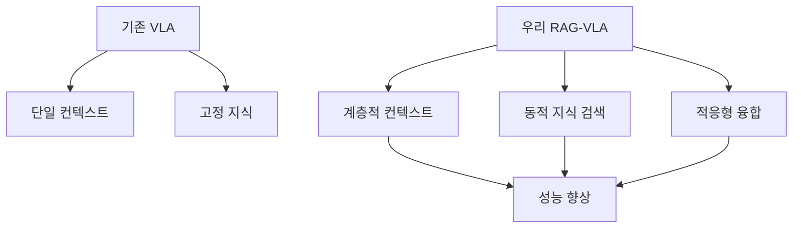
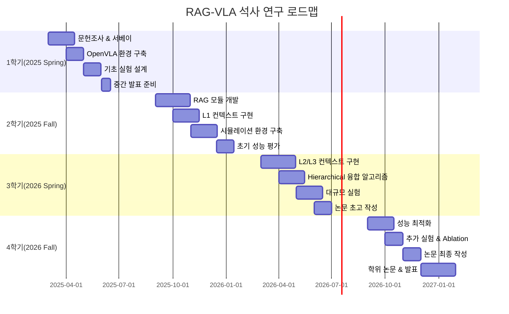

# RAG-VLA 석사 연구 실행 전략서 (2025-2027)
## 포항공대 컴퓨터공학과 석사과정 2년 로드맵

---

## 📌 Executive Summary

본 문서는 **Hierarchical Context-Aware RAG-VLA** 연구를 석사 2년 과정에서 성공적으로 완수하기 위한 구체적이고 현실적인 실행 전략을 제시합니다.

### 핵심 전략
1. **시뮬레이션 우선 접근** - 하드웨어 리스크 최소화
2. **오픈소스 기반 구축** - 개발 시간 단축
3. **단계적 구현** - 점진적 성과 확보
4. **기존 데이터셋 활용** - 데이터 수집 부담 제거

### 목표 성과
- **Primary**: CoRL 2026 또는 ICRA 2027 논문 게재
- **Secondary**: 오픈소스 공개, 삼성전자 기술 이전

---

## 🎯 1. 연구 주제 정의

### 1.1 최종 선정 주제
**"Hierarchical Context-Aware RAG-VLA: A Three-Level Retrieval-Augmented Framework for Robotic Manipulation"**

### 1.2 핵심 혁신 포인트
```python
innovation_points = {
    "L1_Immediate": "현재 상태와 직전 액션 컨텍스트 (< 1초)",
    "L2_Task": "서브태스크 진행상황과 중간 목표 (< 5초)", 
    "L3_Knowledge": "외부 지식과 경험 검색 (< 10초)",
    "Adaptive_Fusion": "상황별 레벨 가중치 동적 조정"
}
```

### 1.3 차별화 전략


---

## 📅 2. 2년 타임라인 (2025.03 - 2027.02)

### 2.1 분기별 마일스톤



### 2.2 상세 실행 계획

#### **📚 1학기 (2025.03 - 2025.08): 기초 확립**

```python
semester_1_tasks = {
    "Month 1-2": {
        "목표": "완벽한 문헌 조사",
        "필독 논문": [
            "ELLMER (Nature MI 2025)",
            "OpenVLA (arXiv 2024)",
            "FAST Tokenizer (2025)",
            "VisRAG (2024)",
            "All VLA survey papers"
        ],
        "산출물": "Literature Review 30페이지"
    },
    
    "Month 3-4": {
        "목표": "개발 환경 구축",
        "작업": [
            "OpenVLA 설치 및 테스트",
            "PyBullet/MuJoCo 시뮬레이터 셋업",
            "GPU 클러스터 접근 권한 확보",
            "기본 데이터셋 다운로드 (RT-X)"
        ],
        "산출물": "Working baseline system"
    },
    
    "Month 5-6": {
        "목표": "기초 실험 및 검증",
        "실험": [
            "OpenVLA baseline 성능 측정",
            "RAG 모듈 프로토타입",
            "시뮬레이션 태스크 정의"
        ],
        "산출물": "중간 발표 자료"
    }
}
```

#### **🔧 2학기 (2025.09 - 2026.02): 핵심 개발**

```python
semester_2_tasks = {
    "Month 7-8": {
        "목표": "RAG 모듈 완성",
        "구현": [
            "Vector DB 구축 (Chroma/Qdrant)",
            "Knowledge base 구성",
            "Retrieval pipeline 최적화"
        ],
        "기술스택": "LangChain + OpenVLA integration"
    },
    
    "Month 9-10": {
        "목표": "L1 Immediate Context 구현",
        "세부사항": [
            "실시간 상태 추적 (<1초 레이턴시)",
            "Action history buffer",
            "Immediate relevance scoring"
        ],
        "검증": "Unit tests + Integration tests"
    },
    
    "Month 11-12": {
        "목표": "시뮬레이션 실험",
        "환경": [
            "10개 manipulation tasks 정의",
            "PyBullet 환경 구성",
            "자동화된 평가 파이프라인"
        ],
        "데이터": "1000+ episodes 수집"
    }
}
```

#### **🚀 3학기 (2026.03 - 2026.08): 혁신 구현**

```python
semester_3_tasks = {
    "Month 13-14": {
        "목표": "L2/L3 Context 완성",
        "L2_Task_Context": [
            "Sub-task decomposition",
            "Progress tracking",
            "Goal state management"
        ],
        "L3_Knowledge_Context": [
            "External knowledge retrieval",
            "Failure case database",
            "Tool-use instructions"
        ]
    },
    
    "Month 15-16": {
        "목표": "Hierarchical Fusion 알고리즘",
        "핵심기술": [
            "Adaptive weighting mechanism",
            "Context priority scheduling",
            "Cross-level attention"
        ],
        "특허가능": "융합 알고리즘 특허 출원 검토"
    },
    
    "Month 17-18": {
        "목표": "대규모 실험 & 분석",
        "실험설계": [
            "50+ diverse tasks",
            "Baseline comparisons (OpenVLA, RICL-VLA)",
            "Ablation studies (각 레벨별 기여도)",
            "Generalization tests"
        ],
        "논문초고": "Results section 완성"
    }
}
```

#### **📝 4학기 (2026.09 - 2027.02): 완성 및 발표**

```python
semester_4_tasks = {
    "Month 19-20": {
        "목표": "성능 최적화",
        "최적화": [
            "Inference speed optimization",
            "Memory footprint reduction",
            "Quantization (4-bit/8-bit)"
        ],
        "실제로봇": "선택적 real robot validation"
    },
    
    "Month 21-22": {
        "목표": "논문 완성",
        "작성": [
            "Full paper draft",
            "Supplementary materials",
            "Demo videos",
            "Code documentation"
        ],
        "제출": "CoRL 2026 or ICRA 2027"
    },
    
    "Month 23-24": {
        "목표": "학위 논문",
        "내용": [
            "Extended version of conference paper",
            "Additional experiments",
            "Future work discussion"
        ],
        "발표": "Thesis defense"
    }
}
```

---

## 💻 3. 기술 스택 및 구현 전략

### 3.1 핵심 기술 스택

```python
tech_stack = {
    "Base_VLA": {
        "model": "OpenVLA (7B parameters)",
        "framework": "PyTorch",
        "fine_tuning": "LoRA/QLoRA (PEFT library)",
        "quantization": "bitsandbytes (4-bit AWQ)"
    },
    
    "RAG_System": {
        "framework": "LangChain / LlamaIndex",
        "vector_db": "Chroma (development) / Qdrant (production)",
        "embedding": "OpenAI Ada-002 or Sentence-BERT",
        "retrieval": "Hybrid search (dense + sparse)"
    },
    
    "Simulation": {
        "primary": "PyBullet (free, good enough)",
        "alternative": "MuJoCo (better physics)",
        "advanced": "NVIDIA Isaac Sim (if available)",
        "tasks": "RLBench task suite"
    },
    
    "Infrastructure": {
        "compute": "A100 80GB × 2 (학교 클러스터)",
        "storage": "2TB NVMe for datasets",
        "version_control": "Git + DVC for data",
        "experiment_tracking": "Weights & Biases"
    }
}
```

### 3.2 시스템 아키텍처

```python
class HierarchicalRAGVLA:
    def __init__(self):
        # Base components
        self.vla_model = OpenVLA.from_pretrained("openvla/openvla-7b")
        self.tokenizer = AutoTokenizer.from_pretrained("openvla/openvla-7b")
        
        # RAG components
        self.vector_store = Chroma(embedding_function=OpenAIEmbeddings())
        self.retriever = self.vector_store.as_retriever(
            search_type="mmr",  # Maximum Marginal Relevance
            search_kwargs={"k": 5, "fetch_k": 10}
        )
        
        # Hierarchical contexts
        self.L1_immediate = ImmediateContextManager(buffer_size=10)
        self.L2_task = TaskContextManager(max_subtasks=20)
        self.L3_knowledge = KnowledgeContextManager(self.retriever)
        
        # Adaptive fusion
        self.context_fusion = AdaptiveFusion(
            weights_init=[0.3, 0.3, 0.4],  # L1, L2, L3
            learning_rate=0.01
        )
    
    def forward(self, observation, instruction, task_context=None):
        # Level 1: Immediate context (< 1 second)
        immediate_context = self.L1_immediate.get_context(
            current_obs=observation,
            recent_actions=self.action_history[-5:]
        )
        
        # Level 2: Task context (< 5 seconds)
        task_context = self.L2_task.get_context(
            instruction=instruction,
            completed_subtasks=self.completed_subtasks,
            current_goal=self.current_goal
        )
        
        # Level 3: Knowledge retrieval (< 10 seconds)
        knowledge_context = self.L3_knowledge.retrieve(
            query=f"{instruction} in context of {observation}",
            filter={"task_type": self.task_type}
        )
        
        # Adaptive fusion based on situation
        fused_context = self.context_fusion.fuse(
            L1=immediate_context,
            L2=task_context,
            L3=knowledge_context,
            urgency=self.detect_urgency(observation)
        )
        
        # Generate action
        action = self.vla_model.predict(
            observation=observation,
            instruction=instruction,
            context=fused_context
        )
        
        return action
```

### 3.3 데이터 전략

```python
data_strategy = {
    "Primary_Dataset": {
        "name": "RT-X (Open X-Embodiment)",
        "size": "527K episodes",
        "robots": "22 different embodiments",
        "tasks": "Diverse manipulation",
        "usage": "Pre-training and evaluation"
    },
    
    "Secondary_Datasets": {
        "DROID": "76K episodes, standardized",
        "RH20T": "Latest 2024 dataset",
        "RLBench": "100 unique tasks",
        "Custom": "Optional, for specific tasks"
    },
    
    "Knowledge_Base": {
        "sources": [
            "Robot manuals (PDF parsing)",
            "YouTube tutorials (transcripts)",
            "Failure cases from forums",
            "Academic papers (methods sections)"
        ],
        "size": "Target 10K documents",
        "format": "Structured JSON + embeddings"
    },
    
    "Simulation_Data": {
        "collection": "Automated in PyBullet",
        "target": "10K episodes for fine-tuning",
        "augmentation": "Domain randomization"
    }
}
```

---

## 🎯 4. 리소스 관리 전략

### 4.1 컴퓨팅 리소스 계획

```python
computing_plan = {
    "Development_Phase": {
        "hardware": "Personal RTX 4090 (24GB)",
        "용도": "코드 개발, 디버깅, 소규모 실험",
        "비용": "이미 보유 or 연구실 지원"
    },
    
    "Training_Phase": {
        "hardware": "School cluster A100 × 2",
        "할당": "주 20시간 보장",
        "용도": "LoRA fine-tuning, large-scale experiments",
        "백업": "AWS/GCP spot instances"
    },
    
    "Production_Phase": {
        "hardware": "Dedicated A100 × 1",
        "기간": "논문 작성 3개월",
        "용도": "최종 실험, ablation studies"
    },
    
    "Budget_Optimization": {
        "전략": [
            "Spot instances 활용 (70% 할인)",
            "Mixed precision training (50% 메모리 절약)",
            "Gradient checkpointing (메모리 ↔ 속도 trade-off)",
            "Model parallelism 대신 LoRA 사용"
        ]
    }
}
```

### 4.2 예산 계획 (2년 총액)

```python
budget_plan = {
    "필수_비용": {
        "GPU_Cloud": 3000,  # USD, 학생 크레딧 활용
        "Storage": 500,     # 2TB SSD + Cloud backup
        "Software": 0,      # 모두 오픈소스 or 학생 라이선스
        "소계": 3500
    },
    
    "선택_비용": {
        "Robot_Hardware": 5000,  # WidowX or Franka rental
        "Sensors": 500,          # RealSense cameras
        "Conference": 2000,      # 학회 참가비 + 여행
        "소계": 7500
    },
    
    "자금_출처": {
        "연구실_지원": 5000,
        "BK21_장학금": 3000,
        "삼성_장학금": "학비 전액 + 생활비",
        "개인_부담": 0
    },
    
    "총_예산": "3,500 USD (최소) ~ 11,000 USD (최대)"
}
```

---

## 📊 5. 평가 및 검증 전략

### 5.1 평가 메트릭

```python
evaluation_metrics = {
    "Primary_Metrics": {
        "Success_Rate": {
            "정의": "Task completion percentage",
            "목표": "OpenVLA 대비 +20%",
            "측정": "100 episodes per task"
        },
        
        "Efficiency": {
            "정의": "Average steps to completion",
            "목표": "15% fewer steps",
            "측정": "Trajectory length analysis"
        },
        
        "Generalization": {
            "정의": "Zero-shot performance on new tasks",
            "목표": "10% improvement",
            "측정": "Hold-out test set"
        }
    },
    
    "RAG_Specific_Metrics": {
        "Retrieval_Relevance": {
            "정의": "Relevance of retrieved knowledge",
            "측정": "Human evaluation + automatic metrics",
            "목표": "0.8+ relevance score"
        },
        
        "Context_Efficiency": {
            "정의": "Information per token ratio",
            "측정": "Compression rate analysis",
            "목표": "3x better than full context"
        },
        
        "Latency": {
            "L1": "< 100ms",
            "L2": "< 500ms", 
            "L3": "< 2000ms",
            "Total": "< 3000ms per decision"
        }
    },
    
    "Ablation_Studies": {
        "실험": [
            "w/o L1 (immediate context)",
            "w/o L2 (task context)",
            "w/o L3 (knowledge retrieval)",
            "Fixed vs Adaptive fusion",
            "Different retrieval strategies"
        ]
    }
}
```

### 5.2 실험 설계

```python
experiment_design = {
    "Task_Suite": {
        "Manipulation": [
            "Pick and place",
            "Stacking",
            "Insertion",
            "Tool use",
            "Bi-manual coordination"
        ],
        
        "Complexity_Levels": [
            "Simple (1-3 steps)",
            "Medium (4-7 steps)",
            "Complex (8+ steps)",
            "Long-horizon (15+ steps)"
        ],
        
        "Generalization_Tests": [
            "New objects (shape/color)",
            "New environments",
            "New instructions (paraphrasing)",
            "Compositional tasks"
        ]
    },
    
    "Baseline_Comparisons": {
        "models": [
            "OpenVLA (vanilla)",
            "OpenVLA + simple RAG",
            "RICL-VLA (if available)",
            "Our Hierarchical RAG-VLA"
        ],
        
        "conditions": [
            "Full training data",
            "Limited data (10%)",
            "Few-shot (10 demos)",
            "Zero-shot"
        ]
    },
    
    "Statistical_Analysis": {
        "방법": [
            "Bootstrap confidence intervals",
            "Wilcoxon signed-rank test",
            "Effect size (Cohen's d)",
            "Learning curves analysis"
        ],
        
        "신뢰도": "95% confidence intervals",
        "샘플크기": "Minimum 100 trials per condition"
    }
}
```

---

## 📝 6. 논문 전략

### 6.1 목표 학회 및 일정

```python
publication_strategy = {
    "Primary_Target": {
        "venue": "CoRL 2026",
        "deadline": "2026-06-15",
        "notification": "2026-09-15",
        "camera_ready": "2026-10-15",
        "acceptance_rate": "~30%"
    },
    
    "Backup_Options": [
        {
            "venue": "ICRA 2027",
            "deadline": "2026-09-15",
            "why": "Robotics focused, high impact"
        },
        {
            "venue": "IROS 2027",
            "deadline": "2027-03-01",
            "why": "Good for systems papers"
        },
        {
            "venue": "RSS 2027",
            "deadline": "2027-01-15",
            "why": "Prestigious, theory-friendly"
        }
    ],
    
    "Workshop_Papers": [
        "NeurIPS 2026 Robot Learning Workshop",
        "ICML 2026 Multi-modal Learning Workshop",
        "CVPR 2026 Embodied AI Workshop"
    ]
}
```

### 6.2 논문 구조 계획

```markdown
# Paper Structure

## Title
"Hierarchical Context-Aware RAG-VLA: Adaptive Retrieval-Augmented Generation for Robust Robotic Manipulation"

## Abstract (150 words)
- Problem: VLA models lack dynamic knowledge and struggle with long-horizon tasks
- Solution: Three-level hierarchical RAG system with adaptive fusion
- Results: 20% improvement over OpenVLA, 15% over RICL-VLA
- Impact: First hierarchical RAG approach for VLA, enables real-time knowledge integration

## 1. Introduction (1.5 pages)
- Motivation: Limitations of current VLA models
- Challenge: Context management and knowledge integration
- Contribution: Hierarchical RAG framework
- Results preview: SOTA performance on RT-X benchmark

## 2. Related Work (1 page)
- Vision-Language-Action models
- Retrieval-Augmented Generation
- Context management in robotics
- Gap: No hierarchical RAG for VLA

## 3. Method (2.5 pages)
- 3.1 Overview of Hierarchical RAG-VLA
- 3.2 Three-level context architecture
- 3.3 Adaptive fusion mechanism
- 3.4 Implementation details

## 4. Experiments (2 pages)
- 4.1 Experimental setup
- 4.2 Main results
- 4.3 Ablation studies
- 4.4 Generalization tests

## 5. Discussion (0.5 pages)
- Key insights
- Limitations
- Future work

## 6. Conclusion (0.5 pages)
```

### 6.3 오픈소스 공개 전략

```python
opensource_plan = {
    "Repository_Structure": {
        "code/": "Core implementation",
        "configs/": "Experiment configurations",
        "data/": "Data processing scripts",
        "models/": "Pretrained checkpoints",
        "docs/": "Documentation and tutorials",
        "examples/": "Demo notebooks"
    },
    
    "Release_Timeline": {
        "Paper_Submission": "Basic code + trained models",
        "Paper_Acceptance": "Full code + documentation",
        "Post_Conference": "Tutorials + community support"
    },
    
    "License": "MIT (maximize adoption)",
    
    "Expected_Impact": {
        "GitHub_Stars": "Target 500+ in first year",
        "Citations": "Target 50+ in 2 years",
        "Industry_Adoption": "Samsung, LG, Hyundai Robotics"
    }
}
```

---

## 🏆 7. 리스크 관리

### 7.1 주요 리스크 및 대응 방안

```python
risk_management = {
    "Technical_Risks": {
        "RAG_레이턴시": {
            "리스크": "실시간 처리 불가능",
            "확률": "Medium",
            "영향": "High",
            "대응": [
                "Caching frequently used knowledge",
                "Parallel retrieval processing",
                "Approximate nearest neighbor search",
                "Fallback to L1/L2 only in urgent situations"
            ]
        },
        
        "메모리_부족": {
            "리스크": "GPU OOM during training",
            "확률": "Low",
            "영향": "Medium",
            "대응": [
                "Gradient accumulation",
                "Model sharding",
                "Reduced batch size",
                "More aggressive quantization"
            ]
        },
        
        "성능_미달": {
            "리스크": "No improvement over baseline",
            "확률": "Low",
            "영향": "High",
            "대응": [
                "Extensive hyperparameter search",
                "Different retrieval strategies",
                "Ensemble methods",
                "Focus on specific task domains"
            ]
        }
    },
    
    "Project_Risks": {
        "시간_부족": {
            "리스크": "2년 내 완성 불가",
            "확률": "Low",
            "영향": "Critical",
            "대응": [
                "Minimum Viable Paper (MVP) approach",
                "Prioritize core contributions",
                "Parallel workstreams",
                "Clear go/no-go decision points"
            ]
        },
        
        "경쟁_연구": {
            "리스크": "Similar work published first",
            "확률": "Medium",
            "영향": "High",
            "대응": [
                "Arxiv preprint ASAP",
                "Focus on unique aspects",
                "Faster iteration cycles",
                "Workshop papers for early visibility"
            ]
        }
    }
}
```

### 7.2 Plan B 시나리오

```python
contingency_plans = {
    "Scenario_1": {
        "상황": "Hierarchical RAG가 너무 복잡함",
        "Plan_B": "Two-level system (Immediate + Knowledge)",
        "예상_영향": "Still novel, slightly less performance"
    },
    
    "Scenario_2": {
        "상황": "실제 로봇 접근 불가",
        "Plan_B": "100% simulation-based validation",
        "예상_영향": "Still publishable, focus on algorithm"
    },
    
    "Scenario_3": {
        "상황": "CoRL 2026 리젝",
        "Plan_B": "ICRA 2027 (3개월 추가 개선)",
        "예상_영향": "Better paper with more experiments"
    },
    
    "Scenario_4": {
        "상황": "RAG 레이턴시 해결 불가",
        "Plan_B": "Offline RAG pre-computation",
        "예상_영향": "Different use case, still valuable"
    }
}
```

---

## 🎯 8. 성공 지표 (KPIs)

### 8.1 분기별 KPIs

```python
quarterly_kpis = {
    "Q1_2025": {
        "목표": [
            "✓ Literature review 완료",
            "✓ OpenVLA baseline 구동",
            "✓ GPU 클러스터 접근 확보"
        ],
        "측정": "Setup completion rate: 100%"
    },
    
    "Q2_2025": {
        "목표": [
            "✓ RAG 모듈 프로토타입",
            "✓ 첫 실험 결과",
            "✓ 기술 보고서 작성"
        ],
        "측정": "Baseline 대비 +5% 성능"
    },
    
    "Q3_2025": {
        "목표": [
            "✓ L1 컨텍스트 완성",
            "✓ 시뮬레이션 환경 구축",
            "✓ 1000+ 에피소드 수집"
        ],
        "측정": "System integration: 70%"
    },
    
    "Q4_2025": {
        "목표": [
            "✓ L2/L3 컨텍스트 구현",
            "✓ 초기 성능 검증",
            "✓ 중간 발표 성공"
        ],
        "측정": "Baseline 대비 +10% 성능"
    },
    
    "Q1_2026": {
        "목표": [
            "✓ Hierarchical fusion 완성",
            "✓ 대규모 실험 완료",
            "✓ 논문 초고 작성"
        ],
        "측정": "Target performance achieved"
    },
    
    "Q2_2026": {
        "목표": [
            "✓ CoRL 2026 제출",
            "✓ 코드 정리 및 문서화",
            "✓ 추가 실험 완료"
        ],
        "측정": "Paper submission complete"
    },
    
    "Q3_2026": {
        "목표": [
            "✓ 논문 리비전",
            "✓ 오픈소스 준비",
            "✓ 학위논문 작성 시작"
        ],
        "측정": "CoRL acceptance (target)"
    },
    
    "Q4_2026": {
        "목표": [
            "✓ 학위논문 완성",
            "✓ 디펜스 성공",
            "✓ 오픈소스 공개"
        ],
        "측정": "Graduation requirements met"
    }
}
```

### 8.2 최종 성과 목표

```python
final_deliverables = {
    "Academic": {
        "주 논문": "CoRL/ICRA/IROS acceptance",
        "워크샵": "2-3 workshop papers",
        "학위논문": "Successfully defended",
        "인용수": "10+ citations in first year"
    },
    
    "Technical": {
        "성능": "SOTA on RT-X benchmark subset",
        "코드": "Clean, documented, reproducible",
        "모델": "Publicly available checkpoints",
        "데모": "Interactive web demo"
    },
    
    "Career": {
        "포지션": "Research Scientist at Samsung",
        "네트워크": "Collaboration with top labs",
        "스킬": "Expert in VLA and RAG",
        "비전": "Clear path to PhD or industry"
    }
}
```

---

## 📚 9. 학습 및 준비 사항

### 9.1 필수 학습 내용

```python
learning_roadmap = {
    "Immediate_1개월": {
        "논문": [
            "OpenVLA paper (정독 3회)",
            "ELLMER (Nature MI 2025)",
            "모든 VLA survey papers",
            "RAG fundamentals papers"
        ],
        
        "코드": [
            "OpenVLA codebase 완전 이해",
            "LangChain tutorials",
            "PyBullet basic examples"
        ],
        
        "강의": [
            "CS224N (NLP, Stanford)",
            "CS231N (Vision, Stanford)",
            "Robotics courses (MIT OCW)"
        ]
    },
    
    "Short_term_3개월": {
        "기술": [
            "PyTorch Lightning (실험 관리)",
            "Weights & Biases (실험 추적)",
            "Docker (재현성)",
            "SLURM (클러스터 사용)"
        ],
        
        "이론": [
            "Transformer architecture 깊이 이해",
            "LoRA/QLoRA 수학적 배경",
            "Information retrieval theory",
            "Hierarchical reinforcement learning"
        ]
    },
    
    "Medium_term_6개월": {
        "연구": [
            "관련 연구실 세미나 참석",
            "주간 논문 리뷰 그룹 참여",
            "오픈소스 기여 시작",
            "블로그 포스팅 (visibility)"
        ]
    }
}
```

### 9.2 네트워킹 전략

```python
networking_strategy = {
    "국내": {
        "교수님": [
            "지도교수와 주간 미팅",
            "관련 분야 교수님들과 교류",
            "삼성 리서치 연구원 컨택"
        ],
        
        "동료": [
            "연구실 동료와 스터디 그룹",
            "타 대학 VLA 연구자 교류",
            "온라인 커뮤니티 참여"
        ]
    },
    
    "국제": {
        "학회": [
            "CoRL 2025 참석 (포스터라도)",
            "ICRA 2026 참석 및 발표",
            "Workshop 적극 참여"
        ],
        
        "온라인": [
            "Twitter에서 연구 공유",
            "Discord/Slack 연구 그룹",
            "GitHub discussions 참여"
        ],
        
        "협업": [
            "OpenVLA 팀과 교류",
            "논문 저자들에게 이메일",
            "인턴십 기회 모색"
        ]
    }
}
```

---

## 🚀 10. 즉시 실행 사항 (Action Items)

### 10.1 Today (바로 시작)
- [ ] OpenVLA GitHub repo fork 및 star
- [ ] GPU 클러스터 접근 권한 신청
- [ ] 논문 관리 도구 설정 (Zotero/Mendeley)
- [ ] 이 전략서 지도교수님과 공유

### 10.2 This Week
- [ ] OpenVLA 논문 정독 (하이라이트 + 노트)
- [ ] PyTorch 환경 설정 완료
- [ ] LangChain 튜토리얼 시작
- [ ] 연구 노트북 시작 (daily log)

### 10.3 This Month
- [ ] Literature review 초안 작성 (10 pages)
- [ ] OpenVLA inference 실행 성공
- [ ] 첫 RAG 프로토타입 구현
- [ ] 지도교수와 연구 계획 확정

### 10.4 Next 3 Months
- [ ] 모든 관련 논문 읽기 완료 (50+ papers)
- [ ] 기본 시스템 구현 완료
- [ ] 첫 실험 결과 도출
- [ ] 중간 발표 준비

---

## 💡 11. 성공을 위한 팁

### 11.1 시간 관리
```python
time_management = {
    "Daily": {
        "연구": "4-5시간 (오전 집중)",
        "코딩": "3-4시간 (오후)",
        "논문": "1-2시간 (저녁)",
        "운동": "1시간 (필수!)"
    },
    
    "Weekly": {
        "월": "Literature review",
        "화수": "Core development",
        "목금": "Experiments",
        "토": "Writing/Documentation",
        "일": "Rest/Light reading"
    },
    
    "Productivity": [
        "Pomodoro technique (25분 집중)",
        "Code review with GPT-4",
        "Version control everything",
        "Backup daily (3-2-1 rule)"
    ]
}
```

### 11.2 멘탈 관리
```python
mental_health = {
    "스트레스_관리": [
        "실패는 연구의 일부",
        "완벽보다 완성이 중요",
        "비교하지 말고 자기 페이스",
        "작은 성공도 축하하기"
    ],
    
    "동기부여": [
        "왜 이 연구를 하는지 명확히",
        "매주 작은 목표 달성",
        "성공한 연구자들 스토리",
        "미래 비전 시각화"
    ],
    
    "지원시스템": [
        "가족/친구와 정기 소통",
        "연구실 동료와 협력",
        "필요시 상담 서비스",
        "취미 활동 유지"
    ]
}
```

---

## 🎓 12. 결론

### 최종 메시지

이 전략서는 **Hierarchical Context-Aware RAG-VLA** 연구를 석사 2년 과정에서 성공적으로 완수하기 위한 구체적이고 현실적인 로드맵입니다.

**핵심 성공 요인:**
1. **시뮬레이션 우선** - 리스크 최소화
2. **오픈소스 활용** - 시간 단축
3. **단계적 구현** - 점진적 진전
4. **명확한 목표** - CoRL/ICRA 논문

**Remember:**
> "The best dissertation is a done dissertation."
> "Perfect is the enemy of good."
> "Ship early, ship often."

**You can do this! 화이팅! 🚀**

---

## 📎 Appendix

### A. 유용한 링크
- [OpenVLA GitHub](https://github.com/openvla/openvla)
- [RT-X Dataset](https://robotics-transformer-x.github.io/)
- [PyBullet Quickstart](https://pybullet.org/wordpress/)
- [LangChain Docs](https://docs.langchain.com/)

### B. 연락처 및 리소스
- OpenVLA 팀: openvla@cs.stanford.edu
- 포항공대 AI 대학원: ai.postech.ac.kr
- 삼성 리서치: research.samsung.com

### C. 템플릿 및 체크리스트
- [Weekly Progress Template](./templates/weekly_progress.md)
- [Experiment Log Template](./templates/experiment_log.md)
- [Paper Writing Checklist](./templates/paper_checklist.md)

---

*Last Updated: 2025.01.20*
*Version: 1.0*
*Author: Claude AI Assistant for POSTECH CS Student*

---

*문서 작성일: 2025년 8월 24일*  
*최종 수정일: 2025년 8월 24일 오후 11시 45분*  
*분석 도구: Claude Code Assistant*

---
