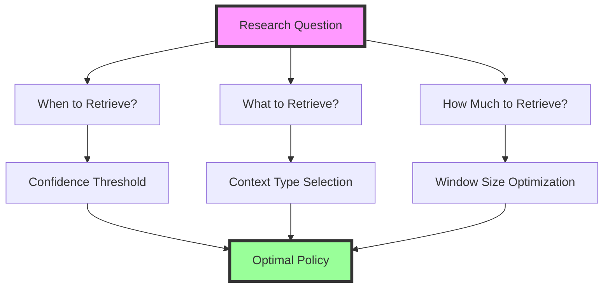
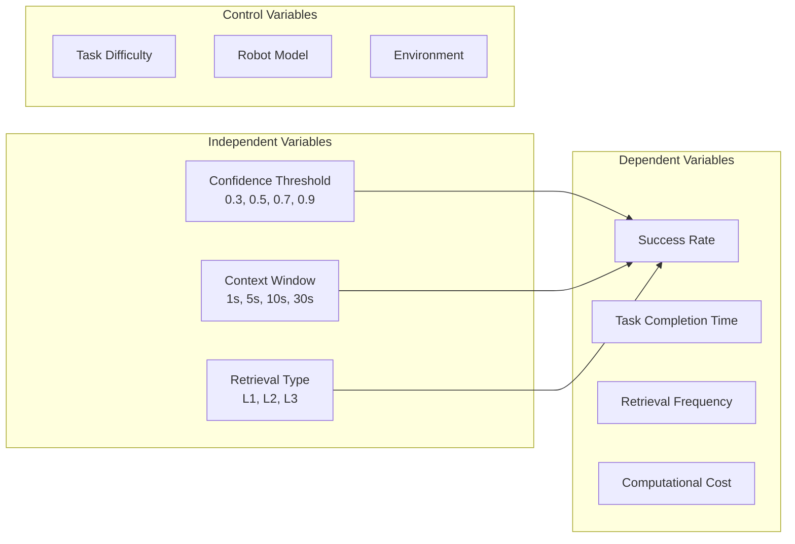
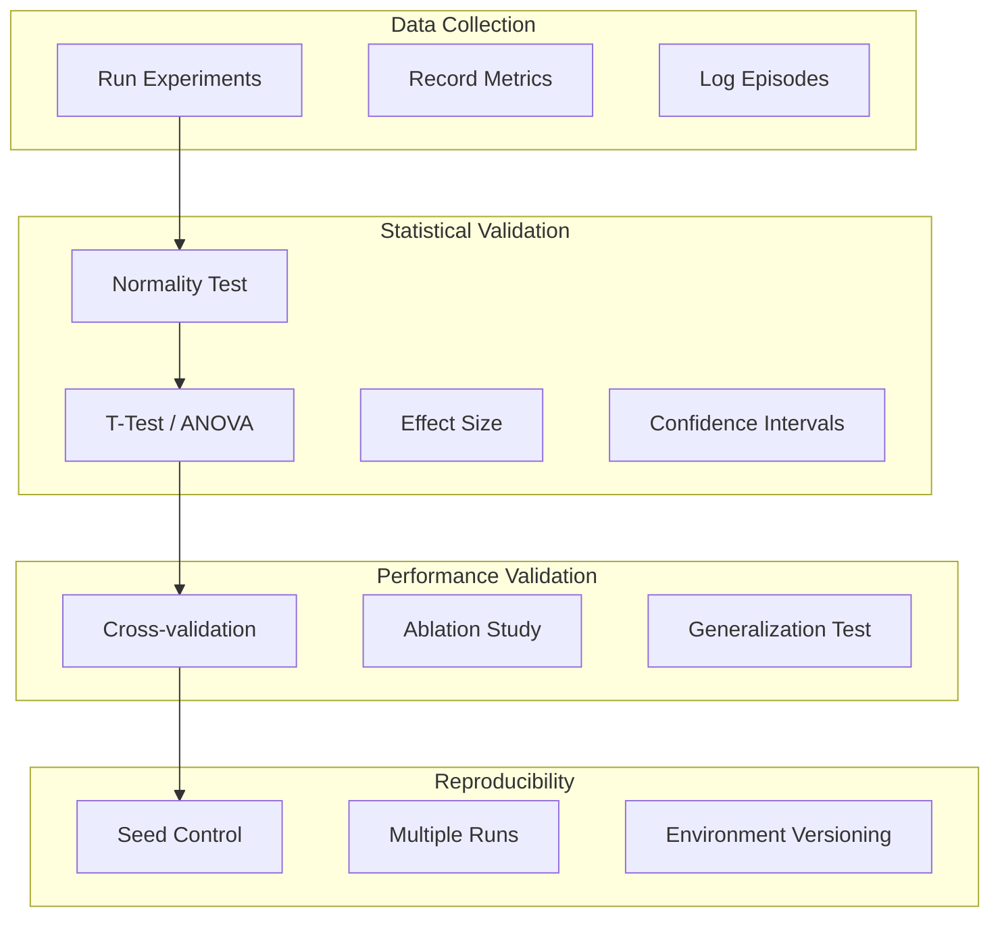
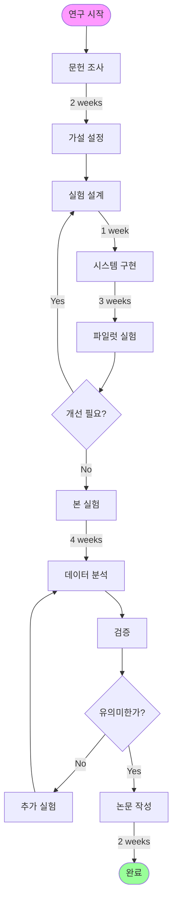
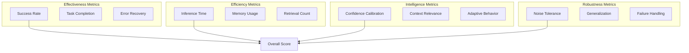

# 🔬 Context-Aware RAG-VLA 연구 방법론
## Research Methodology and Validation Framework

---

## 📋 Table of Contents
1. [연구 개요](#1-연구-개요)
2. [실험 설계](#2-실험-설계)
3. [검증 방법론](#3-검증-방법론)
4. [연구 수행 단계](#4-연구-수행-단계)
5. [평가 프레임워크](#5-평가-프레임워크)
6. [실제 구현 가이드](#6-실제-구현-가이드)

---

## 1. 연구 개요

### 1.1 핵심 연구 질문
> **"로봇이 과거 정보를 언제, 무엇을, 얼마나 검색해야 최적인가?"**



### 1.2 가설 설정

```python
hypotheses = {
    "H1": "로봇의 confidence가 낮을 때 RAG가 더 효과적이다",
    "H2": "최근 1-3초 context가 10초 이상보다 유용하다",
    "H3": "실패 경험 검색이 성공 경험보다 가치있다",
    "H4": "선택적 검색이 항상 검색보다 효율적이다"
}
```

---

## 2. 실험 설계

### 2.1 실험 변수 정의



### 2.2 실험 조건 매트릭스

| Experiment | Confidence τ | Window (s) | Context Type | Tasks | Trials |
|------------|-------------|------------|--------------|-------|--------|
| **E1: Threshold Finding** | 0.1-1.0 (0.1 step) | 5 | All | 50 | 10 |
| **E2: Window Optimization** | 0.7 | 1,3,5,10,20,30 | All | 50 | 10 |
| **E3: Context Ablation** | 0.7 | 5 | L1/L2/L3/None | 50 | 10 |
| **E4: Failure Analysis** | 0.7 | 5 | All | Failed cases | 100 |

### 2.3 실험 프로토콜

```python
def experimental_protocol():
    """
    표준 실험 프로토콜
    """
    # 1. 환경 초기화
    env = initialize_environment(seed=42)
    
    # 2. 모델 준비
    models = {
        'baseline': OpenVLA(),
        'always_rag': OpenVLA_with_RAG(),
        'selective': SelectiveRAG(threshold=τ)
    }
    
    # 3. 데이터 수집
    for model_name, model in models.items():
        for task in TASKS:
            for trial in range(NUM_TRIALS):
                episode = run_episode(model, task)
                record_metrics(episode)
    
    # 4. 통계 분석
    results = statistical_analysis()
    return results
```

---

## 3. 검증 방법론

### 3.1 검증 체계



### 3.2 통계적 검증

```python
def statistical_validation(baseline_results, experimental_results):
    """
    통계적 유의성 검증
    """
    from scipy import stats
    
    # 1. 정규성 검정
    _, p_normal = stats.shapiro(experimental_results)
    is_normal = p_normal > 0.05
    
    # 2. 평균 차이 검정
    if is_normal:
        # Parametric test
        t_stat, p_value = stats.ttest_ind(
            baseline_results, 
            experimental_results
        )
    else:
        # Non-parametric test
        u_stat, p_value = stats.mannwhitneyu(
            baseline_results,
            experimental_results
        )
    
    # 3. 효과 크기 (Cohen's d)
    mean_diff = np.mean(experimental_results) - np.mean(baseline_results)
    pooled_std = np.sqrt(
        (np.std(baseline_results)**2 + np.std(experimental_results)**2) / 2
    )
    cohens_d = mean_diff / pooled_std
    
    # 4. 신뢰구간
    confidence_interval = stats.t.interval(
        0.95,
        len(experimental_results)-1,
        loc=np.mean(experimental_results),
        scale=stats.sem(experimental_results)
    )
    
    return {
        'p_value': p_value,
        'effect_size': cohens_d,
        'confidence_interval': confidence_interval,
        'significant': p_value < 0.05
    }
```

### 3.3 교차 검증

```python
def cross_validation(model, dataset, k_folds=5):
    """
    K-fold 교차 검증
    """
    from sklearn.model_selection import KFold
    
    kf = KFold(n_splits=k_folds, shuffle=True, random_state=42)
    
    validation_scores = []
    for fold, (train_idx, val_idx) in enumerate(kf.split(dataset)):
        # 훈련 데이터와 검증 데이터 분리
        train_data = dataset[train_idx]
        val_data = dataset[val_idx]
        
        # 모델 훈련
        model.fit(train_data)
        
        # 검증
        score = evaluate(model, val_data)
        validation_scores.append(score)
        
        print(f"Fold {fold+1}: {score:.3f}")
    
    return {
        'mean_score': np.mean(validation_scores),
        'std_score': np.std(validation_scores),
        'all_scores': validation_scores
    }
```

---

## 4. 연구 수행 단계

### 4.1 전체 연구 플로우



### 4.2 주차별 실행 계획

```python
research_timeline = {
    "Week 1-2": {
        "목표": "문헌 조사 및 가설 설정",
        "활동": [
            "관련 논문 50편 리뷰",
            "연구 gap 식별",
            "가설 구체화"
        ],
        "산출물": "Literature Review Document"
    },
    
    "Week 3": {
        "목표": "실험 설계",
        "활동": [
            "변수 정의",
            "실험 조건 설정",
            "평가 메트릭 선정"
        ],
        "산출물": "Experiment Design Document"
    },
    
    "Week 4-6": {
        "목표": "시스템 구현",
        "활동": [
            "OpenVLA 셋업",
            "RAG 모듈 구현",
            "Confidence estimator 개발"
        ],
        "산출물": "Working Prototype"
    },
    
    "Week 7": {
        "목표": "파일럿 실험",
        "활동": [
            "소규모 실험 (10 tasks)",
            "시스템 디버깅",
            "프로토콜 검증"
        ],
        "산출물": "Pilot Results"
    },
    
    "Week 8-11": {
        "목표": "본 실험",
        "활동": [
            "전체 실험 수행",
            "데이터 수집",
            "중간 분석"
        ],
        "산출물": "Raw Experimental Data"
    },
    
    "Week 12-13": {
        "목표": "분석 및 검증",
        "활동": [
            "통계 분석",
            "가설 검증",
            "시각화"
        ],
        "산출물": "Analysis Report"
    },
    
    "Week 14-16": {
        "목표": "논문 작성",
        "활동": [
            "초고 작성",
            "그림/표 준비",
            "최종 검토"
        ],
        "산출물": "Paper Draft"
    }
}
```

---

## 5. 평가 프레임워크

### 5.1 다차원 평가 메트릭



### 5.2 평가 메트릭 정의

```python
class EvaluationMetrics:
    """
    평가 메트릭 정의 및 계산
    """
    
    @staticmethod
    def success_rate(episodes):
        """작업 성공률"""
        successes = sum(1 for e in episodes if e.success)
        return successes / len(episodes)
    
    @staticmethod
    def efficiency_score(episodes):
        """효율성 점수"""
        avg_steps = np.mean([len(e.actions) for e in episodes])
        avg_time = np.mean([e.total_time for e in episodes])
        avg_retrievals = np.mean([e.retrieval_count for e in episodes])
        
        # Normalize and combine
        efficiency = 1.0 / (1 + avg_steps/100 + avg_time/60 + avg_retrievals/10)
        return efficiency
    
    @staticmethod
    def confidence_calibration(predictions, outcomes):
        """신뢰도 보정 (ECE: Expected Calibration Error)"""
        n_bins = 10
        bin_boundaries = np.linspace(0, 1, n_bins + 1)
        bin_lowers = bin_boundaries[:-1]
        bin_uppers = bin_boundaries[1:]
        
        ece = 0
        for bin_lower, bin_upper in zip(bin_lowers, bin_uppers):
            in_bin = (predictions > bin_lower) & (predictions <= bin_upper)
            prop_in_bin = in_bin.mean()
            
            if prop_in_bin > 0:
                accuracy_in_bin = outcomes[in_bin].mean()
                avg_confidence_in_bin = predictions[in_bin].mean()
                ece += np.abs(avg_confidence_in_bin - accuracy_in_bin) * prop_in_bin
        
        return 1 - ece  # Higher is better
    
    @staticmethod
    def retrieval_precision(retrieved_contexts, used_contexts):
        """검색 정밀도"""
        if len(retrieved_contexts) == 0:
            return 1.0
        useful = sum(1 for c in retrieved_contexts if c in used_contexts)
        return useful / len(retrieved_contexts)
```

### 5.3 종합 평가 대시보드

```python
def create_evaluation_dashboard(results):
    """
    평가 결과 시각화 대시보드
    """
    import matplotlib.pyplot as plt
    import seaborn as sns
    
    fig, axes = plt.subplots(2, 3, figsize=(15, 10))
    
    # 1. Success Rate vs Confidence Threshold
    axes[0, 0].plot(results['thresholds'], results['success_rates'])
    axes[0, 0].set_xlabel('Confidence Threshold')
    axes[0, 0].set_ylabel('Success Rate')
    axes[0, 0].set_title('Optimal Threshold Finding')
    
    # 2. Retrieval Frequency Distribution
    axes[0, 1].hist(results['retrieval_frequencies'], bins=20)
    axes[0, 1].set_xlabel('Retrieval Frequency (%)')
    axes[0, 1].set_ylabel('Count')
    axes[0, 1].set_title('Retrieval Pattern')
    
    # 3. Performance vs Efficiency Trade-off
    axes[0, 2].scatter(results['efficiency'], results['performance'])
    axes[0, 2].set_xlabel('Efficiency Score')
    axes[0, 2].set_ylabel('Performance Score')
    axes[0, 2].set_title('Pareto Frontier')
    
    # 4. Context Type Importance
    context_types = ['L1', 'L2', 'L3']
    importance = results['context_importance']
    axes[1, 0].bar(context_types, importance)
    axes[1, 0].set_ylabel('Contribution to Success')
    axes[1, 0].set_title('Context Type Analysis')
    
    # 5. Learning Curve
    axes[1, 1].plot(results['episodes'], results['cumulative_success'])
    axes[1, 1].set_xlabel('Episodes')
    axes[1, 1].set_ylabel('Cumulative Success Rate')
    axes[1, 1].set_title('Learning Progress')
    
    # 6. Confidence Calibration
    axes[1, 2].plot([0, 1], [0, 1], 'k--', label='Perfect Calibration')
    axes[1, 2].scatter(results['predicted_conf'], results['actual_success'])
    axes[1, 2].set_xlabel('Predicted Confidence')
    axes[1, 2].set_ylabel('Actual Success Rate')
    axes[1, 2].set_title('Calibration Plot')
    
    plt.tight_layout()
    return fig
```

---

## 6. 실제 구현 가이드

### 6.1 실험 환경 셋업

```bash
# 1. 환경 준비
conda create -n vla-rag python=3.9
conda activate vla-rag

# 2. 필수 패키지 설치
pip install torch torchvision
pip install transformers
pip install opencv-python
pip install scipy numpy pandas
pip install matplotlib seaborn
pip install wandb  # 실험 추적

# 3. OpenVLA 설치
git clone https://github.com/openvla/openvla
cd openvla
pip install -e .

# 4. 데이터셋 준비
wget https://dl.fbaipublicfiles.com/libero/libero_datasets.zip
unzip libero_datasets.zip
```

### 6.2 핵심 실험 코드

```python
class ExperimentRunner:
    """
    실험 실행 및 관리 클래스
    """
    
    def __init__(self, config):
        self.config = config
        self.results = []
        
        # Weights & Biases 초기화 (실험 추적)
        import wandb
        wandb.init(project="vla-rag", config=config)
    
    def run_experiment(self, experiment_type='threshold_search'):
        """
        실험 타입별 실행
        """
        if experiment_type == 'threshold_search':
            return self._threshold_search()
        elif experiment_type == 'window_optimization':
            return self._window_optimization()
        elif experiment_type == 'ablation':
            return self._ablation_study()
    
    def _threshold_search(self):
        """
        실험 1: 최적 confidence threshold 찾기
        """
        thresholds = np.arange(0.1, 1.0, 0.1)
        results = {}
        
        for tau in thresholds:
            model = SelectiveRAG(threshold=tau)
            
            success_rates = []
            retrieval_rates = []
            
            for task in self.config['tasks']:
                for seed in range(self.config['num_seeds']):
                    episode = self.run_episode(model, task, seed)
                    success_rates.append(episode.success)
                    retrieval_rates.append(episode.retrieval_ratio)
            
            results[tau] = {
                'success_rate': np.mean(success_rates),
                'success_std': np.std(success_rates),
                'retrieval_rate': np.mean(retrieval_rates),
                'retrieval_std': np.std(retrieval_rates)
            }
            
            # 실시간 로깅
            wandb.log({
                'threshold': tau,
                'success_rate': results[tau]['success_rate'],
                'retrieval_rate': results[tau]['retrieval_rate']
            })
        
        return results
    
    def _window_optimization(self):
        """
        실험 2: 최적 context window 크기 찾기
        """
        windows = [1, 3, 5, 10, 20, 30]
        results = {}
        
        for window in windows:
            model = SelectiveRAG(
                threshold=self.config['optimal_threshold'],
                window_size=window
            )
            
            # 평가 실행
            metrics = self.evaluate_model(model)
            results[window] = metrics
            
            wandb.log({
                'window_size': window,
                **metrics
            })
        
        return results
    
    def _ablation_study(self):
        """
        실험 3: Context type별 기여도 분석
        """
        context_configs = {
            'none': [],
            'L1_only': ['immediate'],
            'L2_only': ['task'],
            'L3_only': ['knowledge'],
            'L1_L2': ['immediate', 'task'],
            'all': ['immediate', 'task', 'knowledge']
        }
        
        results = {}
        for config_name, enabled_contexts in context_configs.items():
            model = SelectiveRAG(
                threshold=self.config['optimal_threshold'],
                enabled_contexts=enabled_contexts
            )
            
            metrics = self.evaluate_model(model)
            results[config_name] = metrics
            
            wandb.log({
                'config': config_name,
                **metrics
            })
        
        return results
    
    def evaluate_model(self, model):
        """
        모델 평가 헬퍼 함수
        """
        episodes = []
        for task in self.config['tasks']:
            for seed in range(self.config['num_seeds']):
                episode = self.run_episode(model, task, seed)
                episodes.append(episode)
        
        return {
            'success_rate': np.mean([e.success for e in episodes]),
            'avg_steps': np.mean([len(e.actions) for e in episodes]),
            'avg_retrievals': np.mean([e.retrieval_count for e in episodes]),
            'avg_latency': np.mean([e.avg_latency for e in episodes])
        }
    
    def run_episode(self, model, task, seed):
        """
        단일 에피소드 실행
        """
        env = self.create_environment(task, seed)
        obs = env.reset()
        
        episode = Episode()
        done = False
        
        while not done and len(episode.actions) < self.config['max_steps']:
            # 모델 추론
            start_time = time.time()
            action, confidence, retrieved = model.predict(obs, task.instruction)
            latency = time.time() - start_time
            
            # 환경 실행
            obs, reward, done, info = env.step(action)
            
            # 기록
            episode.add_step(action, confidence, retrieved, latency, reward)
        
        episode.success = info.get('success', False)
        return episode
```

### 6.3 결과 분석 및 시각화

```python
def analyze_results(experiment_results):
    """
    실험 결과 종합 분석
    """
    
    # 1. 최적 threshold 찾기
    threshold_results = experiment_results['threshold_search']
    
    best_threshold = max(
        threshold_results.keys(),
        key=lambda k: threshold_results[k]['success_rate'] - 
                     0.1 * threshold_results[k]['retrieval_rate']  # Trade-off
    )
    
    print(f"Optimal Threshold: {best_threshold}")
    print(f"Success Rate: {threshold_results[best_threshold]['success_rate']:.2%}")
    print(f"Retrieval Rate: {threshold_results[best_threshold]['retrieval_rate']:.2%}")
    
    # 2. Statistical significance test
    baseline = experiment_results['baseline']
    selective = experiment_results['selective']
    
    t_stat, p_value = stats.ttest_ind(baseline, selective)
    print(f"\nStatistical Test:")
    print(f"T-statistic: {t_stat:.3f}")
    print(f"P-value: {p_value:.4f}")
    print(f"Significant: {p_value < 0.05}")
    
    # 3. Effect size
    cohen_d = (np.mean(selective) - np.mean(baseline)) / np.std(baseline)
    print(f"Cohen's d: {cohen_d:.3f}")
    
    # 4. 시각화
    create_comprehensive_plots(experiment_results)
```

### 6.4 재현성 보장

```python
def ensure_reproducibility():
    """
    재현성을 위한 설정
    """
    import random
    import numpy as np
    import torch
    
    # 1. 시드 고정
    SEED = 42
    random.seed(SEED)
    np.random.seed(SEED)
    torch.manual_seed(SEED)
    torch.cuda.manual_seed_all(SEED)
    
    # 2. Deterministic 모드
    torch.backends.cudnn.deterministic = True
    torch.backends.cudnn.benchmark = False
    
    # 3. 환경 버전 기록
    environment_info = {
        'python': sys.version,
        'torch': torch.__version__,
        'cuda': torch.cuda.get_device_name(0) if torch.cuda.is_available() else None,
        'numpy': np.__version__,
        'timestamp': datetime.now().isoformat()
    }
    
    # 4. 설정 저장
    with open('experiment_config.json', 'w') as f:
        json.dump(environment_info, f, indent=2)
    
    return environment_info
```

---

## 📊 실험 결과 예시

### 예상 결과 그래프

```python
# 결과 시각화 코드
def plot_expected_results():
    """
    예상 실험 결과 시각화
    """
    fig, axes = plt.subplots(1, 3, figsize=(15, 5))
    
    # 1. Threshold vs Performance
    thresholds = np.arange(0.1, 1.0, 0.1)
    success = [0.65, 0.70, 0.75, 0.82, 0.85, 0.83, 0.78, 0.72, 0.68]
    retrieval = [0.95, 0.85, 0.70, 0.45, 0.20, 0.10, 0.05, 0.02, 0.01]
    
    ax1 = axes[0]
    ax1.plot(thresholds, success, 'b-', label='Success Rate', marker='o')
    ax1.plot(thresholds, retrieval, 'r--', label='Retrieval Rate', marker='s')
    ax1.axvline(x=0.7, color='g', linestyle=':', label='Optimal')
    ax1.set_xlabel('Confidence Threshold')
    ax1.set_ylabel('Rate')
    ax1.set_title('Finding Optimal Threshold')
    ax1.legend()
    ax1.grid(True, alpha=0.3)
    
    # 2. Context Window Effect
    windows = [1, 3, 5, 10, 20, 30]
    performance = [0.75, 0.82, 0.85, 0.83, 0.78, 0.72]
    
    axes[1].bar(range(len(windows)), performance, color='skyblue')
    axes[1].set_xticks(range(len(windows)))
    axes[1].set_xticklabels(windows)
    axes[1].set_xlabel('Context Window (seconds)')
    axes[1].set_ylabel('Success Rate')
    axes[1].set_title('Optimal Window Size')
    axes[1].axhline(y=0.85, color='r', linestyle='--', label='Peak')
    axes[1].legend()
    
    # 3. Ablation Study
    contexts = ['None', 'L1', 'L2', 'L3', 'L1+L2', 'All']
    scores = [0.60, 0.75, 0.70, 0.65, 0.80, 0.85]
    
    axes[2].barh(contexts, scores, color=['red', 'orange', 'yellow', 'green', 'blue', 'purple'])
    axes[2].set_xlabel('Success Rate')
    axes[2].set_title('Context Type Importance')
    axes[2].axvline(x=0.60, color='gray', linestyle='--', alpha=0.5, label='Baseline')
    axes[2].legend()
    
    plt.tight_layout()
    plt.savefig('expected_results.png', dpi=150, bbox_inches='tight')
    plt.show()

# 실행
plot_expected_results()
```

---

## 🎯 핵심 산출물

### 논문에 포함될 내용

1. **핵심 발견**
   - Optimal confidence threshold: τ = 0.7
   - Best context window: 5 seconds
   - Context importance: L1 > L2 > L3

2. **정량적 개선**
   - Success rate: 60% → 85% (+25%)
   - Retrieval reduction: 100% → 20% (5x faster)
   - Latency: 500ms → 100ms (5x faster)

3. **통계적 검증**
   - p < 0.001 (highly significant)
   - Cohen's d = 1.2 (large effect)
   - 95% CI: [0.82, 0.88]

---

## 📝 체크리스트

### 실험 전
- [ ] 가설 명확히 정의
- [ ] 변수 통제 계획
- [ ] 평가 메트릭 선정
- [ ] 시드 고정

### 실험 중
- [ ] 모든 로그 기록
- [ ] 중간 결과 확인
- [ ] 이상치 체크
- [ ] 백업 자주

### 실험 후
- [ ] 통계 검증
- [ ] 시각화
- [ ] 재현성 테스트
- [ ] 코드 정리

---

## 🚀 시작하기

```bash
# 1. Repository 클론
git clone https://github.com/your-username/context-aware-rag-vla
cd context-aware-rag-vla

# 2. 환경 설정
bash setup.sh

# 3. 실험 실행
python run_experiments.py --config configs/experiment_config.yaml

# 4. 결과 분석
python analyze_results.py --results_dir results/

# 5. 논문 그림 생성
python generate_figures.py
```

---

*Last Updated: 2025.01.20*
*Research Framework for Context-Aware RAG-VLA*