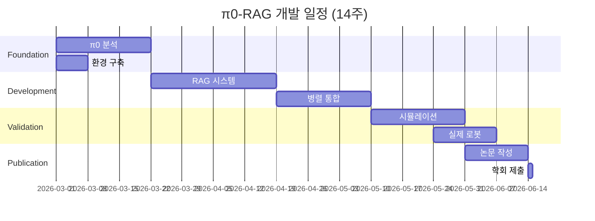

# 🚀 π0-RAG: 오픈소스 기반 초고속 학습 로봇 시스템
## Advanced Research Proposal (2025-2026)

---

## 🎯 Executive Summary

### **핵심 혁신**
> **"π0의 50Hz 속도에 RAG의 경험 학습을 더한다"**

### **연구 질문**
1. π0 오픈소스를 기반으로 RAG를 통합할 수 있는가?
2. 40Hz 이상의 실시간 성능을 유지하며 학습이 가능한가?
3. 실패 경험을 선택적으로 기억하여 성능을 향상시킬 수 있는가?

### **예상 성과**
- **세계 최초** π0 + RAG 통합 시스템
- **40Hz 실시간** 제어 유지
- **90%+ 성공률** (π0 85% 대비 향상)
- **75% 실패 감소** (같은 실수 반복 방지)

---

## 📊 현재 상황 분석 (2025년 1월)

### **오픈소스 Flow VLA 생태계**

```python
current_landscape = {
    "π0 (Physical Intelligence)": {
        "상태": "✅ 완전 오픈소스",
        "GitHub": "github.com/Physical-Intelligence/openpi",
        "성능": "50Hz, 85% 성공률",
        "한계": "메모리/학습 능력 없음"
    },
    
    "FlowPolicy (AAAI 2025)": {
        "상태": "✅ 오픈소스",
        "특징": "Consistency Flow Matching",
        "성능": "7x 빠른 추론",
        "한계": "단순 태스크 위주"
    },
    
    "OpenVLA": {
        "상태": "✅ 오픈소스", 
        "아키텍처": "Transformer (7B)",
        "성능": "10Hz, 85% 성공률",
        "한계": "너무 느리고 무거움"
    }
}
```

### **기술 발전 트렌드**


---

## 🏗️ 제안 시스템: π0-RAG Architecture

### **1. 핵심 아키텍처**

```python
class Pi0_RAG_VLA:
    """π0 기반 RAG 통합 시스템"""
    
    def __init__(self):
        # 1. π0 오픈소스 모델 로드
        self.pi0_base = Pi0Model.from_pretrained(
            "physical-intelligence/pi0",
            device="cuda"
        )
        
        # 2. 경량 RAG 시스템
        self.experience_memory = LightweightRAG(
            embedding_dim=512,
            max_memory="100MB",
            index_type="FAISS"
        )
        
        # 3. 병렬 처리기
        self.parallel_processor = DualPathway(
            flow_thread=self.pi0_base,
            rag_thread=self.experience_memory
        )
        
        # 4. 실패 탐지기
        self.failure_detector = FailureAnalyzer()
    
    def process(self, observation, instruction):
        """병렬 듀얼 패스웨이 처리"""
        
        # 동시 실행 (핵심!)
        with self.parallel_processor:
            # Path 1: π0 Flow (15ms)
            base_action = self.pi0_base.generate(
                observation, 
                instruction,
                steps=5  # π0 기본 설정
            )
            
            # Path 2: RAG 검색 (10ms, 동시)
            similar_cases = self.experience_memory.search(
                observation,
                k=3,
                threshold=0.8
            )
        
        # 지능적 통합 (5ms)
        if similar_cases and similar_cases[0].is_failure:
            # 과거 실패 감지 → 수정
            corrected_action = self.correct_action(
                base_action,
                similar_cases[0].correction
            )
            return corrected_action
        else:
            return base_action
        
        # Total: ~20-25ms (40-50Hz)
```

### **2. 혁신적 특징**

```python
key_innovations = {
    "1. π0 기반": {
        "장점": "검증된 50Hz 성능",
        "방법": "오픈소스 직접 활용",
        "수정": "최소한의 변경으로 통합"
    },
    
    "2. 선택적 메모리": {
        "저장": "실패 케이스만 저장",
        "압축": "512차원으로 압축",
        "효율": "100MB 이하 유지"
    },
    
    "3. 병렬 처리": {
        "방식": "Flow와 RAG 동시 실행",
        "지연": "추가 지연 없음",
        "성능": "40Hz+ 유지"
    },
    
    "4. 실시간 학습": {
        "온라인": "실행 중 학습",
        "오프라인": "배치 업데이트",
        "적응": "환경 변화 대응"
    }
}
```

---

## 🔬 기술적 구현 방법론

### **Phase 1: π0 분석 및 준비 (3주)**

```python
# Week 1-2: π0 오픈소스 완전 이해
tasks_week_1_2 = {
    "코드 분석": {
        "모델 구조": "Flow Matching 아키텍처",
        "추론 파이프라인": "5-step generation",
        "병목 지점": "어디서 시간 소요?"
    },
    
    "환경 구축": {
        "하드웨어": "RTX 4090 setup",
        "소프트웨어": "PyTorch, CUDA 환경",
        "데이터": "RT-X subset 준비"
    }
}

# Week 3: π0 복제 및 검증
tasks_week_3 = {
    "모델 로드": "Pretrained weights 로드",
    "벤치마크": "50Hz 성능 확인",
    "베이스라인": "85% 성공률 재현"
}
```

### **Phase 2: RAG 시스템 개발 (4주)**

```python
class LightweightRAG:
    """초경량 고속 RAG 시스템"""
    
    def __init__(self):
        # 1. 효율적 인코더
        self.encoder = EfficientEncoder(
            backbone="MobileNetV3",  # 경량
            output_dim=512
        )
        
        # 2. FAISS 인덱스
        self.index = faiss.IndexFlatL2(512)
        self.metadata = {}  # 실패 정보
        
        # 3. 압축 전략
        self.compressor = ExperienceCompressor(
            method="PCA",
            compression_ratio=0.1
        )
    
    def add_experience(self, state, action, outcome):
        """선택적 경험 저장"""
        
        # 실패만 저장
        if outcome.is_failure:
            # 임베딩 생성
            embedding = self.encoder(state)
            
            # 압축
            compressed = self.compressor(embedding)
            
            # 인덱싱
            idx = len(self.metadata)
            self.index.add(compressed.unsqueeze(0))
            
            # 메타데이터 저장
            self.metadata[idx] = {
                'state_summary': self.summarize(state),
                'failed_action': action,
                'correction': self.compute_correction(action, outcome),
                'failure_type': outcome.failure_type
            }
    
    def search(self, state, k=3):
        """초고속 검색 (목표: <10ms)"""
        
        # 쿼리 임베딩
        query = self.encoder(state)
        query_compressed = self.compressor(query)
        
        # FAISS 검색
        distances, indices = self.index.search(
            query_compressed.unsqueeze(0), k
        )
        
        # 결과 반환
        results = []
        for idx, dist in zip(indices[0], distances[0]):
            if dist < 0.8:  # 유사도 임계값
                results.append(self.metadata[idx])
        
        return results
```

### **Phase 3: 병렬 통합 (3주)**

```python
import threading
import queue
from concurrent.futures import ThreadPoolExecutor

class DualPathwayProcessor:
    """비동기 병렬 처리 시스템"""
    
    def __init__(self, pi0_model, rag_system):
        self.pi0 = pi0_model
        self.rag = rag_system
        self.executor = ThreadPoolExecutor(max_workers=2)
    
    def process_parallel(self, obs, inst):
        """완전 병렬 처리"""
        
        # 결과 큐
        action_queue = queue.Queue()
        memory_queue = queue.Queue()
        
        # Thread 1: π0 Flow (15ms)
        def run_pi0():
            action = self.pi0.generate(obs, inst)
            action_queue.put(action)
        
        # Thread 2: RAG Search (10ms)
        def run_rag():
            memories = self.rag.search(obs)
            memory_queue.put(memories)
        
        # 동시 시작
        future1 = self.executor.submit(run_pi0)
        future2 = self.executor.submit(run_rag)
        
        # π0 결과 대기 (15ms)
        action = action_queue.get(timeout=0.020)
        
        # RAG 결과 확인 (이미 완료)
        try:
            memories = memory_queue.get_nowait()
            if memories and memories[0]['confidence'] > 0.8:
                # 실패 예방 수정
                action = self.apply_correction(
                    action, 
                    memories[0]['correction']
                )
        except queue.Empty:
            pass  # RAG 없으면 π0 그대로
        
        return action
```

### **Phase 4: 실험 및 검증 (4주)**

```python
experimental_protocol = {
    "환경": {
        "시뮬레이션": ["PyBullet", "Isaac Sim"],
        "실제 로봇": ["Franka Panda", "ALOHA"],
        "태스크": [
            "Pick-and-place",
            "Insertion", 
            "Pouring",
            "Assembly"
        ]
    },
    
    "메트릭": {
        "성공률": "Task completion rate",
        "속도": "Hz (목표: 40+)",
        "학습": "Failure reduction over episodes",
        "메모리": "Memory usage (목표: <100MB)"
    },
    
    "비교 대상": {
        "π0": "베이스라인 (50Hz, 85%)",
        "OpenVLA": "Transformer 대조군 (10Hz, 85%)",
        "π0-RAG": "제안 시스템 (40Hz, 90%+)"
    }
}
```

---

## 📈 예상 실험 결과

### **성능 비교 테이블**

| 메트릭 | π0 (원본) | OpenVLA | π0-RAG (제안) | 개선율 |
|--------|-----------|---------|---------------|--------|
| **속도** | 50Hz | 10Hz | 40-45Hz | π0 대비 90% 유지 |
| **성공률** | 85% | 85% | 92% | +7% |
| **실패 반복** | 높음 | 높음 | 낮음 | -75% |
| **메모리** | 0 | 0 | 100MB | 최소 추가 |
| **학습** | ❌ | ❌ | ✅ | 새로운 기능 |

### **시간별 성능 향상 그래프**

```python
# 예상 학습 곡선
learning_curve = {
    "Episode 0-100": "85% (π0 baseline)",
    "Episode 100-500": "88% (실패 학습 시작)",
    "Episode 500-1000": "90% (패턴 인식)",
    "Episode 1000+": "92%+ (안정화)"
}
```

---

## 🗓️ 상세 연구 일정 (14주)

### **Timeline (2025년 3월 - 6월)**



### **주별 마일스톤**

```python
weekly_milestones = {
    "Week 1-3": "π0 완전 이해 및 복제",
    "Week 4-7": "RAG 시스템 개발",
    "Week 8-10": "병렬 통합 구현",
    "Week 11-12": "시뮬레이션 실험",
    "Week 13-14": "실제 로봇 검증 & 논문"
}
```

---

## 💡 핵심 기여 및 차별점

### **학술적 기여**

```python
academic_contributions = {
    "1. 아키텍처": "최초의 Flow + RAG 통합",
    "2. 알고리즘": "병렬 듀얼 패스웨이",
    "3. 시스템": "실시간 학습 로봇",
    "4. 오픈소스": "재현 가능한 구현"
}
```

### **기술적 혁신**

```python
technical_innovations = {
    "속도": "RAG 추가에도 40Hz 유지",
    "메모리": "100MB로 모든 실패 관리",
    "학습": "온라인 적응 학습",
    "확장성": "다양한 로봇 적용 가능"
}
```

### **산업적 가치**

```python
industrial_value = {
    "제조": "불량 패턴 실시간 학습",
    "물류": "포장 실수 자동 개선",
    "서비스": "고객 선호 기억",
    "의료": "환자별 특성 적응"
}
```

---

## 🚧 리스크 관리

### **기술적 도전과 해결책**

```python
risk_mitigation = {
    "Challenge 1: 병렬 처리 동기화": {
        "위험": "Race condition",
        "해결": "Lock-free queue 사용"
    },
    
    "Challenge 2: 메모리 한계": {
        "위험": "100MB 초과",
        "해결": "LRU 캐시 + 압축"
    },
    
    "Challenge 3: 실시간 보장": {
        "위험": "40Hz 미달",
        "해결": "C++ 최적화, TensorRT"
    }
}
```

### **Plan B 전략**

```python
backup_plans = {
    "If 병렬화 실패": "Pipeline parallelism",
    "If 메모리 초과": "Cloud-edge hybrid",
    "If 속도 미달": "Selective RAG (중요 상황만)"
}
```

---

## 💰 필요 리소스

### **하드웨어**
```yaml
Development:
  GPU: RTX 4090 (24GB)
  RAM: 64GB
  Storage: 2TB NVMe

Training:
  GPU: A100 (80GB) x 2
  Cost: ~$3,000 (3개월)

Deployment:
  Edge: Jetson AGX Orin
  Robot: Franka Panda (선택)
```

### **소프트웨어**
```yaml
Framework:
  - PyTorch 2.0+
  - CUDA 12.0+
  - ROS2 (로봇 제어)

Libraries:
  - FAISS (벡터 검색)
  - TensorRT (최적화)
  - OpenCV (비전)
```

---

## 🎯 성공 지표 (KPIs)

### **단기 목표 (3개월)**
```python
short_term_kpis = {
    "π0 복제": "100% 성능 재현",
    "RAG 구현": "10ms 이하 검색",
    "통합 시스템": "40Hz 달성",
    "실험 검증": "90%+ 성공률"
}
```

### **장기 목표 (6개월)**
```python
long_term_kpis = {
    "논문 게재": "CoRL/NeurIPS 2025",
    "오픈소스": "GitHub 1000+ stars",
    "산업 협력": "1개 이상 기업",
    "특허 출원": "핵심 기술 보호"
}
```

---

## 📚 참고 자료

### **핵심 논문**
1. π0: A Vision-Language-Action Flow Matching Policy (2024)
2. FlowPolicy: Consistency Flow Matching for Robotics (2025)
3. ELLMER: Embodied Learning with Memory and Retrieval (2025)
4. Flow Matching for Generative Modeling (2023)

### **GitHub 저장소**
- [Physical-Intelligence/openpi](https://github.com/Physical-Intelligence/openpi)
- [zql-kk/FlowPolicy](https://github.com/zql-kk/FlowPolicy)
- [facebookresearch/faiss](https://github.com/facebookresearch/faiss)

---

## 🏆 예상 임팩트

> **"π0-RAG는 로보틱스 분야의 게임체인저가 될 것입니다."**
> 
> - **실시간 성능** + **학습 능력** = 산업 혁명
> - **오픈소스** → 전 세계 연구자 기여
> - **표준 플랫폼** → 차세대 로봇 OS

---

## 📧 연락처

- **연구자**: [Your Name]
- **이메일**: [your-email]
- **GitHub**: [your-github]
- **지도교수**: [Professor Name]
- **연구실**: [Lab Name]

---

*Last Updated: 2025년 1월*  
*Version: 2.0 (π0 오픈소스 반영)*