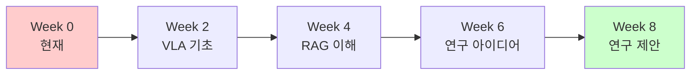
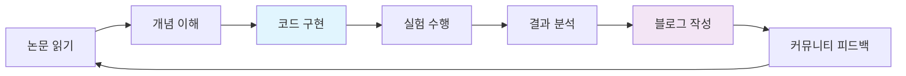

# 🗺️ VLA 학습 로드맵
## 개발자에서 VLA 연구자로: 8주 완성 가이드

---

## 🎯 전체 목표

**시작**: 개발은 잘하지만 VLA는 모르는 4학년  
**도착**: 교수님께 연구 제안할 수 있는 준비된 연구자  
**기간**: 8주 집중 학습



---

## 📅 주차별 상세 계획

### 🚀 Week 0: 빠른 시작 (현재)
```python
week0_objectives = {
    "목표": "전체 그림 파악하고 기초 환경 구축",
    "시간투자": "주 15시간",
    
    "Must_Do": [
        "📖 OpenVLA 논문 1차 읽기 (Pass 1-2)",
        "💻 OpenVLA 코드 설치 및 실행",
        "📚 VLA 개념 기본 이해",
        "🎯 학습 계획 세우기"
    ],
    
    "Papers_to_Read": [
        "OpenVLA (2024) - 기본 중의 기본",
        "RT-X (2023) - 데이터셋 이해"
    ],
    
    "Hands_on": [
        "OpenVLA inference 돌려보기",
        "RT-X 데이터 구조 파악",
        "개발 환경 완전 셋업"
    ],
    
    "Success_Criteria": [
        "VLA가 뭔지 한 문장으로 설명 가능",
        "OpenVLA 코드가 내 컴퓨터에서 돌아감",
        "앞으로 8주 계획이 명확함"
    ]
}
```

### 📚 Week 1: VLA 기초 이론
```python
week1_objectives = {
    "목표": "Vision-Language-Action의 핵심 개념 완전 이해",
    "시간투자": "주 20시간",
    
    "Theory_Focus": [
        "🧠 Transformer Architecture 복습",
        "👁️ Vision Encoder (ViT, CLIP) 이해", 
        "🗣️ Language Model Integration",
        "🤖 Action Space & Representation"
    ],
    
    "Papers_to_Read": [
        "CLIP (2021) - Vision-Language 기초",
        "RT-1 (2022) - 첫 VLA 모델", 
        "RT-2 (2023) - VLA 스케일업",
        "PaLM-E (2023) - 멀티모달 기초"
    ],
    
    "Practical_Exercises": [
        "OpenVLA 코드 완전 분석 (주석 달기)",
        "간단한 VLA inference 스크립트 작성",
        "RT-X 데이터 로딩 및 시각화",
        "Attention map 시각화 실습"
    ],
    
    "Deliverables": [
        "VLA 기초 개념 정리 노트 (10 pages)",
        "OpenVLA 코드 분석 리포트",
        "첫 번째 기술 블로그 포스트"
    ]
}
```

### 🔍 Week 2: RAG 시스템 이해
```python
week2_objectives = {
    "목표": "RAG의 원리와 VLA 적용 방법 마스터",
    "시간투자": "주 20시간",
    
    "RAG_Fundamentals": [
        "🔍 Information Retrieval 기초",
        "🧮 Vector Database & Embeddings",
        "🔗 Retrieval-Generation Pipeline",
        "⚡ Retrieval 최적화 기법"
    ],
    
    "Papers_to_Read": [
        "RAG (2020) - RAG 원조 논문",
        "REALM (2020) - Neural retrieval",
        "FiD (2021) - Fusion-in-Decoder", 
        "ELLMER (2025) - VLA에서 RAG ⭐"
    ],
    
    "Hands_on_Projects": [
        "LangChain RAG 튜토리얼 완주",
        "ChromaDB로 로봇 매뉴얼 저장/검색",
        "OpenVLA + RAG 간단한 통합 실험",
        "Retrieval latency 측정 실험"
    ],
    
    "Key_Questions": [
        "언제 검색해야 할까?",
        "무엇을 검색해야 할까?", 
        "얼마나 검색해야 할까?",
        "어떻게 검색 결과를 활용할까?"
    ]
}
```

### 🤖 Week 3: 로보틱스 기초
```python
week3_objectives = {
    "목표": "로봇 제어와 시뮬레이션 환경 이해",
    "시간투자": "주 18시간",
    
    "Robotics_Theory": [
        "🦾 Forward/Inverse Kinematics 기초",
        "🎯 Motion Planning 개념",
        "👁️ Robot Perception",
        "🎮 Imitation Learning vs RL"
    ],
    
    "Papers_to_Read": [
        "Behavioral Cloning Survey",
        "Imitation Learning 기초 논문",
        "Robot Learning Survey (최신)",
        "Sim-to-Real Transfer 논문"
    ],
    
    "Simulation_Practice": [
        "PyBullet 기초 튜토리얼",
        "로봇팔 제어 실습",
        "Pick & Place 태스크 구현",
        "간단한 VLA 에이전트 테스트"
    ],
    
    "Skills_to_Acquire": [
        "로봇 시뮬레이션 환경 구축",
        "기본적인 로봇 제어 코드 작성",
        "실패 케이스 분석 방법",
        "성능 지표 측정"
    ]
}
```

### 📊 Week 4: 최신 VLA 동향
```python
week4_objectives = {
    "목표": "최신 연구 동향 파악 및 연구 기회 발견",
    "시간투자": "주 18시간",
    
    "Cutting_Edge_Papers": [
        "VLA-RL (2025) - 온라인 학습 ⭐",
        "SC-VLA (2024) - Self-correction",
        "AHA Model (2024) - Failure analysis ⭐",
        "PaLI-X (2024) - 대규모 VLA"
    ],
    
    "Research_Skills": [
        "📈 논문 트렌드 분석 방법",
        "📊 실험 설계 기초",
        "📝 Related Work 정리법",
        "🔍 Research Gap 찾는 법"
    ],
    
    "Gap_Analysis": [
        "현재 VLA 모델들의 한계점",
        "RAG 적용에서의 문제점",
        "Context 관리의 어려움",
        "실시간 처리의 제약"
    ],
    
    "Research_Opportunity": [
        "Context-Aware RAG 아이디어 구체화",
        "기존 연구와의 차별점 정의",
        "예상 기술적 도전과제 리스트업"
    ]
}
```

### 💡 Week 5: 연구 아이디어 개발
```python
week5_objectives = {
    "목표": "구체적인 연구 주제 확정 및 접근법 설계",
    "시간투자": "주 20시간",
    
    "Idea_Development": [
        "🎯 Problem Statement 명확화",
        "💡 핵심 아이디어 구체화", 
        "📋 Technical Approach 설계",
        "📊 평가 방법론 계획"
    ],
    
    "Deep_Dive_Papers": [
        "Context management 관련 논문들",
        "Memory systems in RL",
        "Hierarchical planning 논문들",
        "Continual learning 기법들"
    ],
    
    "Prototype_Development": [
        "Context-Aware RAG 프로토타입 v0.1",
        "3-level hierarchy 기초 구현",
        "간단한 실험 설계 및 실행",
        "Baseline과의 비교 실험"
    ],
    
    "Research_Proposal_Draft": [
        "문제 정의 (Problem Statement)",
        "관련 연구 (Related Work)", 
        "제안 방법 (Proposed Method)",
        "예상 결과 (Expected Results)"
    ]
}
```

### 🔬 Week 6: 실험 및 검증
```python
week6_objectives = {
    "목표": "연구 아이디어의 feasibility 검증",
    "시간투자": "주 22시간",
    
    "Implementation": [
        "Context-Aware RAG 완전한 구현",
        "L1/L2/L3 컨텍스트 모듈 개발",
        "OpenVLA와의 통합 완성",
        "실험 자동화 스크립트 작성"
    ],
    
    "Experiments": [
        "10개 기본 manipulation tasks",
        "Baseline(OpenVLA) vs Ours 비교",
        "Ablation study (각 level별 기여도)",
        "Latency vs Performance trade-off"
    ],
    
    "Data_Analysis": [
        "성공률 개선 정량화",
        "Context 효율성 측정",
        "실패 케이스 분석",
        "통계적 유의성 검증"
    ],
    
    "Preliminary_Results": [
        "주요 성능 지표 개선 확인",
        "Context 선택의 effectiveness",
        "시스템의 scalability 평가"
    ]
}
```

### 📝 Week 7: 연구 제안서 작성
```python
week7_objectives = {
    "목표": "완성된 연구 제안서와 프레젠테이션 준비",
    "시간투자": "주 20시간",
    
    "Research_Proposal": [
        "📋 Executive Summary (1 page)",
        "🎯 Problem & Motivation (2 pages)",
        "📚 Literature Review (3 pages)",
        "💡 Proposed Method (3 pages)",
        "🧪 Experimental Plan (2 pages)",
        "⏰ Timeline & Milestones (1 page)",
        "📊 Expected Results (1 page)"
    ],
    
    "Supporting_Materials": [
        "프로토타입 데모 비디오",
        "주요 실험 결과 그래프",
        "관련 논문 survey table",
        "기술적 feasibility 증명"
    ],
    
    "Presentation_Prep": [
        "10분 발표 자료 (핵심만)",
        "30분 상세 설명 자료",
        "예상 질문과 답변 준비",
        "라이브 데모 준비"
    ]
}
```

### 🎯 Week 8: 최종 준비 및 컨택
```python
week8_objectives = {
    "목표": "교수님 컨택 및 연구 시작 준비 완료",
    "시간투자": "주 15시간",
    
    "Final_Polish": [
        "연구 제안서 최종 검토",
        "실험 결과 재검증",
        "코드 정리 및 문서화",
        "GitHub 저장소 공개 준비"
    ],
    
    "Professor_Research": [
        "포항공대 VLA/로보틱스 교수님 리스트업",
        "각 교수님 최근 연구 조사",
        "연구실 분위기 및 스타일 파악",
        "컨택 이메일 개인화"
    ],
    
    "Networking": [
        "기술 블로그 포스트 게시",
        "Twitter/LinkedIn에 연구 소개",
        "관련 커뮤니티 참여",
        "오픈소스 기여 시작"
    ],
    
    "Action_Items": [
        "교수님께 이메일 발송",
        "VLA-Chain MVP 공개",
        "연구 커뮤니티 참여",
        "다음 단계 계획 수립"
    ]
}
```

---

## ⏰ 주간 시간 배분 가이드

### 효율적인 시간 관리
```python
weekly_schedule = {
    "월요일": {
        "오전": "새로운 논문 읽기 (Pass 1-2)",
        "오후": "이전 논문 심화 이해 (Pass 3)",
        "저녁": "일주일 계획 세우기"
    },
    
    "화-목": {
        "오전": "이론 학습 (논문/개념)",
        "오후": "실습 프로젝트 (코딩)",
        "저녁": "학습 내용 정리/블로그"
    },
    
    "금요일": {
        "오전": "주간 실험 완료", 
        "오후": "결과 분석 및 정리",
        "저녁": "주간 회고 및 다음 주 계획"
    },
    
    "주말": {
        "토요일": "심화 프로젝트 (자유시간)",
        "일요일": "휴식 + 가벼운 논문 읽기"
    }
}
```

### 일일 루틴
```python
daily_routine = {
    "아침 (9-12시)": {
        "활동": "논문 읽기",
        "이유": "집중력 최고, 새로운 개념 흡수",
        "팁": "핸드폰 끄고, 조용한 환경"
    },
    
    "점심 후 (2-5시)": {
        "활동": "코딩/실습",
        "이유": "손을 움직이며 이해 심화",
        "팁": "작은 목표 세우고 달성"
    },
    
    "저녁 (7-9시)": {
        "활동": "정리/블로깅/계획",
        "이유": "하루 배운 것 체화",
        "팁": "다른 사람에게 설명하듯 작성"
    }
}
```

---

## 📊 주차별 성공 지표

### Week 1-2: 기초 확립
```python
weeks_1_2_kpis = {
    "지식": [
        "VLA 기본 개념 친구에게 설명 가능",
        "OpenVLA 아키텍처 그림으로 그릴 수 있음",
        "RAG 시스템 원리 이해"
    ],
    
    "실습": [
        "OpenVLA inference 성공",
        "간단한 RAG 시스템 구현",
        "PyBullet 로봇 제어"
    ],
    
    "문서화": [
        "학습 노트 20+ pages",
        "기술 블로그 포스트 2편",
        "코드 정리 및 주석"
    ]
}
```

### Week 3-4: 심화 이해
```python
weeks_3_4_kpis = {
    "연구": [
        "최신 VLA 논문 10편+ 읽기",
        "Research gap 명확히 식별",
        "연구 아이디어 초안 작성"
    ],
    
    "기술": [
        "로봇 시뮬레이션 환경 구축",
        "실패 분석 도구 개발",
        "성능 측정 파이프라인"
    ],
    
    "네트워킹": [
        "VLA 커뮤니티 참여",
        "관련 연구자 팔로우",
        "오픈소스 기여 시작"
    ]
}
```

### Week 5-6: 연구 개발
```python
weeks_5_6_kpis = {
    "프로토타입": [
        "Context-Aware RAG 동작",
        "Baseline 대비 성능 개선 확인",
        "핵심 아이디어 검증 완료"
    ],
    
    "실험": [
        "10개 태스크에서 평가",
        "통계적 유의성 확인",
        "Ablation study 완료"
    ],
    
    "문서": [
        "연구 제안서 초안",
        "실험 결과 정리",
        "코드 문서화"
    ]
}
```

### Week 7-8: 완성 및 컨택
```python
weeks_7_8_kpis = {
    "완성도": [
        "완벽한 연구 제안서 (15+ pages)",
        "데모 가능한 프로토타입",
        "발표 자료 및 Q&A 준비"
    ],
    
    "실행": [
        "교수님께 이메일 발송",
        "GitHub 프로젝트 공개",
        "커뮤니티에 연구 소개"
    ],
    
    "준비": [
        "연구실 면담 준비",
        "장기 연구 계획 수립",
        "VLA-Chain 도구 개발 시작"
    ]
}
```

---

## 🛠️ 학습 도구 및 환경

### 필수 도구 스택
```python
essential_tools = {
    "Paper_Management": {
        "도구": "Zotero (무료)",
        "용도": "논문 저장, 주석, 인용 관리",
        "설정": "VLA 폴더 구조 미리 만들기"
    },
    
    "Note_Taking": {
        "도구": "Obsidian or Notion",
        "용도": "개념 연결, 아이디어 정리",
        "설정": "논문-개념-프로젝트 연결 구조"
    },
    
    "Development": {
        "도구": "VSCode + Python + Conda",
        "용도": "코드 구현, 실험",
        "설정": "VLA 전용 환경 구성"
    },
    
    "Experiment_Tracking": {
        "도구": "Weights & Biases (학생 무료)",
        "용도": "실험 로그, 결과 시각화",
        "설정": "VLA 프로젝트 생성"
    }
}
```

### 학습 환경 설정
```bash
# 1. 기본 디렉토리 구조
mkdir -p ~/vla-research/{papers,notes,code,experiments}

# 2. Conda 환경
conda create -n vla-research python=3.10
conda activate vla-research

# 3. 기본 패키지 설치
pip install torch transformers langchain chromadb
pip install matplotlib plotly jupyter wandb

# 4. VLA 관련 패키지
pip install openai-clip sentence-transformers
pip install pybullet gym stable-baselines3

# 5. 논문 관리
# Zotero 설치 및 설정

# 6. 노트 도구
# Obsidian 설치 및 vault 생성
```

---

## 🎯 핵심 성공 전략

### 1. 완벽주의 피하기
```python
perfectionism_vs_progress = {
    "완벽주의": {
        "행동": "한 논문을 100% 이해할 때까지",
        "결과": "진도 못 나감, 동기 저하",
        "시간": "일주일에 논문 1편"
    },
    
    "점진적_학습": {
        "행동": "80% 이해하면 다음으로",
        "결과": "빠른 학습, 전체 그림 파악",
        "시간": "일주일에 논문 5-7편"
    }
}
```

### 2. 이론과 실습의 균형
```python
theory_practice_balance = {
    "비율": "Theory 40% : Practice 60%",
    
    "Theory": [
        "논문 읽기",
        "개념 정리", 
        "트렌드 분석"
    ],
    
    "Practice": [
        "코드 구현",
        "실험 수행",
        "프로토타입 개발"
    ],
    
    "연결": "읽은 즉시 구현, 구현하며 이해"
}
```

### 3. 피드백 루프 구축


### 4. 동기 유지 방법
```python
motivation_strategies = [
    "📈 작은 성공 축하: 매일 작은 목표 달성",
    "👥 커뮤니티 참여: 혼자가 아님을 느끼기",
    "📝 진행상황 기록: 성장 과정 가시화",
    "🎯 최종 목표 상기: 왜 시작했는지 기억",
    "💬 누군가에게 설명: 배운 것 공유하며 정리",
    "🏆 마일스톤 보상: 주차별 목표 달성시 자기 보상"
]
```

---

## 🚨 주의사항 및 위험 요소

### 일반적인 함정들
```python
common_pitfalls = {
    "정보_과부하": {
        "증상": "너무 많은 논문, 혼란스러운 개념들",
        "해결": "핵심 논문부터, 순서대로 학습"
    },
    
    "실습_부족": {
        "증상": "이론은 알지만 구현 못함", 
        "해결": "읽은 즉시 코드로 검증"
    },
    
    "고립된_학습": {
        "증상": "혼자만의 이해, 검증 부족",
        "해결": "커뮤니티 참여, 피드백 요청"
    },
    
    "목표_상실": {
        "증상": "공부 위한 공부, 방향성 상실",
        "해결": "매주 목표 재확인, 최종 목적 상기"
    }
}
```

### 응급 처치법
```python
emergency_solutions = {
    "막혔을_때": [
        "다른 논문 먼저 읽어보기",
        "YouTube 강의나 블로그 찾아보기", 
        "커뮤니티에 질문하기",
        "기초 개념부터 다시 정리"
    ],
    
    "동기_저하": [
        "초심 기억하기 (왜 시작했나?)",
        "지금까지의 성장 돌아보기",
        "동료나 멘토와 대화하기",
        "작은 성취부터 다시 시작"
    ],
    
    "시간_부족": [
        "우선순위 재정렬",
        "비효율적 활동 제거",
        "집중 시간대 확보",
        "목표 조정 (80% 달성도 OK)"
    ]
}
```

---

## 🔗 다음 단계 연결

8주 학습 완료 후:

1. **`03_Essential_Papers_List.md`**: 읽어야 할 논문들 체크리스트
2. **`04_Study_Templates/`**: 실제 사용할 학습 템플릿들  
3. **`05_Practical_Exercises/`**: 주차별 실습 과제들
4. **교수님 컨택**: 준비된 연구 제안서로 연구실 문 두드리기
5. **VLA-Chain 개발**: 연구와 병행할 도구 개발 시작

---

## 💪 마지막 당부

**8주는 짧습니다. 하지만 충분합니다.**

```python
success_mindset = {
    "집중": "8주 동안만 VLA에 올인",
    "일관성": "매일 조금씩이라도 진행",
    "실험정신": "모르면 직접 해보기",
    "개방성": "모르는 건 바로 질문하기",
    "기록": "배운 것은 반드시 정리하기",
    "공유": "알게 된 것은 다른 사람과 나누기"
}
```

**시작이 반입니다. 지금 바로 Week 0부터 시작하세요!** 🚀

---

*Created: 2025-08-24*  
*Purpose: VLA 연구자로의 완벽한 성장 가이드*  
*Target: 개발 경험이 있는 대학생/대학원생*