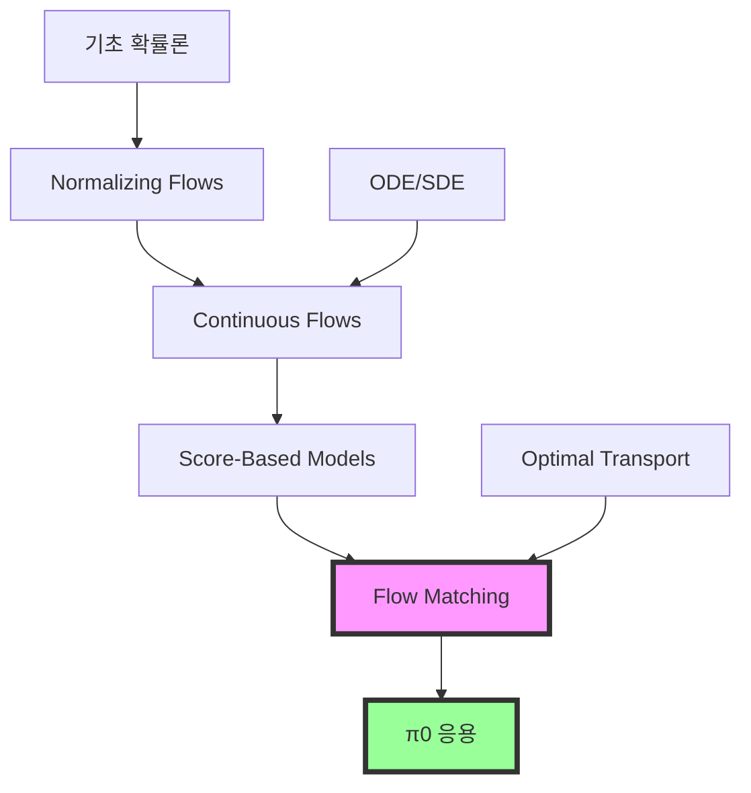

# 🌊 Flow Models 완벽 이해 가이드
## From Normalizing Flows to Flow Matching

---

## 📌 Overview
Flow Models는 생성 모델의 한 종류로, 복잡한 분포를 간단한 분포로부터 **가역 변환(invertible transformation)**을 통해 생성합니다.

---

## 1. 기초: Normalizing Flows

### 1.1 핵심 아이디어
```python
"""
Normalizing Flow: 
간단한 분포 z ~ N(0,1) → 복잡한 분포 x ~ p(x)
가역 함수 f를 통한 변환
"""

# Forward: z → x
x = f(z)

# Inverse: x → z  
z = f_inverse(x)

# Change of Variables Formula
log p(x) = log p(z) - log |det(J_f(z))|
# J_f는 Jacobian matrix
```

### 1.2 주요 Normalizing Flow 모델들

#### **RealNVP (2016)**
```python
class RealNVP:
    """Real-valued Non-Volume Preserving transformations"""
    
    def coupling_layer(self, x):
        # Split input
        x1, x2 = x.split(dim//2, dim=1)
        
        # Transform
        s = self.scale_net(x1)  # Scale
        t = self.shift_net(x1)  # Translation
        
        # Affine coupling
        y1 = x1  # Keep unchanged
        y2 = x2 * exp(s) + t  # Transform
        
        return concat([y1, y2])
```

#### **Glow (2018)**
```python
class Glow:
    """Generative Flow with Invertible 1x1 Convolutions"""
    
    def flow_step(self, x):
        # 1. Activation normalization
        x = self.actnorm(x)
        
        # 2. Invertible 1x1 conv
        x = self.invertible_conv(x)
        
        # 3. Affine coupling
        x = self.coupling(x)
        
        return x
```

#### **FFJORD (2019)**
```python
class FFJORD:
    """Free-form Jacobian of Reversible Dynamics"""
    
    def __init__(self):
        # Continuous normalizing flow
        self.ode_func = ODEFunc()
    
    def forward(self, x, t0=0, t1=1):
        # Solve ODE
        z = odeint(self.ode_func, x, [t0, t1])
        return z[-1]
```

---

## 2. Continuous Normalizing Flows (CNF)

### 2.1 Neural ODE 기반
```python
# 이산 변환 대신 연속 변환
# dx/dt = f_θ(x, t)

class ContinuousNormalizingFlow:
    def __init__(self):
        self.dynamics = nn.Sequential(
            nn.Linear(dim + 1, hidden),
            nn.ReLU(),
            nn.Linear(hidden, dim)
        )
    
    def forward(self, x0, t_span):
        """ODE를 풀어서 x0 → x1 변환"""
        
        def ode_func(t, x):
            t_vec = torch.ones(x.shape[0], 1) * t
            x_t = torch.cat([x, t_vec], dim=1)
            return self.dynamics(x_t)
        
        # Solve ODE
        solution = odeint(ode_func, x0, t_span)
        return solution[-1]
```

### 2.2 장단점
```python
advantages = {
    "메모리 효율": "역전파시 O(1) 메모리",
    "유연성": "임의의 깊이 가능",
    "정확성": "수치적으로 정확한 likelihood"
}

disadvantages = {
    "속도": "ODE solver가 느림",
    "훈련": "adjoint method 필요",
    "안정성": "수치 오류 누적 가능"
}
```

---

## 3. Score-Based Models와의 연결

### 3.1 Score Matching
```python
# Score function: ∇_x log p(x)

class ScoreNetwork(nn.Module):
    """Score를 예측하는 네트워크"""
    
    def forward(self, x, t):
        # Predict score at time t
        score = self.network(x, t)
        return score  # ∇_x log p_t(x)

# Score matching loss
def score_matching_loss(model, x):
    score = model(x)
    loss = 0.5 * (score ** 2).sum() + (score * grad_x).sum()
    return loss
```

### 3.2 SDE 관점
```python
# Forward SDE: dx = f(x,t)dt + g(t)dw
# Reverse SDE: dx = [f(x,t) - g²(t)∇_x log p_t(x)]dt + g(t)dw̄

class SDEFlow:
    def forward_sde(self, x0, t):
        """데이터를 노이즈로 변환"""
        drift = self.f(x0, t)
        diffusion = self.g(t)
        return drift, diffusion
    
    def reverse_sde(self, xt, t):
        """노이즈를 데이터로 변환"""
        score = self.score_net(xt, t)
        drift = self.f(xt, t) - self.g(t)**2 * score
        return drift
```

---

## 4. Flow Matching (최신 혁신)

### 4.1 핵심 아이디어
```python
"""
Flow Matching: 
- ODE를 직접 학습하는 대신 velocity field 학습
- Optimal transport 이론 활용
- 훨씬 간단하고 안정적
"""

class FlowMatching:
    def __init__(self):
        # Velocity field v_θ(x, t)
        self.velocity_net = VelocityNetwork()
    
    def conditional_flow(self, x0, x1, t):
        """Conditional probability path"""
        # Linear interpolation (가장 간단한 경우)
        mu_t = (1 - t) * x0 + t * x1
        return mu_t
    
    def conditional_velocity(self, x0, x1):
        """Conditional vector field"""
        return x1 - x0  # 직선 속도
    
    def loss(self, x0, x1):
        """Flow matching loss"""
        t = torch.rand(batch_size, 1)
        
        # Interpolate
        x_t = self.conditional_flow(x0, x1, t)
        
        # Target velocity
        v_target = self.conditional_velocity(x0, x1)
        
        # Predicted velocity  
        v_pred = self.velocity_net(x_t, t)
        
        return MSE(v_pred, v_target)
```

### 4.2 왜 Flow Matching이 우수한가?

```python
comparison = {
    "Diffusion": {
        "경로": "Curved (Brownian bridge)",
        "훈련": "Denoising score matching",
        "샘플링": "50-1000 steps",
        "안정성": "Hyperparameter sensitive"
    },
    
    "Flow Matching": {
        "경로": "Straight (Optimal transport)",
        "훈련": "Simple regression",
        "샘플링": "5-10 steps",
        "안정성": "Very stable"
    }
}

# 시각적 비교
"""
Diffusion Path:
Start •~~~~~~〰️〰️〰️• End  (구불구불)

Flow Matching Path:  
Start •————————————• End  (직선)
"""
```

### 4.3 Rectified Flow
```python
class RectifiedFlow:
    """Flow를 직선화하는 기법"""
    
    def rectify(self, flow):
        """
        1. 초기 flow 학습
        2. 샘플 생성
        3. 직선 경로로 재학습
        """
        
        # Step 1: Learn initial flow
        v_0 = self.learn_flow(data)
        
        # Step 2: Generate pairs
        x0 = sample_noise()
        x1 = self.generate(x0, v_0)
        
        # Step 3: Relearn with straight paths
        v_1 = self.learn_flow_with_pairs(x0, x1)
        
        return v_1  # Rectified (straightened) flow
```

---

## 5. 로보틱스 응용: π0의 혁신

### 5.1 Action Generation via Flow
```python
class RobotFlowPolicy:
    """π0 스타일 로봇 제어"""
    
    def __init__(self):
        self.flow = FlowMatching(
            input_dim=vision_dim + language_dim,
            output_dim=action_dim
        )
    
    def generate_action(self, observation, instruction):
        # Start from noise or rest position
        a_0 = torch.zeros(action_dim)
        
        # Generate via flow
        for t in torch.linspace(0, 1, steps=5):
            v = self.flow.velocity(a_0, t, observation)
            a_0 = a_0 + v * dt
        
        return a_0  # Final action
```

### 5.2 왜 로보틱스에 적합한가?
```python
robotics_benefits = {
    "연속성": "부드러운 trajectory 생성",
    "속도": "5 steps로 충분 (50Hz 가능)",
    "안정성": "Mode collapse 없음",
    "다양성": "Multimodal actions 가능"
}
```

---

## 6. 구현 실습

### 6.1 간단한 1D Flow Matching
```python
import torch
import torch.nn as nn
import matplotlib.pyplot as plt

class Simple1DFlow(nn.Module):
    def __init__(self):
        super().__init__()
        self.net = nn.Sequential(
            nn.Linear(2, 32),  # [x, t] → hidden
            nn.ReLU(),
            nn.Linear(32, 32),
            nn.ReLU(),
            nn.Linear(32, 1)   # → velocity
        )
    
    def forward(self, x, t):
        inputs = torch.cat([x, t], dim=-1)
        return self.net(inputs)

# 데이터: N(0,1) → N(2,0.5)
x0 = torch.randn(1000, 1)  # Source
x1 = torch.randn(1000, 1) * 0.5 + 2  # Target

# 훈련
model = Simple1DFlow()
optimizer = torch.optim.Adam(model.parameters(), lr=1e-3)

for epoch in range(1000):
    t = torch.rand(1000, 1)
    x_t = (1 - t) * x0 + t * x1
    v_true = x1 - x0
    
    v_pred = model(x_t, t)
    loss = ((v_pred - v_true) ** 2).mean()
    
    optimizer.zero_grad()
    loss.backward()
    optimizer.step()
    
    if epoch % 100 == 0:
        print(f"Epoch {epoch}, Loss: {loss.item():.4f}")

# 생성
with torch.no_grad():
    x_gen = torch.randn(100, 1)  # Start from N(0,1)
    trajectory = [x_gen.clone()]
    
    for t in torch.linspace(0, 1, 10):
        t_batch = torch.ones(100, 1) * t
        v = model(x_gen, t_batch)
        x_gen = x_gen + v * 0.1
        trajectory.append(x_gen.clone())
    
    # Plot
    plt.figure(figsize=(10, 6))
    for i, x in enumerate(trajectory):
        plt.hist(x.numpy(), bins=30, alpha=0.3, label=f't={i/10:.1f}')
    plt.legend()
    plt.title('Flow from N(0,1) to N(2,0.5)')
    plt.show()
```

### 6.2 2D Visualization
```python
def visualize_2d_flow():
    """2D Flow field 시각화"""
    
    # Create grid
    x = np.linspace(-3, 3, 20)
    y = np.linspace(-3, 3, 20)
    X, Y = np.meshgrid(x, y)
    
    # Velocity field (예시: 회전 flow)
    U = -Y  # x-velocity
    V = X   # y-velocity
    
    # Plot
    plt.figure(figsize=(8, 8))
    plt.quiver(X, Y, U, V, angles='xy')
    plt.title('2D Flow Field')
    plt.xlabel('x')
    plt.ylabel('y')
    plt.grid(True)
    plt.show()

visualize_2d_flow()
```

---

## 7. 핵심 논문 리스트

### 필독 논문 (시간순)
1. **2015**: Variational Inference with Normalizing Flows
2. **2016**: Density estimation using Real NVP
3. **2018**: Glow: Generative Flow with Invertible 1x1 Convolutions
4. **2019**: FFJORD: Free-form Continuous Dynamics
5. **2020**: Score-Based Generative Modeling
6. **2021**: Variational Diffusion Models
7. **2023**: Flow Matching for Generative Modeling ⭐
8. **2023**: Flow Straight and Fast: Rectified Flow
9. **2024**: π0: Flow Matching for Robotics ⭐

---

## 8. 학습 로드맵



---

## 핵심 요약

> **Flow Models는 "변환의 예술"입니다.**
> - Normalizing Flows: 가역 변환의 시작
> - Continuous Flows: ODE로 확장
> - Flow Matching: 최적 수송으로 단순화
> - π0: 로보틱스의 미래

---

*최종 업데이트: 2025년 1월*
*난이도: ⭐⭐⭐⭐ (고급)*