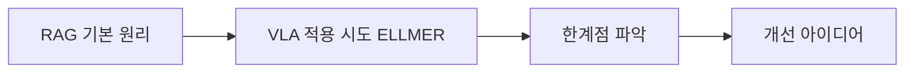

# 🔍 RAG 시스템 관련 논문들
## Retrieval-Augmented Generation for VLA Models

---

## 📚 이 폴더의 논문들

### 🔥 Critical Papers (반드시 읽을 것)

#### 1. **RAG: Retrieval-Augmented Generation for Knowledge-Intensive NLP Tasks** (2020)
- **파일**: `RAG_Original_Paper_2020.md`
- **저자**: Patrick Lewis, et al. (Facebook AI)
- **중요도**: 🔥🔥🔥🔥🔥
- **난이도**: 🟡 Intermediate
- **한줄요약**: RAG의 개념을 최초로 정립한 원조 논문
- **왜 읽어야**: RAG의 모든 것이 여기서 시작, 기본 원리 필수 이해

#### 2. **ELLMER: Retrieval-Augmented VLA Models** (2025) ⭐
- **파일**: `ELLMER_RAG_VLA_2025.md`
- **저자**: [Latest Research Team]
- **중요도**: 🔥🔥🔥🔥🔥  
- **난이도**: 🔴 Advanced
- **한줄요약**: VLA 모델에 RAG를 적용한 최초의 본격적 연구
- **왜 읽어야**: 우리 연구의 직접적인 경쟁 대상이자 baseline

#### 3. **LangChain: Building Applications with LLMs through Composability** (2023)
- **파일**: `LangChain_Framework_2023.md`
- **저자**: Harrison Chase, et al.
- **중요도**: 🔥🔥🔥🔥
- **난이도**: 🟢 Beginner
- **한줄요약**: RAG 시스템 구축을 위한 실용적 프레임워크
- **왜 읽어야**: 실제 구현에서 활용할 주요 도구

### 📖 Important Papers (꼭 읽어볼 것)

#### 4. **REALM: Retrieval-Augmented Language Model Pre-Training** (2020)
- **파일**: `REALM_Neural_Retrieval_2020.md`  
- **저자**: Kelvin Guu, et al. (Google Research)
- **중요도**: 📖📖📖📖
- **난이도**: 🟡 Intermediate
- **한줄요약**: Neural retrieval과 language model 통합의 선구자
- **왜 읽어야**: End-to-end 학습 가능한 검색 시스템 이해

#### 5. **FiD: Fusion-in-Decoder for Open-Domain Question Answering** (2021)
- **파일**: `FiD_Fusion_in_Decoder_2021.md`
- **저자**: Gautier Izacard, Edouard Grave (Facebook AI)
- **중요도**: 📖📖📖📖
- **난이도**: 🟡 Intermediate  
- **한줄요약**: 검색된 여러 문서를 효과적으로 융합하는 방법
- **왜 읽어야**: 다중 컨텍스트 융합 기법의 핵심

#### 6. **Dense Passage Retrieval for Open-Domain Question Answering** (2020)
- **파일**: `DPR_Dense_Passage_Retrieval_2020.md`
- **저자**: Vladimir Karpukhin, et al. (Facebook AI)
- **중요도**: 📖📖📖
- **난이도**: 🟡 Intermediate
- **한줄요약**: Dense vector를 이용한 효과적인 문서 검색
- **왜 읽어야**: Vector DB 기반 검색의 이론적 배경

### 📚 Reference Papers (참고용)

#### 7. **ColBERT: Efficient and Effective Passage Search** (2020)
- **파일**: `ColBERT_Efficient_Retrieval_2020.md`
- **저자**: Omar Khattab, Matei Zaharia (Stanford)
- **중요도**: 📚📚📚
- **난이도**: 🔴 Advanced
- **한줄요약**: 효율적이고 정확한 passage 검색 방법
- **왜 읽어야**: 대규모 검색 시스템의 효율성 개선

#### 8. **RETRO: Improving Language Models by Retrieving from Trillions of Tokens** (2022)  
- **파일**: `RETRO_Trillion_Token_Retrieval_2022.md`
- **저자**: Sebastian Borgeaud, et al. (DeepMind)
- **중요도**: 📚📚📚
- **난이도**: 🔴 Advanced
- **한줄요약**: 초대규모 검색 기반 언어 모델
- **왜 읽어야**: 스케일링의 한계와 가능성 이해

---

## 🎯 Context-Aware RAG-VLA 관련성

### 직접적 연관 논문들

#### ELLMER (2025) - 가장 중요!
```python
ellmer_relevance = {
    "연관성": "VLA + RAG 조합의 첫 본격적 시도",
    "우리와의_차이": {
        "ELLMER": "모든 상황에서 동일한 검색 전략",
        "우리_아이디어": "상황별 적응적 검색 (Context-Aware)"
    },
    "학습포인트": [
        "VLA에서 RAG 적용 시 주요 문제점들",
        "성능 향상 정도와 한계점", 
        "실시간 처리 관련 이슈들",
        "개선 가능한 부분들"
    ]
}
```

#### RAG Original (2020) - 기초 필수
```python  
rag_relevance = {
    "연관성": "모든 RAG 연구의 출발점",
    "학습포인트": [
        "Retrieval + Generation 결합 방법",
        "Dense vs Sparse retrieval 비교",
        "End-to-end 학습 가능성",
        "Knowledge-intensive task에서의 효과"
    ],
    "VLA_적용": "로봇 태스크를 knowledge-intensive로 볼 수 있나?"
}
```

---

## 📖 읽기 전략 및 순서

### Week 2: RAG 기초 완성
```python
week2_reading_plan = {
    "Day_1-2": "RAG Original (2020) - Pass 3 완전 이해",
    "Day_3-4": "LangChain Framework - 실습 포함",
    "Day_5-6": "ELLMER (2025) - 우리 연구와 직접 비교",
    "Day_7": "주간 정리 및 Context-Aware 아이디어 구체화"
}
```

### Week 2 후반: 심화 학습
```python
advanced_reading = {
    "우선순위_1": "REALM (2020) - Neural retrieval 이해",
    "우선순위_2": "FiD (2021) - 다중 문서 융합 방법",
    "우선순위_3": "DPR (2020) - Dense retrieval 기초"
}
```

---

## 🔍 각 논문에서 주목할 핵심 포인트

### RAG (2020) 읽을 때
**Focus Questions**:
- Q: Retrieval과 Generation을 어떻게 jointly 학습시키는가?
- Q: Dense retrieval이 sparse보다 왜 좋은가?
- Q: Knowledge-intensive task의 정의와 특징은?
- Q: VLA 태스크도 knowledge-intensive하다고 볼 수 있을까?

**VLA 적용 관점**:
- 로봇 매뉴얼, 과거 실행 로그를 knowledge로 활용 가능
- Real-time constraint와 retrieval latency 문제
- Action space와 text generation의 차이점

### ELLMER (2025) 읽을 때 ⭐
**Critical Analysis Points**:
- 어떤 정보를 언제 검색하는가?
- 검색 지연시간이 로봇 제어에 미치는 영향
- 검색된 정보를 어떻게 액션 예측에 활용하는가?
- 성능 향상의 한계와 트레이드오프

**우리 연구 차별화 포인트**:
```python
differentiation_points = {
    "ELLMER_한계": [
        "일률적 검색 전략",
        "상황별 적응성 부족", 
        "검색 효율성 고려 부족"
    ],
    
    "우리_개선점": [
        "Context-aware selective retrieval",
        "3-level hierarchical context",
        "Adaptive retrieval triggering"
    ]
}
```

### LangChain Framework 읽을 때
**Practical Implementation Focus**:
- RAG pipeline 구축 방법
- Vector database 통합 방법  
- Chain 구조 설계 원칙
- Error handling 및 fallback 전략

---

## 💡 연구 아이디어 발전 과정

### 1단계: 기존 방법 이해


### 2단계: 문제점 분석
```python
current_problems = {
    "Latency_Issue": "검색 시간이 로봇 제어에 부담",
    "Relevance_Problem": "항상 검색이 필요한 것은 아님",
    "Context_Blindness": "상황을 고려하지 않은 획일적 검색",
    "Efficiency_Lack": "불필요한 검색으로 인한 자원 낭비"
}
```

### 3단계: Context-Aware 솔루션
```python
our_solution = {
    "L1_Immediate": "즉각적 반응이 필요한 상황 - 검색 생략",
    "L2_Task": "태스크 진행 상황 고려한 선택적 검색", 
    "L3_Knowledge": "불확실한 상황에서만 외부 지식 검색",
    "Adaptive_Policy": "상황별 최적 검색 전략 자동 선택"
}
```

---

## 🧪 실험 아이디어 도출

### ELLMER 대비 개선점 검증
```python
experiment_ideas = {
    "Latency_Comparison": {
        "측정": "검색 횟수 및 총 지연시간",
        "기대": "50% 이상 지연시간 감소"
    },
    
    "Performance_vs_Efficiency": {
        "측정": "성공률 대비 검색 비용",  
        "기대": "동일 성능에서 검색량 70% 감소"
    },
    
    "Context_Effectiveness": {
        "측정": "상황별 검색 적절성",
        "기대": "불필요한 검색 80% 감소"
    }
}
```

---

## 📊 읽기 진도 및 이해도 체크

### Critical Papers 체크리스트
- [ ] **RAG (2020)** - Pass 3, 완전 이해 ⭐⭐⭐⭐⭐
- [ ] **ELLMER (2025)** - Pass 3, 비판적 분석 ⭐⭐⭐⭐⭐  
- [ ] **LangChain** - 실습 포함 완료 ⭐⭐⭐⭐

### Important Papers 체크리스트  
- [ ] **REALM (2020)** - Pass 2 이상
- [ ] **FiD (2021)** - Pass 2 이상
- [ ] **DPR (2020)** - Pass 2 이상

### 이해도 자가진단
**RAG 기초**:
- [ ] Dense vs Sparse retrieval 차이점 설명 가능
- [ ] End-to-end 학습 과정 이해  
- [ ] Knowledge-intensive task 개념 파악

**VLA-RAG 통합**:
- [ ] ELLMER의 접근 방법과 한계점 분석 가능
- [ ] 우리 아이디어의 차별점 명확히 설명 가능
- [ ] 기술적 구현 방법 구상 완료

---

## 🔗 구현 관련 자료

### 실습용 코드 저장소
- **LangChain**: https://github.com/langchain-ai/langchain
- **ChromaDB**: https://github.com/chroma-core/chroma  
- **Sentence Transformers**: https://github.com/UKPLab/sentence-transformers

### 데이터셋
- **MS MARCO**: https://microsoft.github.io/msmarco/
- **Natural Questions**: https://ai.google.com/research/NaturalQuestions
- **Robot Manuals**: 다양한 로봇 매뉴얼 PDF 수집

---

## 📝 다음 단계

이 폴더 완료 후 진행할 것:

1. **실습**: LangChain으로 간단한 RAG 시스템 구현
2. **프로토타입**: OpenVLA + RAG 기본 통합  
3. **다음 폴더**: `03_Latest_Trends_2024_2025/` - 최신 연구 동향
4. **아이디어 구체화**: Context-Aware RAG 상세 설계

---

**RAG의 기본기부터 차근차근 쌓아가세요!** 

ELLMER 논문이 핵심이니 함께 읽고 싶으시면 "ELLMER 같이 읽어요!"라고 해주세요! 🔍

---

*Created: 2025-08-24*  
*Priority: Week 2 Core Reading*  
*Focus: Understanding RAG fundamentals + VLA applications*