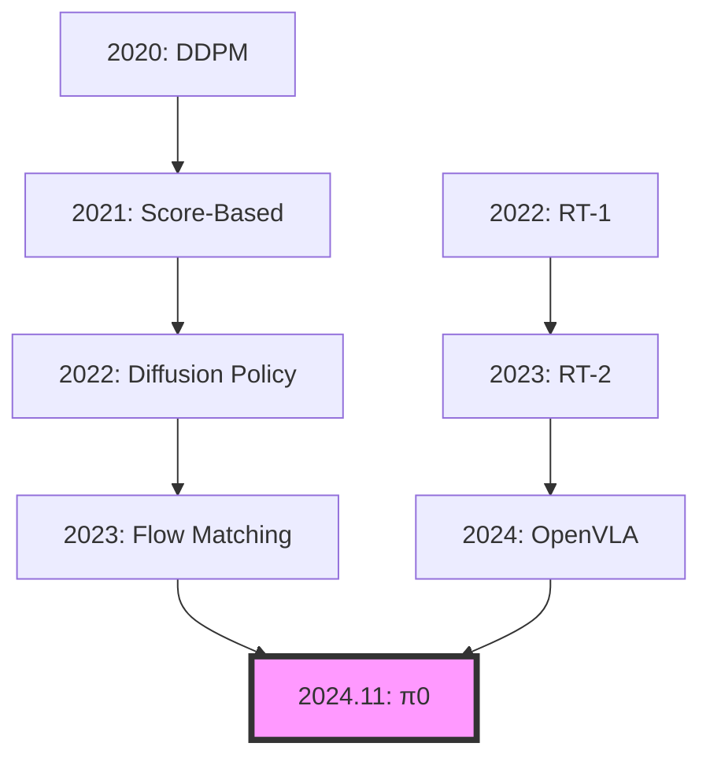

# 📚 π0 (Pi-Zero) 완벽 학습 가이드
## Physical Intelligence의 혁신적 Flow Matching VLA 모델

---

## 📌 Table of Contents
1. [사전 지식 요구사항](#1-사전-지식-요구사항)
2. [Flow Matching 이론적 배경](#2-flow-matching-이론적-배경)
3. [π0 모델 상세 분석](#3-π0-모델-상세-분석)
4. [관련 논문 타임라인](#4-관련-논문-타임라인)
5. [구현 세부사항](#5-구현-세부사항)
6. [실습 가이드](#6-실습-가이드)

---

## 1. 사전 지식 요구사항

### 1.1 필수 개념
```python
prerequisites = {
    "수학적 기초": [
        "확률론 (Probability Theory)",
        "최적 수송 이론 (Optimal Transport)",
        "확률미분방정식 (SDE)",
        "변분 추론 (Variational Inference)"
    ],
    
    "ML/DL 기초": [
        "Diffusion Models",
        "Normalizing Flows", 
        "Score Matching",
        "Energy-Based Models"
    ],
    
    "로보틱스": [
        "Action Spaces (continuous/discrete)",
        "Trajectory Optimization",
        "Imitation Learning",
        "Behavior Cloning"
    ]
}
```

### 1.2 선수 논문 필독 리스트
```markdown
## Diffusion 계열 (기초)
1. **DDPM** (2020): "Denoising Diffusion Probabilistic Models"
   - Diffusion의 기초 이해 필수
   
2. **Score-Based Models** (2021): "Score-Based Generative Modeling"
   - Score matching 개념

3. **Diffusion Policy** (2023): "Diffusion Policy: Visuomotor Policy Learning"
   - 로보틱스에 Diffusion 적용

## Flow 계열 (핵심)
4. **Normalizing Flows** (2019): "Normalizing Flows for Probabilistic Modeling"
   - Flow 기반 생성 모델 기초

5. **Flow Matching** (2023): "Flow Matching for Generative Modeling"
   - π0의 이론적 토대 ⭐

6. **Rectified Flow** (2023): "Flow Straight and Fast"
   - Linear interpolation의 효율성
```

---

## 2. Flow Matching 이론적 배경

### 2.1 핵심 수학적 원리

#### **Diffusion vs Flow Matching**
```python
# Diffusion: 확률적 과정 (Stochastic)
def diffusion_process(x_0, t):
    """
    Forward process: x_0 → x_t (노이즈 추가)
    dx_t = -0.5 * β(t) * x_t dt + sqrt(β(t)) dW_t
    """
    noise = torch.randn_like(x_0)
    alpha_t = compute_alpha(t)
    x_t = sqrt(alpha_t) * x_0 + sqrt(1 - alpha_t) * noise
    return x_t

# Flow Matching: 결정적 과정 (Deterministic)  
def flow_matching(x_0, x_1, t):
    """
    Transport: x_0 → x_1 (직접 이동)
    x_t = (1-t) * x_0 + t * x_1
    """
    return (1 - t) * x_0 + t * x_1
```

#### **왜 Flow Matching이 빠른가?**
```python
# 1. Straight Path (직선 경로)
"""
Diffusion: 곡선 경로로 돌아감
Flow: 직선 경로로 직진
→ 더 적은 step으로 도달
"""

# 2. Optimal Transport
"""
최적 수송 이론에 기반
Wasserstein distance 최소화
→ 가장 효율적인 경로
"""

# 3. Simulation-Free Training
"""
Diffusion: 전체 trajectory 시뮬레이션 필요
Flow: 임의의 t에서 직접 학습 가능
→ 훈련 5-10배 빠름
"""
```

### 2.2 Flow Matching 알고리즘

```python
class FlowMatching:
    """Flow Matching 핵심 알고리즘"""
    
    def __init__(self):
        self.velocity_net = VelocityNetwork()  # v_θ(x_t, t)
    
    def training_step(self, x_0, x_1):
        """훈련: velocity field 학습"""
        # 1. 랜덤 시간 샘플링
        t = torch.rand(batch_size, 1)
        
        # 2. Interpolation
        x_t = (1 - t) * x_0 + t * x_1
        
        # 3. Target velocity (ground truth)
        v_target = x_1 - x_0  # 직선 속도
        
        # 4. Predicted velocity
        v_pred = self.velocity_net(x_t, t)
        
        # 5. Loss
        loss = MSE(v_pred, v_target)
        return loss
    
    def generate(self, x_0, steps=5):
        """생성: ODE 풀기"""
        x = x_0
        dt = 1.0 / steps
        
        for i in range(steps):
            t = i * dt
            v = self.velocity_net(x, t)
            x = x + v * dt  # Euler integration
            
        return x  # x_1 (최종 출력)
```

---

## 3. π0 모델 상세 분석

### 3.1 아키텍처 구조

```python
class Pi0Architecture:
    """π0 전체 아키텍처"""
    
    def __init__(self):
        # Vision Encoder
        self.vision_encoder = PaliGemma3B(
            image_size=224,
            patch_size=14,
            hidden_dim=1024
        )
        
        # Language Processor  
        self.language_processor = Gemma2B(
            vocab_size=256128,
            hidden_dim=2048
        )
        
        # Cross-Modal Fusion
        self.fusion = CrossAttention(
            vision_dim=1024,
            language_dim=2048,
            output_dim=1536
        )
        
        # Flow Matching Policy Head
        self.flow_policy = FlowMatchingHead(
            input_dim=1536,
            action_dim=7,  # 7-DoF robot
            hidden_dim=1024,
            num_layers=6
        )
    
    def forward(self, image, text, t=None):
        # 1. Encode inputs
        vision_features = self.vision_encoder(image)
        language_features = self.language_processor(text)
        
        # 2. Fusion
        fused = self.fusion(vision_features, language_features)
        
        # 3. Generate action via Flow
        if self.training:
            # Training: predict velocity
            velocity = self.flow_policy.predict_velocity(fused, t)
            return velocity
        else:
            # Inference: generate action
            action = self.flow_policy.generate(fused, steps=5)
            return action
```

### 3.2 훈련 데이터 및 과정

```python
training_details = {
    "데이터셋": {
        "규모": "10,000시간 로봇 데모",
        "다양성": "7종 로봇, 100+ 태스크",
        "수집": "원격조작 + 자율수집"
    },
    
    "훈련 과정": {
        "Phase 1": "Behavior Cloning (100K steps)",
        "Phase 2": "Flow Matching (500K steps)",
        "Phase 3": "Online Fine-tuning (100K steps)"
    },
    
    "하이퍼파라미터": {
        "learning_rate": 1e-4,
        "batch_size": 256,
        "flow_steps_train": 100,
        "flow_steps_inference": 5,
        "optimizer": "AdamW"
    }
}
```

### 3.3 핵심 혁신 포인트

```python
innovations = {
    "1. Continuous Action Generation": """
        - 이산 토큰 대신 연속 trajectory
        - 부드러운 움직임 생성
        - 50Hz 고주파 제어
    """,
    
    "2. Pre-training Strategy": """
        - Vision: PaliGemma (사전훈련)
        - Language: Gemma-2B (사전훈련)
        - Policy: Flow Matching (처음부터)
    """,
    
    "3. Multi-Resolution Control": """
        - Coarse: 전체 trajectory 계획
        - Fine: 50Hz 세밀 제어
        - Adaptive: 상황별 주파수 조정
    """
}
```

---

## 4. 관련 논문 타임라인

### 4.1 Evolution Path



### 4.2 주요 논문 상세

```markdown
## 2023년
- **Flow Matching for Generative Modeling** (Lipman et al.)
  - Flow Matching 이론 정립
  - Citation: 500+

- **Diffusion Policy** (Chi et al., Columbia)
  - 로봇 제어에 Diffusion 적용
  - Citation: 300+

## 2024년
- **OpenVLA** (Kim et al., Stanford)
  - 오픈소스 VLA 기준점
  - Citation: 200+

- **3D Diffusion Policy** (Ze et al.)
  - 3D 인식 추가
  - Citation: 100+

- **π0** (Physical Intelligence)
  - Flow Matching + VLA
  - 최신, Citation 급증 중
```

---

## 5. 구현 세부사항

### 5.1 Flow Matching 구현 (PyTorch)

```python
import torch
import torch.nn as nn
import torch.nn.functional as F

class FlowMatchingPolicy(nn.Module):
    """π0 스타일 Flow Matching Policy"""
    
    def __init__(self, state_dim, action_dim, hidden_dim=256):
        super().__init__()
        
        # Velocity Network v_θ(x_t, t)
        self.velocity_net = nn.Sequential(
            nn.Linear(state_dim + action_dim + 1, hidden_dim),
            nn.ReLU(),
            nn.Linear(hidden_dim, hidden_dim),
            nn.ReLU(),
            nn.Linear(hidden_dim, hidden_dim),
            nn.ReLU(),
            nn.Linear(hidden_dim, action_dim)
        )
        
    def compute_velocity(self, state, action_t, t):
        """Velocity prediction v_θ(x_t, t)"""
        # Concatenate inputs
        inputs = torch.cat([state, action_t, t], dim=-1)
        return self.velocity_net(inputs)
    
    def training_loss(self, state, action_0, action_1):
        """Flow Matching training loss"""
        batch_size = state.shape[0]
        
        # Sample random time
        t = torch.rand(batch_size, 1).to(state.device)
        
        # Interpolate
        action_t = (1 - t) * action_0 + t * action_1
        
        # True velocity
        v_true = action_1 - action_0
        
        # Predicted velocity
        v_pred = self.compute_velocity(state, action_t, t)
        
        # MSE loss
        loss = F.mse_loss(v_pred, v_true)
        return loss
    
    def generate(self, state, action_0, num_steps=5):
        """Generate action via ODE integration"""
        dt = 1.0 / num_steps
        action = action_0
        
        for i in range(num_steps):
            t = torch.tensor([[i * dt]]).to(state.device)
            v = self.compute_velocity(state, action, t)
            action = action + v * dt
            
        return action
```

### 5.2 실제 사용 예시

```python
# 모델 초기화
model = FlowMatchingPolicy(
    state_dim=512,  # Vision features
    action_dim=7,   # 7-DoF robot
    hidden_dim=256
)

# 훈련
optimizer = torch.optim.AdamW(model.parameters(), lr=1e-4)

for epoch in range(epochs):
    for batch in dataloader:
        state = batch['state']
        action_expert = batch['action']  # Expert demonstration
        action_noise = torch.randn_like(action_expert)  # Random init
        
        loss = model.training_loss(state, action_noise, action_expert)
        
        optimizer.zero_grad()
        loss.backward()
        optimizer.step()

# 추론 (50Hz)
with torch.no_grad():
    state = get_current_state()
    action_init = torch.zeros(1, 7)  # Start from rest
    
    action = model.generate(
        state, 
        action_init,
        num_steps=5  # 5 steps = 20ms @ 50Hz
    )
    
    execute_action(action)
```

---

## 6. 실습 가이드

### 6.1 환경 설정

```bash
# 1. 환경 생성
conda create -n pi0_study python=3.9
conda activate pi0_study

# 2. 필수 패키지
pip install torch torchvision
pip install transformers  # For PaliGemma
pip install scipy numpy matplotlib

# 3. 시뮬레이션 환경
pip install pybullet
pip install gym
```

### 6.2 간단한 2D 실습

```python
"""
2D Navigation with Flow Matching
목표: (0,0) → (1,1) 이동 학습
"""

import numpy as np
import matplotlib.pyplot as plt

class Simple2DFlow:
    def __init__(self):
        self.velocity_fn = lambda x, t: np.array([1.0, 1.0])  # 대각선 이동
    
    def demonstrate(self):
        # Generate trajectory
        positions = []
        pos = np.array([0.0, 0.0])
        
        for t in np.linspace(0, 1, 50):
            positions.append(pos.copy())
            velocity = self.velocity_fn(pos, t)
            pos += velocity * 0.02
        
        positions = np.array(positions)
        
        # Plot
        plt.figure(figsize=(8, 8))
        plt.plot(positions[:, 0], positions[:, 1], 'b-', linewidth=2)
        plt.scatter([0], [0], c='green', s=100, label='Start')
        plt.scatter([1], [1], c='red', s=100, label='Goal')
        plt.xlabel('X')
        plt.ylabel('Y')
        plt.title('Flow Matching Trajectory')
        plt.legend()
        plt.grid(True)
        plt.axis('equal')
        plt.show()

# 실행
flow = Simple2DFlow()
flow.demonstrate()
```

### 6.3 학습 체크리스트

```markdown
## Week 1: 이론 기초
- [ ] Diffusion Models 논문 정독
- [ ] Flow Matching 논문 정독
- [ ] Optimal Transport 기초 이해

## Week 2: π0 분석
- [ ] π0 논문 정독 (3회)
- [ ] 아키텍처 도표 그리기
- [ ] 의사코드 작성

## Week 3: 구현
- [ ] 2D toy example 구현
- [ ] Flow Matching 훈련 코드
- [ ] 시각화 도구 개발

## Week 4: 확장
- [ ] 3D manipulation 시도
- [ ] PyBullet 통합
- [ ] 성능 벤치마크
```

---

## 📚 추가 학습 자료

### 논문
1. **Flow Matching**: https://arxiv.org/abs/2210.02747
2. **π0 Blog**: https://physicalintelligence.company/blog/pi0
3. **Rectified Flow**: https://arxiv.org/abs/2209.03003

### 코드
1. **Flow Matching Tutorial**: https://github.com/atong01/conditional-flow-matching
2. **Diffusion Policy**: https://github.com/columbia-ai-robotics/diffusion_policy

### 강의
1. **Optimal Transport**: https://youtu.be/6iR1E6t1MMQ
2. **Generative Models**: CS236 Stanford

---

*마지막 업데이트: 2025년 1월*
*작성자: VLA Research Assistant*