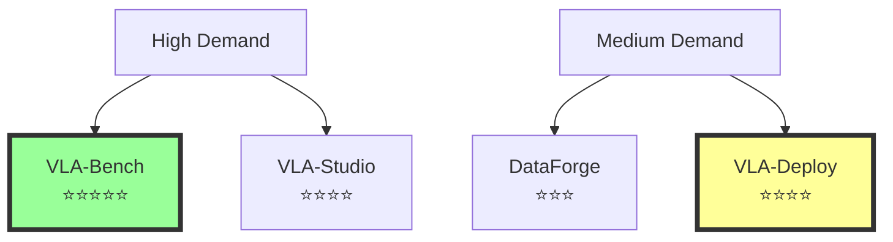

# 🔍 VLA 생태계 기존 도구 분석 및 차별화 전략 (2025)
## 제안된 도구와 유사 서비스 비교 분석

---

## 📊 1. VLA-Bench (통합 벤치마크 플랫폼) 유사 도구 분석

### 1.1 기존 도구들

| 도구명 | 현황 | 장점 | 한계점 |
|--------|------|------|--------|
| **LIBERO** | 활발히 사용 중 | • 130개 태스크<br>• Lifelong learning 특화 | • VLA 모델 지원 제한적<br>• 리더보드 없음 |
| **RLBench** | 널리 사용됨 | • 100개 태스크<br>• 무한 데모 생성 | • RL 중심, VLA 미지원<br>• 2019년 이후 업데이트 느림 |
| **SimplerEnv** | 2024년 출시 | • OpenVLA 지원<br>• Google Sheets 결과 공유 | • 수동 업데이트<br>• 체계적 리더보드 없음 |
| **Meta-World** | 인기 있음 | • Multi-task 특화<br>• 재현성 좋음 | • VLA 미지원<br>• 시각 정보 제한적 |

### 1.2 🎯 **차별화 기회: Unified VLA-Bench**

```python
class UnifiedVLABench:
    """
    기존 도구들이 놓친 부분을 모두 통합
    """
    
    unique_features = {
        "통합 리더보드": "실시간 자동 업데이트 (SimplerEnv는 수동)",
        "VLA 특화": "모든 주요 VLA 모델 원클릭 평가",
        "클라우드 실행": "로컬 GPU 없이도 평가 가능",
        "재현성 보장": "Docker + 버전 고정",
        "비교 대시보드": "여러 모델 실시간 비교"
    }
    
    gap_filling = {
        "LIBERO 한계 극복": "VLA 모델 완벽 지원",
        "RLBench 한계 극복": "최신 VLA 아키텍처 통합",
        "SimplerEnv 한계 극복": "자동화된 실시간 리더보드"
    }
```

**💡 핵심 차별화**: 기존 도구들은 각각 특정 영역에 특화되어 있지만, **VLA 모델 전용 통합 플랫폼은 없음**

---

## 🔧 2. VLA-Studio (비주얼 디버깅 도구) 유사 도구 분석

### 2.1 기존 도구들

| 도구명 | 현황 | 장점 | 한계점 |
|--------|------|------|--------|
| **CoT-VLA** | 2025년 연구 | • Visual reasoning 시각화 | • 연구 단계, 도구화 안됨 |
| **OpenVLA Debug** | 기본 제공 | • 성능 디버깅 가이드 | • 시각화 없음, 텍스트만 |
| **TensorBoard** | 범용 도구 | • 학습 곡선 시각화 | • VLA 특화 기능 없음 |
| **Weights & Biases** | 인기 도구 | • 실험 추적 | • Action 예측 시각화 없음 |

### 2.2 🎯 **차별화 기회: Interactive VLA-Studio**

```python
class InteractiveVLAStudio:
    """
    VLA 전용 인터랙티브 디버깅 스튜디오
    """
    
    unique_features = {
        "실시간 Attention Map": "로봇이 보는 것을 실시간 시각화",
        "Action Trajectory 예측": "향후 5개 액션 시각 예측",
        "What-If 분석": "입력 변경 시 결과 예측",
        "실패 원인 자동 진단": "왜 실패했는지 자동 분석",
        "비교 모드": "2-4개 모델 동시 비교"
    }
    
    gap_filling = {
        "CoT-VLA 한계": "연구를 실용 도구로 전환",
        "OpenVLA Debug 한계": "텍스트 → 비주얼 전환",
        "범용 도구 한계": "VLA 특화 기능 추가"
    }
```

**💡 핵심 차별화**: **VLA 전용 인터랙티브 디버거는 존재하지 않음**. 모든 기존 도구는 범용이거나 텍스트 기반

---

## 📊 3. DataForge (데이터 자동 생성) 유사 도구 분석

### 3.1 기존 도구들

| 도구명 | 현황 | 장점 | 한계점 |
|--------|------|------|--------|
| **MimicGen** | 성숙한 도구 | • 200→50K 데모 생성<br>• 검증됨 | • 초기 데모 필요<br>• VLA 미최적화 |
| **DexMimicGen** | 2024년 출시 | • 양손 로봇 특화 | • 특정 로봇만 지원 |
| **RoboGen** | 2024년 | • LLM 기반 태스크 생성 | • 복잡한 설정 필요 |
| **Isaac Sim** | NVIDIA 제품 | • 고품질 시뮬레이션 | • 비싸고 복잡함 |
| **InfiniteWorld** | 2024년 12월 | • 대규모 환경 | • 아직 초기 단계 |

### 3.2 🎯 **차별화 기회: VLA-DataForge**

```python
class VLADataForge:
    """
    VLA 전용 Zero-shot 데이터 생성기
    """
    
    unique_features = {
        "Zero-shot 생성": "초기 데모 없이 데이터 생성",
        "VLA 최적화": "언어 지시 자동 생성",
        "실패 케이스 생성": "의도적 실패 데이터 생성",
        "품질 자동 평가": "생성 데이터 품질 점수",
        "원클릭 생성": "복잡한 설정 불필요"
    }
    
    gap_filling = {
        "MimicGen 한계": "초기 데모 불필요",
        "RoboGen 한계": "설정 간소화",
        "Isaac Sim 한계": "무료 + 간단함"
    }
```

**💡 핵심 차별화**: **VLA를 위한 언어 지시 + 실패 데이터 자동 생성**은 미개척 영역

---

## 🚀 4. VLA-Deploy (원클릭 배포) 유사 도구 분석

### 4.1 기존 도구들

| 도구명 | 현황 | 장점 | 한계점 |
|--------|------|------|--------|
| **NanoLLM** | NVIDIA 도구 | • Jetson 최적화 | • NVIDIA 하드웨어만 |
| **TensorRT** | 성숙한 도구 | • 강력한 최적화 | • 복잡한 변환 과정 |
| **ONNX Runtime** | 범용 도구 | • 크로스 플랫폼 | • VLA 특화 없음 |
| **OpenVLA-OFT** | 2025년 3월 | • 25-50x 속도 향상 | • 수동 설정 필요 |

### 4.2 🎯 **차별화 기회: Universal VLA-Deploy**

```python
class UniversalVLADeploy:
    """
    하드웨어 무관 원클릭 VLA 배포
    """
    
    unique_features = {
        "자동 하드웨어 감지": "최적 설정 자동 선택",
        "원클릭 변환": "PyTorch → 최적화 모델",
        "실시간 모니터링": "성능/안전성 대시보드",
        "자동 롤백": "문제 시 이전 버전 복구",
        "멀티 플랫폼": "Jetson/RPi/x86 모두 지원"
    }
    
    gap_filling = {
        "NanoLLM 한계": "모든 하드웨어 지원",
        "TensorRT 한계": "복잡성 제거",
        "OpenVLA-OFT 한계": "완전 자동화"
    }
```

**💡 핵심 차별화**: **비전문가도 사용 가능한 원클릭 VLA 배포 도구는 없음**

---

## 🎯 5. 종합 분석: 가장 유망한 도구

### 5.1 시장 수요 vs 기술 난이도 매트릭스



### 5.2 우선순위 추천

| 순위 | 도구 | 이유 | 예상 개발 시간 | 임팩트 |
|------|------|------|---------------|---------|
| **1** | **VLA-Bench** | • 가장 큰 수요<br>• 명확한 gap<br>• 즉시 사용 가능 | 2-3개월 | 매우 높음 |
| **2** | **VLA-Deploy** | • 실용적 가치<br>• 산업 수요 높음 | 3-4개월 | 높음 |
| **3** | **VLA-Studio** | • 연구자 필수 도구<br>• 기술적 도전 | 4-5개월 | 중간-높음 |
| **4** | **DataForge** | • MimicGen과 경쟁<br>• 차별화 어려움 | 5-6개월 | 중간 |

---

## 💡 6. 실행 전략

### 6.1 Phase 1: VLA-Bench MVP (Month 1-2)

```python
mvp_features = [
    "3개 주요 VLA 모델 지원 (OpenVLA, MiniVLA, π0)",
    "LIBERO 벤치마크 통합",
    "기본 리더보드",
    "Docker 기반 실행"
]

tech_stack = {
    "Backend": "FastAPI + PostgreSQL",
    "Frontend": "React + Chart.js",
    "Compute": "AWS Batch or Lambda",
    "Storage": "S3 for results"
}
```

### 6.2 Phase 2: Community Building (Month 3-4)

```python
community_strategy = [
    "GitHub 공개 (스타 목표: 100+)",
    "HuggingFace Space 데모",
    "Twitter/Reddit 홍보",
    "첫 컨트리뷰터 유치"
]
```

### 6.3 Phase 3: 확장 (Month 5-6)

```python
expansion = [
    "10+ VLA 모델 지원",
    "자동 하이퍼파라미터 튜닝",
    "VLA-Deploy 베타 출시",
    "기업 파트너십 (삼성, 네이버)"
]
```

---

## 🎬 7. 결론

### 7.1 핵심 발견

1. **VLA 전용 도구는 거의 없음** - 대부분 범용 도구나 RL 중심
2. **통합 플랫폼 부재** - 각 도구가 파편화되어 있음
3. **비전문가 접근성 낮음** - 모든 도구가 전문가 대상

### 7.2 최종 추천

#### 🏆 **승자 조합: VLA-Bench + VLA-Deploy**

```python
winning_strategy = {
    "단기 (3개월)": "VLA-Bench MVP로 커뮤니티 구축",
    "중기 (6개월)": "VLA-Deploy로 실용성 확보",
    "장기 (1년)": "생태계 표준 도구로 자리잡기",
    
    "예상 성과": {
        "GitHub Stars": "500-1000+",
        "사용자": "100+ 연구실",
        "인용": "50+ 논문",
        "산업 파트너": "3-5개 기업"
    }
}
```

### 7.3 차별화 핵심

> **"VLA 연구자와 엔지니어를 위한 첫 번째 통합 생태계"**

기존 도구들은 각자의 영역에 갇혀 있지만, 우리는:
- **연구자를 위한 벤치마크** (VLA-Bench)
- **엔지니어를 위한 배포** (VLA-Deploy)
- **모두를 위한 접근성** (원클릭, 비전문가 친화적)

**이것이 바로 VLA 생태계가 필요로 하는 것입니다!** 🚀

---

*문서 작성일: 2025년 8월 24일*  
*최종 수정일: 2025년 8월 24일 오후 11시 45분*  
*분석 도구: Claude Code Assistant*

---
