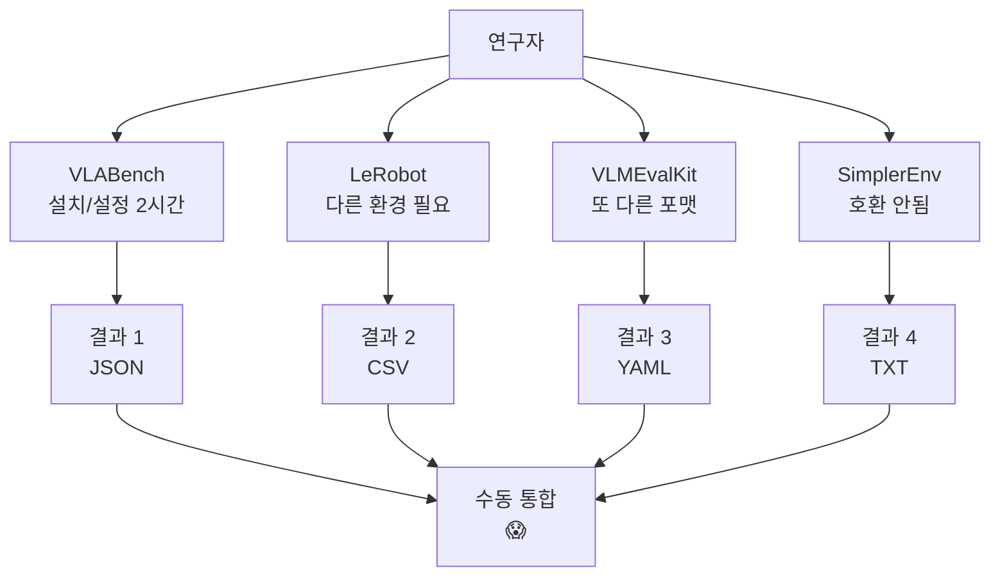

# 🔗 "통합"이 정확히 무엇을 의미하는가?
## VLA 도구 통합의 구체적 의미와 가치

---

## 🤔 현재 문제: 파편화의 고통

### 연구자 A의 하루 (현재)

```python
# 오전 9시: OpenVLA 모델 평가하고 싶다
researcher_morning = {
    "09:00": "VLABench 설치... Python 버전 충돌",
    "10:00": "LeRobot 설치... CUDA 버전 안맞음", 
    "11:00": "SimplerEnv 실행... 데이터 포맷 다름",
    "12:00": "수동으로 결과 복사-붙여넣기 😭"
}

# 오후: 결과 비교하고 싶다
researcher_afternoon = {
    "14:00": "VLABench 결과 → Excel",
    "15:00": "LeRobot 결과 → 다른 포맷",
    "16:00": "수동으로 그래프 그리기",
    "17:00": "아직도 비교 못함... 🤯"
}
```

### 현재 파편화 문제들



---

## 💡 "통합"의 구체적 의미

### 1. 🔧 **기술적 통합 (Technical Integration)**

```python
class TechnicalIntegration:
    """
    서로 다른 도구들을 프로그래밍적으로 연결
    """
    
    def unified_interface(self):
        """하나의 API로 모든 도구 제어"""
        # Before (현재)
        vlabench_result = run_vlabench(model)  # 포맷 A
        lerobot_result = run_lerobot(model)    # 포맷 B
        vlmeval_result = run_vlmeval(model)    # 포맷 C
        
        # After (통합 후)
        results = unified_eval(model)  # 모든 결과 표준 포맷
        return results
    
    def dependency_management(self):
        """의존성 지옥 해결"""
        # Before
        # VLABench: Python 3.8, CUDA 11.3
        # LeRobot: Python 3.10, CUDA 11.8
        # 충돌! 😱
        
        # After
        # Docker 컨테이너로 격리
        # 또는 통합 requirements.txt
        return "모든 도구가 함께 작동"
```

### 2. 📊 **데이터 통합 (Data Integration)**

```python
class DataIntegration:
    """
    서로 다른 포맷을 하나로
    """
    
    def standardize_formats(self):
        # Before: 4가지 다른 포맷
        formats_before = {
            "VLABench": {"success": 0.85, "steps": 100},
            "LeRobot": [["task1", 85], ["task2", 90]],
            "SimplerEnv": "Success: 85%\nSteps: 100",
            "OpenX": XML_FORMAT
        }
        
        # After: 통합 포맷
        unified_format = {
            "model": "OpenVLA",
            "benchmarks": {
                "VLABench": {"success_rate": 0.85, "avg_steps": 100},
                "LeRobot": {"success_rate": 0.87, "avg_steps": 95},
                "SimplerEnv": {"success_rate": 0.85, "avg_steps": 100},
                "OpenX": {"success_rate": 0.83, "avg_steps": 105}
            },
            "aggregate_score": 0.85,
            "timestamp": "2025-01-20"
        }
        return unified_format
```

### 3. 🖥️ **인터페이스 통합 (UI/UX Integration)**

```python
class InterfaceIntegration:
    """
    하나의 대시보드에서 모든 것을 관리
    """
    
    def unified_dashboard(self):
        """
        Before: 4개 웹사이트, 3개 CLI, 2개 GUI
        After: 하나의 웹 대시보드
        """
        dashboard_features = {
            "모델 업로드": "한 번만 업로드",
            "평가 실행": "모든 벤치마크 동시 실행",
            "결과 비교": "실시간 시각화",
            "리더보드": "통합 순위",
            "다운로드": "모든 결과 한번에"
        }
        return dashboard_features
```

### 4. 🔄 **워크플로우 통합 (Workflow Integration)**

```python
class WorkflowIntegration:
    """
    연구 프로세스 전체를 자동화
    """
    
    def before_workflow(self):
        """현재: 수동 단계들"""
        steps = [
            "1. 모델 훈련 (PyTorch)",
            "2. 변환 (ONNX)",
            "3. VLABench 평가 (수동)",
            "4. LeRobot 평가 (수동)",
            "5. 결과 수집 (복사-붙여넣기)",
            "6. 보고서 작성 (수동)"
        ]
        time_required = "2-3일"
        
    def after_workflow(self):
        """통합 후: 자동화"""
        automated_pipeline = """
        git push → 
        CI/CD 트리거 → 
        자동 평가 (모든 벤치마크) → 
        결과 수집 → 
        보고서 생성 → 
        리더보드 업데이트
        """
        time_required = "2-3시간"
```

---

## 🎯 통합이 만드는 구체적 가치

### For 연구자

```python
value_for_researchers = {
    "시간 절약": {
        "before": "평가에 3일",
        "after": "평가에 3시간",
        "saved": "90% 시간 절약"
    },
    
    "정확성": {
        "before": "수동 작업 → 실수 가능",
        "after": "자동화 → 일관된 결과"
    },
    
    "비교 용이성": {
        "before": "엑셀에서 수동 비교",
        "after": "실시간 인터랙티브 차트"
    }
}
```

### For 기업

```python
value_for_companies = {
    "신속한 프로토타이핑": "모델 평가 즉시 가능",
    "의사결정 속도": "어떤 모델이 최적인지 바로 확인",
    "비용 절감": "엔지니어 시간 절약",
    "표준화": "팀 전체가 같은 도구 사용"
}
```

### For 커뮤니티

```python
value_for_community = {
    "공정한 비교": "모든 모델을 같은 조건에서 평가",
    "재현성": "원클릭으로 결과 재현",
    "접근성": "초보자도 쉽게 사용",
    "혁신 가속": "평가에 시간 덜 쓰고 연구에 집중"
}
```

---

## 🏗️ 통합 구현 예시

### 실제 코드 예시

```python
class UnifiedVLAEvaluator:
    """
    통합의 실제 구현
    """
    
    def __init__(self):
        # 각 도구를 래핑
        self.evaluators = {
            'vlabench': VLABenchWrapper(),
            'lerobot': LeRobotWrapper(),
            'simplereenv': SimplerEnvWrapper(),
            'openx': OpenXWrapper()
        }
        
        # 통합 설정
        self.config = UnifiedConfig()
        self.results_db = ResultsDatabase()
    
    def evaluate(self, model_path, benchmarks='all'):
        """
        핵심: 하나의 함수로 모든 평가
        """
        results = {}
        
        # 모델 로드 (한 번만)
        model = self.load_model(model_path)
        
        # 병렬로 모든 벤치마크 실행
        with parallel_executor() as executor:
            futures = []
            for name, evaluator in self.evaluators.items():
                if benchmarks == 'all' or name in benchmarks:
                    future = executor.submit(evaluator.run, model)
                    futures.append((name, future))
            
            # 결과 수집
            for name, future in futures:
                results[name] = future.result()
        
        # 통합 리포트 생성
        report = self.generate_unified_report(results)
        
        # 자동으로 리더보드 업데이트
        self.update_leaderboard(model_path, report)
        
        return report
    
    def generate_unified_report(self, results):
        """
        모든 결과를 하나의 보고서로
        """
        report = {
            'summary': self.calculate_aggregate_metrics(results),
            'detailed_results': results,
            'visualizations': self.create_charts(results),
            'recommendations': self.analyze_weaknesses(results)
        }
        return report
```

### 사용자 경험

```python
# Before (현재): 복잡하고 시간 소모적
vlabench_install()  # 30분
vlabench_run(model)  # 2시간
lerobot_install()  # 30분
lerobot_run(model)  # 2시간
# ... 결과 수동 정리 2시간
# 총 7시간+

# After (통합 후): 간단하고 빠름
evaluator = UnifiedVLAEvaluator()
results = evaluator.evaluate("my_model.pt")
# 총 2시간 (자동 병렬 처리)
```

---

## 🎬 결론: 통합의 진정한 의미

### 통합은...

1. **기술적**: 호환되지 않는 도구들을 연결
2. **데이터적**: 다른 포맷들을 표준화
3. **경험적**: 복잡한 과정을 단순화
4. **가치적**: 시간과 비용을 절약

### 통합이 아닌 것

❌ 모든 도구를 하나로 다시 만들기
❌ 기존 도구들을 대체하기
❌ 단순히 링크만 모아놓기

### 통합인 것

✅ 기존 도구들을 **연결**하기
✅ 공통 인터페이스 **제공**하기
✅ 워크플로우 **자동화**하기
✅ 사용자 경험 **개선**하기

---

## 💡 핵심 통찰

> **"통합 = 1 + 1 + 1 + 1 = 10"**

개별 도구들의 단순 합이 아니라,
시너지를 만들어 **10배의 가치**를 창출하는 것이 통합입니다.

**예시**: 
- Slack = IRC + Email + File Sharing + ... → 협업 혁명
- Notion = Wiki + Database + Kanban + ... → 생산성 혁명
- **UnifiedVLA** = VLABench + LeRobot + ... → VLA 연구 혁명?

이것이 "통합"의 진정한 의미입니다! 🚀

---

*문서 작성일: 2025년 8월 24일*  
*최종 수정일: 2025년 8월 24일 오후 11시 45분*  
*분석 도구: Claude Code Assistant*

---
